# 凝视深渊: 千核并发控制评估

著作信息:

- Xiangyao Yu MIT CSAIL yxy@csail.mit.edu
- George Bezerra MIT CSAIL gbezerra@csail.mit.edu
- Andrew Pavlo Carnegie Mellon University pavlo@cs.cmu.edu
- Srinivas Devadas MIT CSAIL devadas@csail.mit.edu
- Michael Stonebraker MIT CSAIL stonebraker@csail.mit.edu

# 摘要

计算机体系结构正在走向一个众核机器占主导地位的时代，在单个芯片上有几十个甚至上百个核心。这种前所未有的片上并行性为当前数据库管理系统(DBMSs)的设计带来了新的可扩展性。特别是，随着内核数量的增加，并发控制问题变得极具挑战性。随着数百个线程并行运行，协调对数据的竞争访问的复杂性可能会降低内核数量增加带来的好处。

为了更好地了解当前DBMS对未来CPU架构的准备程度，我们在众核芯片上对在线事务处理(OLTP)工作负载的并发控制进行了评估。我们在主存DBMS上实现了七个并发控制算法，并使用计算机模拟将我们的系统扩展到1024个内核。我们的分析表明，所有算法都无法扩展到这个数量级，但原因不同。在每种情况下，我们都确定了独立于特定数据库实现的基本瓶颈，并认为即使是最先进的DBMSs也会受到这些限制。我们的结论是，与其追求增量解决方案，众核芯片可能需要完全重新设计的DBMS架构，该架构从头开始构建，并与硬件紧密耦合。

# 1. 简介

单线程性能指数级提升的时代已经结束。硬功耗限制和复杂性问题迫使芯片设计者从单核转向多核设计。几十年来，时钟频率一直在增加，但现在这种增长已经停止。激进的、无序的、超标量的处理器现在正被简单的、有序的、单发射内核所取代[1]。我们正在进入由单个芯片上的大量较小、低功耗内核驱动的众核机器时代。鉴于当前的功率限制和单线程处理的低效率，除非出现突破性技术，否则增加内核数量是目前架构师能够提高计算能力的唯一方法。这意味着指令级并行和单线程性能将让位于海量线程级并行。

> 本作品根据知识共享署名-非商业性使用-禁止转载3.0许可协议进行许可。要查看本许可证的副本，请访问 [http://creativecommons.org/licenses/by-nc-nd/3.0/](http://creativecommons.org/licenses/by-nc-nd/3.0/).，在超出本许可证涵盖范围的任何使用之前获得许可。通过电子邮件联系版权所有者info@vldb.org。本卷中的文章被邀请在2015年8月31日至9月4日在夏威夷科哈拉海岸举行的第41届超大型数据库国际会议上展示他们的成果。VLDB基金会会议录，第8卷，第3号版权所有2014 VLDB基金会2150-8097/14/11。

随着摩尔定律的延续，单个芯片上的内核数量预计将呈指数级增长。很快，我们将在一个芯片上拥有数百甚至上千个内核。在众核时代，单节点共享内存DBMS的可伸缩性更加重要。但如果当前的DBMS技术不适应这一现实，所有这些计算能力都将浪费在瓶颈上，额外的核心将变得毫无用处。

在本文中，我们将一窥这一可怕的未来，并研究在一千个内核上处理事务会发生什么。我们没有考虑所有可能的可伸缩性挑战，而是将范围限制在并发控制上。随着数百个线程并行运行，协调对数据的竞争访问的复杂性将成为可伸缩性的主要瓶颈，并可能使内核数量增加带来的收益减少。因此，我们试图通过OLTP DBMS最重要的组件之一来全面研究其可伸缩性。

我们在内存数据库管理系统中实现了七种并发控制算法，并使用高性能的分布式CPU模拟器将系统扩展到1000个内核。从零开始实现一个系统允许我们避免现有DBMS中的任何人为瓶颈，而是理解算法中更基本的问题。以前的可扩展性研究使用现有的DBMS[24，26，32]，但这些系统的许多传统组件并不针对众核CPU。据我们所知，还没有对单个数据库管理系统上的多个并发控制算法进行如此大规模的评估。

我们的分析表明，所有算法都无法随着内核数量的增加而扩展。在每种情况下，我们都确定了独立于DBMS实现的主要瓶颈，并认为即使是最先进的系统也会受到这些限制。我们的结论是，为了解决这个可扩展性问题，需要与众核架构紧密协同设计的新并发控制方法。计算机架构师将有责任提供硬件解决方案来解决软件无法解决的DBMS瓶颈，而不是增加更多的内核。

本文做出了以下贡献:

- 七种并发控制方案可扩展性的综合评价。
- 在1000个内核上首次评估OLTP DBMS。
- 识别非特定于实现的并发控制方案中的瓶颈。
 
本文的其余部分组织如下。我们从第2节开始，概述我们评估中使用的并发控制方案。第3节描述了我们研究的组成部分。我们在第4节和第5节中介绍我们的分析，然后在第6节中讨论结果。最后，我们在第7节总结了相关工作，并在第8节讨论了未来的研究方向。

# 2. 并发控制方案

OLTP数据库系统支持应用程序中与最终用户交互的部分。最终用户通过向前端应用程序发送请求来执行某些功能(例如，预订航班座位)，从而与前端应用程序进行交互。应用程序处理这些请求，然后在DBMS中执行事务。这样的用户可以是在他们的个人计算机或移动设备上的人，或者可能在世界其他地方运行的另一个计算机程序。

在这些系统之一的上下文中，事务是在共享数据库上执行一个或多个操作(例如，SQL查询)的序列，以执行一些高级功能[17]。它是DBMS中变化的基本单位:不允许部分事务，一组事务对数据库状态的影响相当于所有事务的任何串行执行。现代OLTP工作负载中的事务有三个显著的特征:(1)它们是短暂的(即没有用户停顿)，(2)它们使用索引查找触及一小部分数据(即没有全表扫描或大型连接)，以及(3)它们是重复的(即使用不同的输入执行相同的查询)[38]。

OLTP DBMS被期望为它执行的每个事务维护四个属性:(1)原子性，(2)一致性，(3)隔离性，以及(4)持久性。这些统一的概念统称为ACID首字母缩略词[20]。并发控制允许最终用户以多种编程方式访问数据库，同时保持他们每个人都在专用系统上单独执行事务的假象[3]。它本质上提供了系统中的原子性和隔离保证。

现在，我们将描述我们在众核评估中探索的不同并发控制方案。对于这个讨论，我们遵循规范的分类，即所有并发模式要么是两阶段锁定的变体，要么是时间戳排序协议[3]。表1总结了这些不同的方案。

> 表1: 本文评估的并发控制方案。

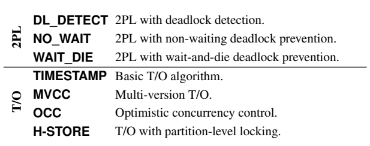

> 针对表1的翻译如下：

- 2PL
  - DL_DETECT：具有死锁检测的2PL
  - NO_WAIT：具有非等待死锁预防的2PL
  - WAIT_DIE: 具有等待死锁预防的2PL
- T/O
  - TIMESTAMP: 基础的T/O算法
  - MVCC: 多版本的T/O算法
  - OCC: 乐观并发控制
  - H-STORE: 具有分区级锁定的T/O

## 2.1 两阶段锁

两阶段锁(2PL)是第一个被证明是正确的方法，可以确保数据库系统中并发事务的正确执行[6，12]。在这种模式下，事务必须获得数据库中特定元素的锁，然后才能对该元素执行读或写操作。在允许事务读取该元素之前，它必须获得一个读锁，同样，为了修改该元素，它必须获得一个写锁。DBMS为每个元组或者在更高的逻辑级别(例如，表、分区)维护锁[14]。

锁的所有权由两个规则控制:(1)不同的事务不能同时拥有冲突的锁，以及(2)一旦一个事务放弃了锁的所有权，它可能永远不会获得额外的锁[3]。元素上的读锁与同一元素上的写锁冲突。同样，元素上的写锁与同一元素上的写锁冲突。

在2PL的第一阶段，称为增长阶段，事务被允许在不释放锁的情况下获取它需要的任意多的锁[12]。当事务释放锁时，它进入第二个阶段，称为收缩阶段；此时禁止获取额外的锁。当事务终止时(通过提交或中止)，所有剩余的锁都会自动释放回协调器。

2PL被认为是一种悲观的方法，因为它假设事务会发生冲突，因此它们需要获得锁来避免这个问题。如果一个事务不能获得一个元素的锁，那么它被迫等待，直到锁变得可用。如果这种等待是不受控制的(即无限期的)，那么DBMS可能会导致死锁[3]。

因此，2PL的不同变体之间的主要区别在于它们处理死锁的方式以及在检测到死锁时采取的操作。现在，我们描述我们在评估框架中实施的不同版本的2PL，并根据以下两个细节对它们进行对比:

- **带死锁检测的2PL(DL_DETECT):** DBMS监控事务的等待图，并检查循环(即死锁)[19]。当发现死锁时，系统必须选择一个事务来中止并重新启动以打破循环。实际上，集中式死锁检测器用于循环检测。检测器根据它已经使用的资源量(例如，它持有的锁的数量)来选择中止哪个事务，以最小化重新启动事务的成本[3]。

- **具有非等待死锁预防的2PL(NO_WAIT):** 与死锁检测不同，在死锁发生后，DBMS会等待找到死锁，这种方法更加谨慎，因为当系统怀疑可能发生死锁时，事务会被中止[3]。当锁请求被拒绝时，调度器立即中止请求事务(即，不允许等待获取锁)。

- **具有等待死锁预防的2PL(WAIT_DIE):**  这是NO_WAIT方案技术的一种非抢占式变体，在这种技术中，如果某个事务比持有锁的事务更老，则允许该事务等待持有所需锁的事务。如果请求事务比较年轻，那么它会被中止(因此出现了“死亡”一词)，并被强制重启[3]。每个事务在执行之前都需要获得一个时间戳，时间戳的排序保证了不会发生死锁。

## 2.2 时间戳

时间戳排序(T/O)并发控制方案先验地生成事务的串行化顺序，然后DBMS执行该顺序。事务在执行之前被分配一个唯一的、单调递增的时间戳；DBMS使用该时间戳以适当的顺序处理冲突的操作(例如，对同一元素的读和写操作，或者对同一元素的两个单独的写操作)[3]。

我们现在描述在我们的测试床上实现的T/O方案。这两种方案的主要区别是:( 1)DBMS检查冲突的粒度(即元组与分区),(2)DBMS检查这些冲突的时间(即事务运行时或结束时)。

- **基本T/O(时间戳):** 每次事务读取或修改数据库中的元组时，DBMS都会将事务的时间戳与最后一个读取或写入相同元组的事务的时间戳进行比较。对于任何读或写操作，如果事务的时间戳小于最后一次写入该元组的时间戳，DBMS将拒绝请求。

    同样，对于写操作，如果事务的时间戳小于对该元组的最后一次读取的时间戳，DBMS会拒绝它。在TIMESTAMP中，读取查询生成元组的本地副本，以确保可重复读取，因为它不受锁的保护。当事务中止时，它被分配一个新的时间戳，然后重新启动。这对应于[3]中描述的“基本T/O”算法，但是我们的实现使用了分散的调度器。

- **多版本并发控制(MVCC):** 在MVCC下，每个写操作在数据库中创建一个新版本的元组[4，5]，每个版本都用创建它的事务的时间戳标记。DBMS维护一个元素版本的内部列表。对于读操作，DBMS确定事务将访问列表中的哪个版本。因此，它确保了所有操作的可串行化排序。MVCC的一个好处是DBMS不会拒绝迟到的操作。也就是说，DBMS不会拒绝读操作，因为它的目标元素已经被另一个事务覆盖[5]。

- **乐观并发控制(OCC):** DBMS跟踪每个事务的读/写集，并将所有的写操作存储在它们的私有工作空间中[28]。当事务提交时，系统确定该事务的读集是否与任何并发事务的写集重叠。如果不存在重叠，则DBMS将来自事务工作区的改变应用到数据库中；否则，事务被中止并重新启动。这种方法对于主存DBMSs的优势在于，事务仅在提交时将其更新写入共享内存，因此争用期很短[42]，OCC的现代实现包括Silo [42]和微软的Hekaton [11，29]。在本文中，我们的算法类似于Hekaton，因为我们将验证阶段并行化，因此比原始算法更具可扩展性[28]。

- **具有分区级锁定的T/O(H-STORE):** 数据库被划分为称为分区的不相交的内存子集。每个分区都受到锁的保护，并被分配一个单线程执行引擎，该引擎可以独占访问该分区。每个事务在被允许开始运行之前，必须获得它需要访问的所有分区的锁。这要求DBMS在开始之前知道每个单独的事务将访问哪些分区[34]，当事务请求到达时，DBMS为其分配一个时间戳，然后将其添加到其目标分区的所有锁获取队列中。如果事务在队列中具有最老的时间戳，则分区的执行引擎从队列中移除事务，并授权其访问该分区[38]。Smallbase是这种方法的早期支持者[22]，最近的例子包括H-Store[27]。

# 3. 众核数据库管理系统测试平台

由于多核芯片尚不存在，我们通过Graphite[30]进行了分析，这是一种可以扩展到1024核的CPU模拟器。对于DBMS，我们实现了一个主存OLTP引擎，它只包含我们实验所需的功能。使用定制DBMS的动机有两个。首先，我们可以确保除了并发控制之外不存在其他瓶颈。这使得我们可以独立地研究每个方案的基本原理，而不受不相关特征的干扰。其次，使用全功能的DBMS是不切实际的，因为模拟器的速度相当慢(例如，Graphite的平均速度慢10000倍)。我们的引擎允许我们将实验限制在合理的时间内。我们现在描述模拟基础设施、DBMS引擎和本研究中使用的工作负载。

## 3.1 模拟器和目标架构

Graphite[30]是一个针对大规模多核系统的快速CPU模拟器。Graphite通过为架构中的每个内核创建一个单独的线程来运行现成的Linux应用程序。如图1所示，每个应用程序线程都被附加到一个模拟的核心线程，然后该核心线程可以被映射到不同主机上的不同进程。为了获得额外的性能，Graphite降低了周期精度，使用定期同步机制来模拟指令级粒度。与其他类似的CPU模拟器一样，它只执行应用程序，不模拟操作系统。对于本文，我们在一个22节点集群上部署了Graphite，每个集群都配有双插槽英特尔至强E5-2670和64GB DRAM。

> 图1: Graphite Simulator基础设施 —— 应用程序线程被映射到部署在多台主机上的模拟核心线程。

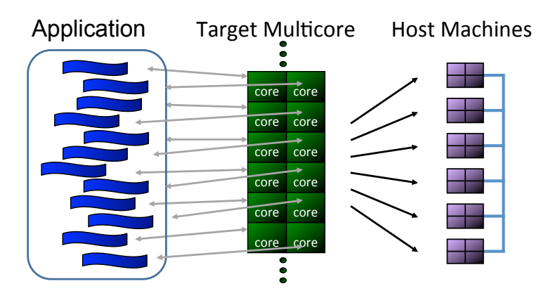

目标架构是一个拼接的多核CPU，其中每个拼接都包含一个低功耗的有序处理内核、32KB指令/数据高速缓存、一个512KB L2高速缓存片和一个网络路由器。这和其他商用CPU类似，比如Tilera的Tile64 (64核)，Intel的SCC (48核)，Intel的Knights Landing (72核)[1]。瓦片使用高带宽、2D网状片上网络互连，其中每一跳需要两个周期。瓦片和网络都以1GHz的频率计时。64核机器的架构示意图如图2所示。

> 图2: 目标架构 —— 具有64个瓦片和一个2D网状片上网络的瓦片式芯片多处理器。每个瓦片包含一个处理核心、L1和L2高速缓存以及一个网络交换机(SW)。

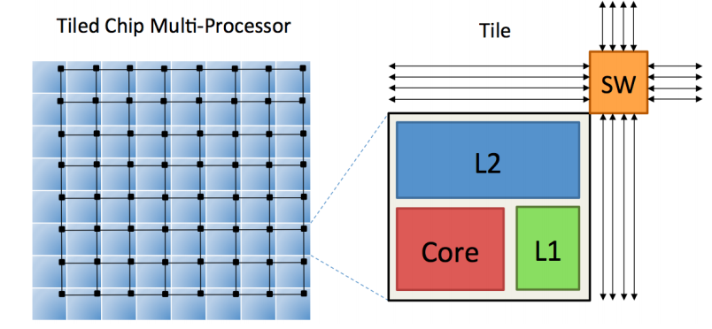

我们使用共享L2缓存配置，因为这是商用多核最常见的末级缓存设计。在共享和私有L2缓存之间的比较实验中，我们观察到，由于共享缓存的聚合缓存容量增加，共享缓存的内存流量明显减少，OLTP工作负载的性能提高(结果未显示)。由于L2片分布在不同的片上，模拟的多核系统是一个NUCA(非统一缓存访问)架构，其中L2缓存延迟随着2D网格中的距离而增加。

## 3.2 DBMS

我们基于pthreads实现了自己的轻量级内存数据库管理系统，并在Graphite上运行。它作为单个进程执行，工作线程的数量等于内核的数量，每个线程映射到一个不同的内核。DBMS中的所有数据都以面向行的方式存储在内存中。该系统支持基本的散列表索引和一个可插入的锁管理器，它允许我们在第2节中描述的并发控制方案的不同实现中进行交换。它还允许索引和锁管理器被分区(就像H-STORE方案一样)或以集中模式运行。

我们的系统不模拟客户端线程；相反，每个工作进程包含一个按顺序服务的固定长度的事务队列。这减少了网络协议的开销，而这些开销本来就很难在模拟器中建模。每个事务包含与查询调用混合在一起的程序逻辑。当查询在程序逻辑中遇到时，它们由事务的工作线程串行执行。在系统达到稳定状态所需的足够长的预热时间后，收集事务统计信息，如吞吐量、延迟和中止率。

除了运行时统计，我们的DBMS还报告每个事务在系统的不同组件中花费了多少时间[21]。我们将这些测量分为六类:

- **USEFUL WORK:** 事务实际执行应用程序逻辑并对系统中的元组进行操作的时间。
- **ABORT:** DBMS回滚中止的事务所做的所有更改时产生的开销。
- **TS ALLOCATION:** 系统从集中式分配器获取一个惟一时间戳所花费的时间。对于那些需要时间戳的并发控制方案，分配开销在每个事务中只发生一次。
- **INDEX:** 事务在表的哈希索引中花费的时间，包括哈希表中存储桶的低级锁存开销。
- **WAIT:** 事务必须等待的总时间。事务可以等待锁(例如，2PL)或者等待其值尚未准备好的元组(例如，T/O)。
- **MANAGER:** 事务在锁管理器或时间戳管理器中花费的时间。这不包括它必须等待的任何时间。

## 3.3 工作负载

接下来，我们将描述在我们的测试平台中为该分析实现的两个基准。

**YCSB:** 是Yahoo!的。云服务基准是基于互联网的公司创建的代表大规模服务的工作负载的集合[8]。对于本文中的所有YCSB实验，我们使用了大约20GB的YCSB数据库，其中包含一个包含2000万条记录的表。每个YCSB元组有一个主键列和10个附加列，每个列有100字节随机生成的字符串数据。DBMS为主键创建一个散列索引。

默认情况下，YCSB工作负载中的每个事务访问数据库中的16条记录。每次访问可以是读取或更新。事务在其程序逻辑中不执行任何计算。所有的查询都是相互独立的；也就是说，一个查询的输入不依赖于前一个查询的输出。YCSB中访问的记录遵循Zipfian分布，该分布由一个名为theta的参数控制，该参数会影响基准测试中的争用级别[18]。

当θ= 0时，所有元组以相同的频率被访问。但是当θ=0.6或θ=0.8时，数据库中10%元组的热点分别被所有事务的大约40%和大约60%访问。

**TPC-C:** 该基准是评估OLTP系统性能的当前行业标准[40]。它由九个表组成，模拟以仓库为中心的订单处理应用程序。TPC-C中的所有事务都提供一个仓库id作为事务的输入参数，它是除ITEM之外的所有表的祖先外键。对于需要数据分区(即H-STORE)的并发控制算法，TPC-C基于该仓库id进行分区。

在我们的模拟中，TPC-C中的五个事务中只有两个(付款和新订单)被建模。由于这两者占总TPC-C工作量的88%,这是一个很好的近似值。我们的TPC-C版本是一个“真诚”的实现，尽管我们忽略了工作线程的“思考时间”。每个工作者不停顿地发出事务；这减轻了随着并发事务数量的增加而增加数据库大小的需要。

## 3.4 模拟器与真实硬件

为了证明使用Graphite模拟器可以产生与现有硬件相当的结果，我们在英特尔至强E7-4830上部署了我们的DBMS，并执行了中等争用(theta=0.6)的读取密集型YCSB工作负载。然后，我们使用相同数量的内核在Graphite中执行相同的工作负载。

图3中的结果表明，所有并发控制方案在Graphite和真实CPU上表现出相同的性能趋势。然而，我们注意到，MVCC、时间戳和OCC之间的相对性能差异在图3b中是不同的。这是因为MVCC比其他两种方案更多地访问内存，并且这些访问在双插槽系统上更昂贵。Graphite模拟单个CPU插槽，因此没有插槽间的流量。除此之外，由于时间戳分配期间跨内核通信的开销，基于T/O和WAIT_DIE方案的吞吐量在32个内核上会下降。我们将在第4.3节讨论这个问题。

> 图3:模拟器与真实硬件 —— 在Graphite和真实多核CPU上运行的并发控制方案的比较，使用YCSB工作负载，中等争用(theta=0.6)。

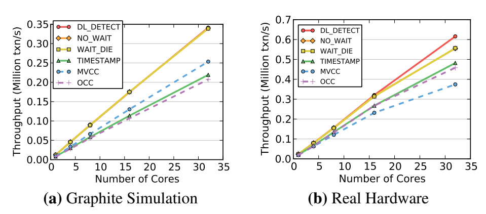

# 4. 设计选择和优化

这项研究的主要挑战之一是设计尽可能可伸缩的DBMS和并发控制方案。在1000个内核上部署DBMS时，实现的许多次要方面会成为性能的障碍。我们尽最大努力优化每个算法，消除所有可能的可扩展性瓶颈，同时保留它们的基本功能。这项工作的大部分是消除共享数据结构和设计经典算法的分布式版本[3]。

在本节中，我们将讨论我们开发众核OLTP DBMS的经验，并重点介绍我们为实现可扩展系统而做出的设计选择。此外，我们确定了2PL和T/O方案的基本瓶颈，并展示了硬件支持如何缓解这些问题。我们在第5节详细分析了各个方案。

## 4.1 常规优化

我们首先讨论我们为提高DBMS在所有并发控制方案中的性能而添加的优化。

**内存分配:** 当我们试图将DBMS扩展到较大的内核数量时，首先遇到的限制之一是malloc函数。当使用默认Linux版本的malloc时，我们发现DBMS花费大部分时间等待内存分配。即使对于只读工作负载，这也是一个问题，因为DBMS仍然需要复制时间戳中的读取记录，并为访问跟踪数据结构创建内部元数据句柄。我们尝试运行优化版本(TCMalloc[15]，jemalloc[13])，但两者都产生了类似的令人失望的结果。

我们通过编写定制的malloc实现克服了这个问题。与TCMalloc和jemalloc类似，每个线程都被分配了自己的内存池。但是不同之处在于，我们的分配器会根据工作负载自动调整池的大小。例如，如果一个基准经常分配大块的连续内存，那么池的大小就会增加，以分摊每次分配的成本。

**锁表:** 正如前面的工作[26，36]所指出的，锁表是DBMS中的另一个关键争用点。我们没有使用集中式锁表或时间戳管理器，而是以每元组的方式实现这些数据结构，其中每个事务只锁存它需要的元组。这提高了可伸缩性，但增加了内存开销，因为DBMS为锁共享者/等待者信息维护额外的元数据。实际上，这种元数据(几个字节)对于大型元组来说是可以忽略的。

**互斥:** 访问互斥锁是一项开销很大的操作，需要在芯片上发送多条消息。由互斥体保护的中央临界区将限制任何系统的可伸缩性(参见4.3节)。因此，避免在关键路径上使用互斥是很重要的。对于2PL来说，保护集中式死锁检测器的互斥体是主要的瓶颈，而对于T/O算法来说，它是用于分配唯一时间戳的互斥体。在随后的部分中，我们将描述我们开发的消除对这些互斥体的需求的优化。

## 4.2 可扩展的2PL

我们接下来讨论2PL算法的优化。

**死锁检测:** 对于DL_DETECT，我们发现当多个线程在集中式数据结构中竞争更新它们的等待图时，死锁检测算法是一个瓶颈。我们通过跨内核划分数据结构并使死锁检测器完全无锁来解决这个问题。现在，当一个事务更新它的等待图时，它的线程用它正在等待的没有任何锁的事务更新它的队列。该步骤是本地的(即，没有跨核通信)，因为线程不写入其他事务的队列。

在死锁检测过程中，线程在通过仅读取相关线程的队列而不锁定队列来构建的部分等待图中搜索循环。虽然这种方法可能不会在死锁形成后立即发现它，但是线程可以保证在后续的传递中找到它[5]。

**锁抖动:** 即使改进了检测，DL_DETECT仍然不会因为锁抖动而伸缩。当一个事务在提交之前一直持有其锁，从而阻塞所有其他试图获取这些锁的并发事务时，就会出现这种情况。这变成了一个高度争用和大量并发事务的问题，因此是所有2PL方案的主要瓶颈。

> 图4:锁抖动 —— 使用DL_DETECT方案的写密集型YCSB工作负载的结果，没有死锁检测。每个事务都按其主键顺序获取锁。

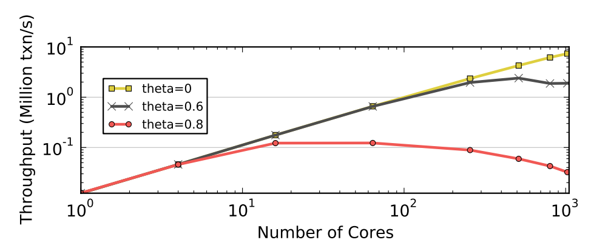

为了演示系统颠簸的影响，我们使用DL_DETECT的变体执行了一个写密集型YCSB工作负载(即50/50%读写混合)，其中事务以主键顺序获取锁。尽管这种方法并不适用于所有工作负载，但它消除了死锁检测的需要，并允许我们更好地观察系统颠簸的影响。图4示出了对于不同的争用级别，作为核心数量的函数的事务吞吐量。当工作负载没有不对称时(theta=0)，锁争用很少，吞吐量几乎呈线性增长。然而，随着争用级别的增加，系统颠簸开始发生。在中等争用情况下(θ= 0.6)，吞吐量在数百个内核时达到峰值，然后由于颠簸而下降。在最高争用级别(theta=0.8)，DBMS的吞吐量在16个内核时达到峰值，并且无法超过该值。模拟结果显示，几乎所有的执行时间都花在等待锁上。因此，锁抖动是基于锁的方法的关键瓶颈，它限制了高争用场景中的可伸缩性。

**等待与中止:** 在DL_DETECT中，系统颠簸问题可以通过中止一些事务来解决，以减少任何时间点的活动事务数量。理想地，这保持系统以图4中实现的最高吞吐量运行。我们在DBMS中添加了一个超时阈值，该阈值会导致系统中止并重新启动任何等待锁的时间超过阈值的事务。我们注意到，当timeout为零时，这个算法相当于NO_WAIT。

我们在64核CPU上使用不同的超时阈值运行了具有高争用的相同YCSB工作负载。我们在DBMS中测量DL_DETECT方案的吞吐量和中止率，扫描超时时间为0-100 ms。

> 图5:等待与中止 —— DL_DETECT在64个内核上运行高争用YCSB (theta=0.8)的不同超时阈值的结果。

图5中的结果表明，当CPU具有少量内核时，最好使用较短的超时阈值。这突出了性能和事务中止率之间的权衡。超时越短，中止率越高，这减少了正在运行的事务的数量，并缓解了系统颠簸问题。使用较长的超时会降低中止率，但代价是更多的系统颠簸。因此，在本文中，我们评估DL_DETECT，将其超时阈值设置为100秒。实际上，该阈值应基于应用的工作负载特征。

## 4.3可扩展时间戳排序

最后，我们讨论了我们为提高基于T/O的算法的可伸缩性而开发的优化。

**时间戳分配:** 所有基于T/O的算法都基于事务分配的时间戳做出排序决定。因此，DBMS必须保证每个时间戳只分配给一个事务。确保这一点的一个简单方法是在分配器的临界区使用互斥体，但是这会导致性能下降。另一种常见的解决方案是使用原子加法操作来推进全局逻辑时间戳。这需要更少的指令，因此DBMS的临界区被锁定的时间比互斥锁要短。但是正如我们将要展示的，这种方法对于1000核的CPU来说仍然是不够的。我们现在讨论三种时间戳分配方案:(1)批处理的原子加法[42]，(2) CPU时钟，以及(3)硬件计数器。

使用批量原子添加方法，DBMS使用相同的原子指令来分配时间戳，但是时间戳管理器为每个请求批量返回多个时间戳。这种方法首先是在筒仓DBMS中提出的[42]。

为了使用基于时钟的分配来生成时间戳，每个工作线程从其本地内核读取一个逻辑时钟，然后将其与其线程id连接起来。只要所有时钟同步，这就提供了良好的可扩展性。在分布式系统中，同步是使用软件协议[31]或外部时钟[9]完成的。然而，在众核CPU上，这带来了巨大的开销，因此需要硬件支持。截至2014年7月，只有英特尔CPU支持跨内核同步时钟。

最后，第三种方法是使用高效的内置硬件计数器。计数器在物理上位于CPU的中心，使得到每个内核的平均距离最小化。目前没有现有的CPU支持这一点。因此，我们在Graphite中实现了一个计数器，通过片上网络发送时间戳请求，在单个周期内自动递增它。

> 图6:时间戳分配微基准 —— 不同时间戳分配方法的吞吐量测量。

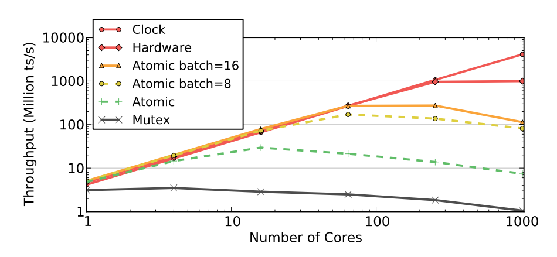

为了确定DBMS可以为每个方法分配时间戳的最大速率，我们运行了一个微基准，其中线程不断获取新的时间戳。图6中示出了作为核心数量的函数的吞吐量。我们首先注意到基于互斥体的分配具有最低的性能，在1024个内核上每秒大约有一百万个时间戳(ts/s)。原子添加方法在内核数量较少的情况下最高可达3000万ts/s，但随着内核数量的减少，吞吐量会下降到800万ts/s。这是由于写回和使每个时间戳的相应缓存行的最后一个副本无效而产生的缓存一致性流量。对于1024核CPU来说，这需要一次芯片间的往返通信或大约100周期，这意味着在1GHz频率下的最大吞吐量为1000万ts/s。批处理这些分配确实有所帮助，但是当存在争用时会导致性能问题(见下文)。基于硬件的解决方案能够随着内核数量的增加而扩展。由于使用基于硬件计数器的方法增加时间戳只需一个周期，因此这种方法实现了10亿ts/s的最大吞吐量。性能提升来自于通过远程执行加法操作来消除一致性流量。基于时钟的方法具有理想的(即线性)缩放，因为这种解决方案是完全分散的。

> 图7: 时间戳分配 —— 使用时间戳和不同时间戳分配方法的YCSB工作负载的吞吐量。

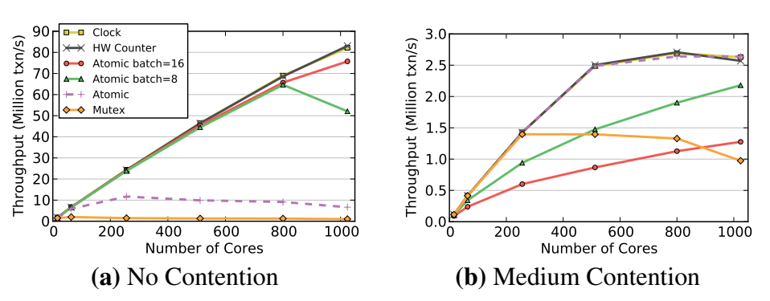

我们还在DBMS中测试了不同的分配方案，以了解它们在实际工作负载中的表现。在这个实验中，我们使用时间戳方案执行了一个写密集型YCSB工作负载，具有两个不同的争用级别。图7a中的结果表明，在没有竞争的情况下，分配方法的相对性能与图6中的相同。然而，当存在竞争时，图7b中的趋势大不相同。首先，使用批量原子添加方法的DBMS的吞吐量要差得多。这是因为当事务由于冲突而重新启动时，它会在同一个工作线程中重新启动，并在最后一批中被分配下一个时间戳。但是这个新的时间戳也将小于导致中止的另一个事务的时间戳，因此它将不断重新启动，直到线程获取新的一批。非批量原子添加方法的性能与时钟和硬件计数器方法一样好。因此，对于本文而言，DBMS使用无批处理的原子加法来分配时间戳，因为其他方法需要专门的硬件支持，而目前并非所有CPU都提供这种支持。

**分布式验证:** 最初的OCC算法在读取阶段的末尾包含一个关键部分，在这里将事务的读取集与先前事务的写入集进行比较，以检测冲突。尽管这一步很短，但如上所述，任何互斥保护的临界区都会严重损害可伸缩性。我们通过使用每元组验证来解决这个问题，这种验证将这个检查分解成更小的操作。这类似于Hekaton [29]中使用的方法，但更简单，因为我们只支持每个元组的单一版本。

**本地分区:** 我们优化了原始的H-STORE协议，以利用共享内存。因为DBMS的工作线程在单个进程中运行，所以我们允许多分区事务直接访问远程分区的元组，而不是发送由远程分区的工作线程执行的查询请求。这允许比使用进程内通信更快的更简单的实现。使用这种方法，数据不会被物理分区，因为片上通信延迟很低。所有线程无需复制即可访问只读表，从而减少了内存占用。最后，我们使用与上面相同的时间戳分配优化来避免由于时钟偏差而导致的强制性等待时间[38]。

# 5. 实验分析

我们现在展示我们对不同并发控制方案的分析结果。我们的实验分为两类:(1)可扩展性和(2)敏感性评估。对于前者，我们希望确定随着内核数量的增加，这些方案的性能如何。我们将内核数量扩展到1024个，同时固定工作负载参数。通过敏感性实验，我们改变了单个工作负载参数(例如，事务访问偏斜)。我们报告了DBMS的总模拟吞吐量，以及每个工作线程在3.2节中列出的系统的不同部分花费的时间的细分。

我们从YCSB工作量的广泛分析开始。这种工作负载的性质允许我们更改其参数，并创建各种以不同方式强调并发控制方案的场景。接下来，我们分析TPC-C工作负载，其中我们改变仓库的数量，并观察对算法吞吐量的影响。H-STORE方案被排除在我们最初的实验之外，仅在5.5节分析数据库分区时引入。

## 5.1 只读工作负载

在第一个可伸缩性分析实验中，我们执行了一个YCSB工作负载，其中包含具有统一访问分布的只读事务。每个事务一次执行16个独立的元组读取。在我们探索更复杂的工作负载安排之前，这为每个并发控制方案提供了一个基线。

> 图8: 只读工作负载 —— 只读YCSB工作负载的结果。

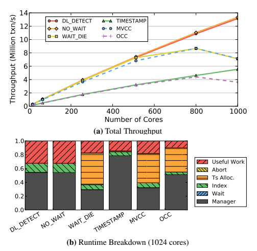

在一个完全可扩展的DBMS中，吞吐量应该随着内核数量的增加而线性增加。然而，对于图8a中的T/O方案，情况并非如此。图8b中的时间分解表明时间戳分配成为大核心计数的瓶颈。OCC遇到瓶颈甚至更早，因为它需要为每个事务分配两次时间戳(即，在事务开始时和验证阶段之前)。无论有多少个内核，OCC和时间戳的性能都比其他算法差得多。这些算法浪费周期，因为它们复制元组来执行读取，而其他算法就地读取元组。

## 5.2 写入密集型工作负载

只读工作负载代表一种乐观的(也是不现实的)场景，因为它不会产生数据争用。但是，即使我们在工作负载中引入写入，数据集的大尺寸也意味着任何两个事务同时访问相同元组的概率很小。实际上，OLTP应用程序的访问分布很少是一致的。相反，它倾向于遵循Zipfian偏斜，其中某些元组比其他元组更有可能被访问。这可能是由于数据库中元素流行度的偏斜或者基于时间局部性的偏斜(即，较新的元组被更频繁地访问)。结果，这增加了争用，因为事务竞争访问相同的数据。

我们执行了一个写密集型YCSB工作负载，包括一次访问16个元组的事务。在每个事务中，这些访问中的每一个都将以50%的概率修改元组。工作负载中的偏斜量由参数theta决定(参见第3.3节)。对于事务的访问模式，我们使用中、高争用级别。

> 图9: 写入密集型工作负载(中等争用) —— 中等争用情况下YCSB工作负载的结果(theta=0.6)。

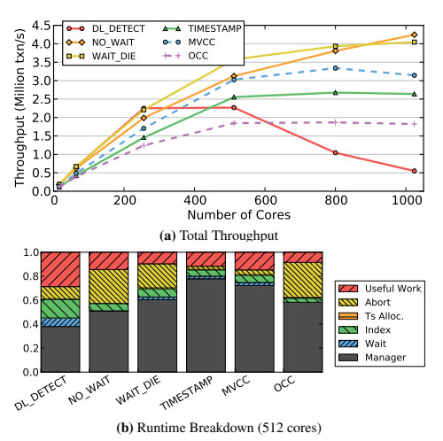

图9中的介质争用结果显示，NO_WAIT和WAIT_DIE是唯一超过512个内核的2PL方案。NO_WAIT比WAIT_DIE的伸缩性好。对于DL_DETECT，图9b中的分解指示DBMS在这些方案中花费更大百分比的时间等待。DL_DETECT被256个内核的锁抖动抑制。NO_WAIT是最具伸缩性的，因为它消除了这种等待。然而，我们注意到NO_WAIT和WAIT_DIE都有很高的事务中止率。在我们的实验中，这不是一个问题，因为重新启动一个中止的事务开销很低；撤消事务所需的时间略少于重新执行事务查询所需的时间。但实际上，对于事务必须回滚对多个表、索引和物化视图的更改的工作负载，开销可能会更大。

图9a中的结果也表明T/O算法总体上表现良好。时间戳和MVCC都能够重叠操作，减少等待时间。MVCC的性能稍好一些，因为它保留了一个元组的多个版本，因此即使读请求具有较旧的时间戳，也可以为其提供服务。OCC的表现不如它，因为它花了很大一部分时间来中止事务；开销更大，因为每个事务都必须在冲突解决之前完成。

> 图10: 写入密集型工作负载(高争用) —— YCSB工作负载在高争用情况下的结果(theta=0.8)。

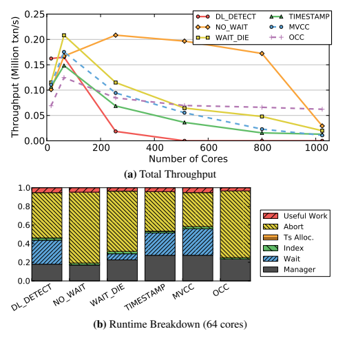

对于更高的争用，图10中的结果显示所有算法的性能都差得多。图10a示出了几乎所有的方案都不能扩展到超过64个核心。超过这一点，DBMS的吞吐量停止增加，增加的核心数量不会带来性能优势。NO_WAIT最初的表现优于所有其他的，但是后来却屈服于锁抖动(参见图4)。令人惊讶的是，OCC在1024核上表现最佳。这是因为尽管在验证阶段大量的事务发生冲突并且不得不中止，但是总是允许提交一个事务。图10b中的时间分解示出了DBMS在每个方案中花费大量时间来中止事务。
为了更好地了解每个方案何时会随着争用的增加而出现问题，我们将内核数量固定为64，并对偏斜参数(theta)进行了敏感性分析。图11中的结果表明，对于小于0.6的θ值，竞争对性能几乎没有影响。但是对于更高的设置，吞吐量会突然下降，导致所有算法都不可伸缩，并且对于大于0.8的值，吞吐量接近于零。

> 图11:写入密集型工作负载(可变争用) —— YCSB工作负载在64个内核上不同争用级别的结果。

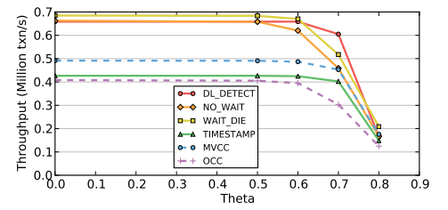

## 5.3 工作集大小

事务访问的元组数量是影响可伸缩性的另一个因素。当事务的工作集很大时，并发事务访问相同数据的可能性就会增加。对于2PL算法，这增加了事务持有锁的时间长度。然而，对于T/O，较长的事务可以减少时间戳分配争用。在这个实验中，我们改变了写入密集型YCSB工作负载中每个事务访问的元组数量。因为短事务导致更高的吞吐量，所以我们测量每秒访问的元组数量，而不是完成的事务数量。我们使用中等偏斜设置(theta=0.6)，并将核心数固定为512。

> 图12:工作集大小 —— 在512个内核上，对于具有不同数量查询的事务，每个内核访问的元组数量(theta=0.6)。

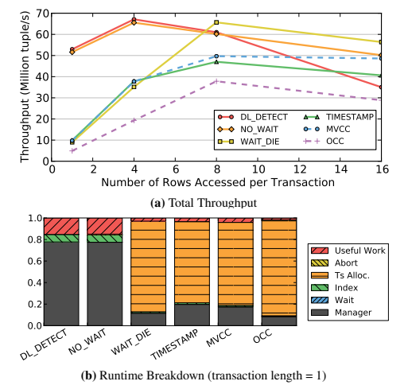

图12中的结果表明，当事务较短时，锁争用较低。DL_DETECT和NO_WAIT在这种情况下具有最好的性能，因为死锁很少，中止的数量也很少。但是随着事务工作集大小的增加，DL_DETECT的性能会由于系统颠簸的开销而下降。对于T/O算法和WAIT_DIE，当事务较短时，吞吐量较低，因为DBMS将其大部分时间用于分配时间戳。但是随着事务变长，时间戳分配成本被分摊。OCC的表现最差，因为它为每个事务分配的时间戳数量是其他方案的两倍。

图12b示出了事务长度等于1的时间分解。同样，我们看到T/O方案将大部分执行时间用于分配时间戳。随着事务变得更长，图8b和9b显示分配不再是主要瓶颈。图12中的结果还表明，基于T/O的算法比DL_DETECT更能容忍竞争。

## 5.4 读/写混合

并发控制的另一个重要因素是事务的读/写混合。更多的写入会导致更多的争用，从而以不同的方式影响算法。在这个实验中，我们在64核配置上使用YCSB，并改变每个事务执行的读取查询的百分比。每个事务使用high skew设置(theta=0.8)执行16次查询。

> 图13: 读/写混合YCSB的结果，具有不同百分比的高争用的只读事务(theta=0.8)。

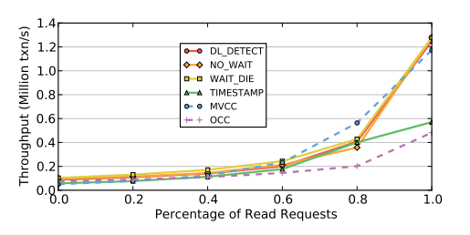

图13中的结果表明，当存在更多读取事务时，所有算法都实现了更好的吞吐量。在100%读取时，结果与图8a中先前的只读结果相匹配。时间戳和OCC性能不佳，因为它们复制元组用于读取。当写入事务数量较少时，MVCC表现最佳。这也是支持多版本非阻塞读取最有效的例子；读取查询基于时间戳访问元组的正确版本，并且不需要等待写入事务。这是与时间戳的一个关键区别，在时间戳中，延迟到达的查询被拒绝，并且它们的事务被中止。

## 5.5 数据库分区

到目前为止，在我们的分析中，我们假设数据库作为单个分区存储在内存中，并且所有工作线程都可以访问任何元组。然而，对于H-STORE方案，DBMS将数据库分割成不相交的子集，以增加可扩展性[38]。只有当数据库的分区方式使得大多数事务只需要访问单个分区上的数据时，这种方法才能获得良好的性能[34]。当工作负载包含多分区事务时，H-STORE不能很好地工作，因为它采用了粗粒度的锁定方案。每个事务访问多少个分区也很重要；例如，如果H-STORE访问所有分区，即使有少量多分区事务，其性能仍然很差。

为了在众核环境中探索这些问题，我们首先在理想条件下将H-STORE与其他六种方案进行比较。然后我们分析它在多分区事务中的性能。

我们将YCSB数据库划分为与每次试验中内核数量相同的分区。因为YCSB只有一个表，所以我们使用一个简单的散列策略根据它们的主键将元组分配给分区，这样每个分区存储大约相同数量的记录。这些测试使用写密集型工作负载，其中每个事务执行16个查询，所有查询都使用索引查找，没有任何偏斜(theta=0.0)。我们还假设DBMS知道在运行时每个事务开始之前分配给哪个分区[34]。

> 图14:数据库分区 —— 分区YCSB数据库上只读工作负载的结果。事务基于均匀分布(theta=0.0)访问数据库。

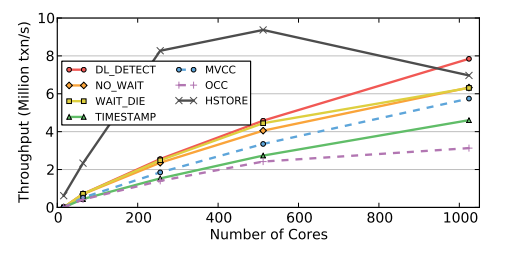

在第一个实验中，我们执行了一个只包含单分区事务的工作负载。图14中的结果表明，H-STORE的性能优于所有其他方案，最高可达800个内核。因为它是专门为利用分区而设计的，所以它的锁定开销比其他方案低得多。但是因为H-STORE也依赖于时间戳分配来进行调度，所以它和其他基于T/O的方案一样存在瓶颈。因此，内核数量越多，性能越差。对于其他方案，分区对吞吐量没有显著影响。然而，有可能调整它们的实现以利用分区的优势[36]。

> 图15:多分区事务HSTORE方案对具有多分区事务的YCSB工作负载的敏感性分析。

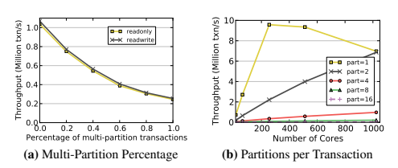

接下来，我们修改了YCSB驱动程序，以改变工作负载中多分区事务的百分比，并在64核CPU上部署了DBMS。图15a中的结果说明了H-STORE方案的两个重要方面。首先，无论工作负载是否包含修改数据库的事务，性能都没有差别；这是因为H-STORE的锁定方案。其次，DBMS的吞吐量随着工作负载中多分区事务数量的增加而下降，因为它们减少了系统中的并行性[34，42]。

最后，我们使用10%的多分区事务执行YCSB，并改变它们访问的分区数量。图15b中的单分区工作负载的DBMS的吞吐量表现出与图14中的H-STORE相同的由于时间戳分配而导致的降低。这也是一个和两个分区工作负载的吞吐量汇聚到1000个内核的原因。由于并行性的降低和跨核通信的增加，DBMS不能随着访问四个或更多分区的事务而扩展。

## 5.6 TPC-C

最后，我们分析了所有并发控制算法在运行TPC-C基准测试时的性能。TPC-C中的事务比YCSB中的更复杂，是一大类OLTP应用程序的代表。例如，它们使用读-修改-写访问模式来访问多个表，一些查询的输出被用作同一事务中后续查询的输入。TPC-C事务也可能因为其程序逻辑中的某些条件而中止，而不仅仅是因为DBMS检测到冲突。
每次审判的工作量包括50%的新订单和50%的付款交易。这两个组成了默认TPC- C组合的88%,并且在复杂性方面是最有趣的。支持其他事务需要额外的DBMS特性，比如并发更新的B树锁存。这将给系统增加额外的开销，因此我们将众核CPU的索引扩展问题推迟到以后的工作中。

TPC-C数据库的大小通常由仓库的数量来衡量。仓库是数据库中几乎所有表的根实体。我们遵循TPC-C规范，其中约10%的新订单交易和约15%的支付交易访问“远程”仓库。对于基于分区的方案，如H-STORE，每个分区由单个仓库的所有数据组成[38]。这意味着远程仓库事务将访问多个分区。

我们首先在一个4仓库数据库上执行TPC-C工作负载，每个仓库有100MB数据(总共0.4GB)。这允许我们在工作线程多于仓库时评估算法。然后，我们在一个有1024个仓库的数据库上再次执行相同的工作负载。由于在Graphite simulator中运行的内存限制，我们将这个数据库的大小减少到每个仓库26MB数据(总共26GB)。这不会影响我们的测量，因为每个事务访问的元组数量与数据库大小无关。

### 5.6.1 4个仓库

图16中的结果表明，当仓库数量少于核心数量时，所有的方案都无法针对TPC-C进行扩展。使用H-STORE，DBMS由于其分区方案而无法利用额外的核心；额外的工作线程实际上是空闲的。对于其他方案，图16c中的结果表明，它们能够针对NewOrder事务扩展到64个内核。时间戳、MVCC和OCC由于高中止率而具有较差的可伸缩性。由于系统颠簸和死锁，DL_DETECT不可伸缩。但是图16b中的结果示出了没有支付交易的方案规模。这样做的原因是，每个付款交易都会更新仓库中的一个字段(W_YTD)。这意味着事务(1)必须获取相应元组上的排他锁(即DL_DETECT)或者(2)对该字段发出预写(即基于T/O的算法)。如果线程的数量大于仓库的数量，那么更新仓库表就会成为一个瓶颈。

> 图16: TPC-C (4个仓库) —— 运行多达256个内核的TPC-C工作负载的结果。

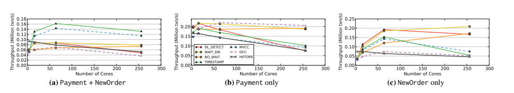

通常，这两个事务的主要问题是更新仓库表的争用。每个付款交易更新其对应的仓库条目，每个新订单将读取它。对于基于2PL的算法，这些读写操作会相互阻塞。时间戳和MVCC这两种基于T/O的算法优于其他方案，因为它们的写操作不会被读操作阻塞。这消除了2PL的锁阻塞问题。因此，新订单交易可以与支付交易并行执行。

## 5.6.2 1024个仓库

接下来，我们使用多达1024个内核的1024个仓库来执行TPC-C工作负载。再一次，我们在图17中看到，没有方案能够扩展。结果表明，与第5.6.1节不同，DBMS的吞吐量受新订单事务的限制。这是由于每个方案的原因不同。

> 图17: TPC-C (1024个仓库) —— 运行多达1024个内核的TPC-C工作负载的结果。

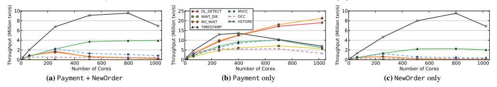

对于几乎所有的方案，主要的瓶颈是维护锁和闩锁的开销，即使没有争用也会发生这种情况。例如，NewOrder事务从只读项目表中读取元组，这意味着对于2PL方案，每次访问都会在DBMS中创建一个共享锁条目。对于大量并发事务，锁元数据会变得很大，因此更新它们需要更长的时间。在事务运行时，OCC不使用这种锁，但是在验证阶段，它会为每个被访问的元组使用锁。对于像NewOrder这样占用空间大的事务，获取这些闩锁成为一个问题。尽管MVCC也没有锁，但是每个读取请求都会生成一个新的历史记录，这会增加内存流量。但是，我们注意到，所有这些在技术上都是不必要的工作，因为条目表从未被修改过。

图17b中的结果表明，当仓库的数量等于或大于工作线程的数量时，支付交易中的瓶颈被消除。这提高了所有方案的性能。然而，对于T/O方案，在较大的核心数量时，吞吐量变得太高，因此它们受到时间戳分配的抑制。因此，它们无法实现高于约1000万txn/s的速度。这与图12a中的场景相同，在该场景中，2PL在短期交易中的表现优于T/O。

H-STORE的整体性能最佳，因为它能够利用分区，即使在工作负载中使用大约12%多分区事务。这证实了之前研究的结果，即当少于20%的工作负载包含多分区事务时，H-STORE优于其他方法[34，42]。然而，在1024个内核时，它受到DBMS的时间戳分配的限制。

# 6. 讨论

我们现在讨论前面几节的结果，并提出解决方案来避免众核DBMS的这些可伸缩性问题。

## 6.1 DBMS瓶颈

我们的评估表明，所有七种并发控制方案都无法扩展到大量内核，但原因和条件各不相同。表2总结了每个方案的结果。特别是，我们发现了可伸缩性的几个瓶颈:(1)锁抖动，(2)抢先中止，(3)死锁，(4)时间戳分配，以及(5)内存到内存复制。

> 表2: 第5节中评估的每个并发控制方案的瓶颈总结。

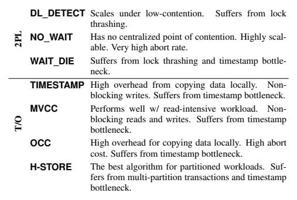

> 针对表2的翻译如下:

- 2PL
  - DL_DETECT: 在低争用情况下扩展，遭受锁抖动。
  - NO_WAIT: 没有集中的竞争，高度可扩展，非常高的中止率。
  - WAIT_DIE: 遭受锁抖动和时间戳瓶颈。
- T/O
  - TIMESTAMP: 本地复制数据的高开销，非阻塞写入，遭遇时间戳瓶颈。
  - MVCC: 在读取密集型工作负载下表现出色，非阻塞读写，遭遇时间戳瓶颈。
  - OCC: 本地复制数据的高开销，高中止成本，遭遇时间戳瓶颈。
  - H-STORE: 分区工作负载的最佳算法，受到多分区事务和时间戳瓶颈的困扰。

任何基于等待的算法都会发生抖动。如4.2节所述，通过主动中止可以减轻系统颠簸。这导致了中止和性能之间的权衡。一般来说，5.2节中的结果表明，对于高争用负载，非等待死锁预防方案(NO_WAIT)的性能比死锁检测(DL_DETECT)好得多。
尽管没有一种并发控制方案能在所有工作负载下都表现最佳，但在某些情况下，一种方案可能会优于其他方案。因此，有可能将两类或两类以上的算法合并到一个DBMS中，并根据工作量在它们之间切换。例如，DBMS可以使用DL_DETECT处理争用很少的工作负载，但是当事务由于系统颠簸而需要很长时间才能完成时，可以切换到NO_WAIT或基于T/O的算法。也可以采用混合方法，比如MySQL的DL_DETECT + MVCC方案，其中只读事务使用多版本，所有其他事务使用2PL。

这些结果也清楚地表明，需要新的硬件支持来克服这些瓶颈。例如，当吞吐量很高时，所有的T/O方案都会遇到时间戳分配瓶颈。当核心数量很大时，使用原子添加方法会导致工作线程跨芯片发送许多消息来修改时间戳。我们在4.3节中展示了时钟和硬件计数器方法如何在没有批处理缺点的情况下实现最佳性能。因此，我们认为它们应该包含在未来的CPU架构中。
我们还看到，在一些方案中，内存问题会导致速度变慢。缓解这个问题的一个方法是在CPU上添加一个硬件加速器，在后台进行内存复制。这将消除通过CPU管道加载所有数据的需要。在第4.1节中，我们还展示了malloc如何成为另一个瓶颈，以及我们如何通过开发自己的支持动态池大小调整的实现来克服它。但是如果有大量的内核，这些池就变得太难用一个全局内存控制器来管理。我们认为，未来的CPU将需要切换到分散或分层的内存控制器，以提供更快的内存分配。

## 6.2 多核与多节点系统

分布式DBMS被吹捧为能够超越单节点DBMS所能支持的范围[38]。当一个节点上的CPU核心数和可用内存量很小时，尤其如此。但是转移到多节点架构会引入一个新的性能瓶颈:分布式事务[3]。由于这些事务访问的数据可能不在同一个节点上，DBMS必须使用原子提交协议，如两阶段提交[16]。这种协议的协调开销抑制了分布式DBMSs的可伸缩性，因为网络上节点之间的通信很慢。相比之下，共享内存环境中线程之间的通信要快得多。这意味着，除了最大的OLTP应用[42]之外，拥有大量DRAM的单个众核节点的性能可能优于分布式DBMS。

对于多节点DBMS，可能需要两个层次的抽象:节点之间的无共享实现和单个芯片内的多线程共享内存DBMS。这种层次结构在高性能计算应用程序中很常见。因此，需要做更多的工作来研究OLTP DBMS中这种分层并发控制的可行性和挑战。

# 7. 相关的工作

[39]中的工作是对运行OLTP工作负载的DBMS进行的首批硬件分析之一。他们的评估集中在多处理器系统上，例如如何将进程分配给处理器以避免带宽瓶颈。另一项研究[37]测量了OLTP工作负载中由于缓存未命中导致的CPU停滞时间。这项工作后来在[2]和最近的[41，35]中得到了扩展。

除了H-STORE [14，22，38，43]和OCC [28]之外，我们的测试平台中实现的所有其他并发控制方案都来自Bernstein等人的开创性调查[3，5]。近年来，已经进行了一些努力来改进这些经典实现的缺点[11，24，32，42]。其他工作包括独立的锁管理器，它们被设计成在多核CPU上更具可扩展性[36，26]。我们现在将进一步详细描述这些系统，并讨论为什么它们仍然不可能在未来的众核架构上扩展。

Shore-MT [24]是Shore [7]的多线程版本，采用类似DL_DETECT的死锁检测方案。Shore-MT的大部分改进来自于优化系统中的瓶颈，而不是并发控制，比如日志[25]。在高争用工作负载上，系统仍然会遇到与DL_DETECT相同的系统颠簸瓶颈。

DORA是一个构建在Shore-MT [32]上的OLTP执行引擎。与传统DBMS体系结构中的将事务分配给线程不同，DORA将线程分配给分区。当事务需要访问特定分区的数据时，它的句柄被发送到该分区的相应线程，然后在队列中等待轮到它。这类似于H-STORE的分区模型，除了DORA支持每个分区多个记录级锁(而不是每个分区一个锁)[33]。我们研究了在我们的DBMS中实现DORA，但发现它不容易适应，需要单独的系统实现。

Silo [42]的作者还观察到全局临界区是OCC的主要瓶颈。为了克服这一点，他们使用了基于批量原子添加时间戳的分散验证阶段。但是正如我们在4.3节中所展示的，当部署在大量内核上时，DBMS必须使用大批量来分摊集中分配的成本。这种批处理反过来增加了系统在争用情况下的延迟。

Hekaton [11]是微软SQL Server的一个主存表扩展，它使用了一个带有无锁数据结构的MVCC的变体[29]。管理员将某些表指定为内存中的表，然后与常规的、驻留在磁盘上的表一起被访问。Hekaton的主要限制是时间戳分配遇到了与本文中评估的其他基于T/O的算法相同的瓶颈。

VLL集中式锁管理器使用每元组2PL来消除竞争瓶颈[36]。它是DL_DETECT的一个优化版本，当竞争较低时，它需要的存储和计算开销比我们的实现小得多。VLL通过将数据库划分为不相交的子集来实现这一点。像H-STORE一样，这种技术仅在工作负载可分区时才有效。在内部，每个分区仍然有一个临界区，这将限制高争用工作负载的可伸缩性。

[26]中的工作将闩锁争用确定为MySQL中的主要可伸缩性瓶颈。他们通过用写后读方案替换原子的读后写同步模式来消除这种争用。他们还建议批量预分配和释放锁，以提高可伸缩性。然而，该系统仍然基于集中式死锁检测，因此当数据库中存在争用时，性能会很差。此外，它们的实现需要使用全局屏障，这在较高的核心数时会有问题。

其他人则研究使用软硬件协同设计的方法来提高DBMS的性能。“仿生数据库”项目[23]类似于我们的建议，但它侧重于在FPGAs中实现OLTP DBMS操作，而不是直接在CPU上实现新的硬件。其他工作集中在OLAP数据库管理系统，因此不适用于我们的问题领域。例如，在[10]中提出的基于FPGA的SQL加速器过滤从数据源移动到数据接收器的动态数据。它通过使用FPGA来加速投影和限制操作，以OLAP应用为目标。Q100项目是用于OLAP查询的特殊硬件协处理器[44]。它采用面向列的数据库存储，并为每个SQL操作符提供特殊的硬件模块。

# 8. 未来的工作

这项工作揭示了并发控制算法的基本瓶颈，随着内核数量的增加，这些瓶颈限制了它们的可扩展性。因为这些限制是这些算法所固有的，所以软件中可能不存在变通办法。在这种情况下，软硬件协同设计是解决这些问题的唯一方法。对于某些功能，专用硬件可以显著提高性能，同时降低功耗。我们计划研究可以为OLTP DBMSs带来最大性能增益的可能的硬件修改。

并发控制只是DBMS影响可伸缩性的几个方面之一。要构建一个真正可扩展的DBMS，还需要研究其他组件。我们计划研究日志和索引实现，然后分析这些组件可能的优化。我们还将扩展我们的工作，以包括具有一个以上众核CPU的多插槽系统。

# 9. 感谢

这项研究得到了英特尔大数据科学技术中心的部分资助。我们也向伟大的Phil Bernstein倾吐感激之情，感谢他睿智的反馈。

# 10. 结论

本文研究了众核CPU并发控制算法的可扩展性瓶颈。我们实现了一个轻量级的内存数据库管理系统，它具有一个可插拔的体系结构，支持七种并发控制方案。我们在分布式CPU模拟器中运行我们的DBMS，该模拟器提供了1000个内核的虚拟环境。我们的结果表明，没有一个算法能够在所有情况下在如此高的核心数下获得良好的性能。对于较低的内核配置，我们发现基于2PL的方案擅长处理键值工作负载中常见的低争用的短事务。而基于T/O的算法擅长处理复杂OLTP工作负载中更常见的较长事务的较高争用。虽然看起来似乎所有的希望都失去了，我们提出了几个研究方向，我们计划探索纠正这些缩放问题。

