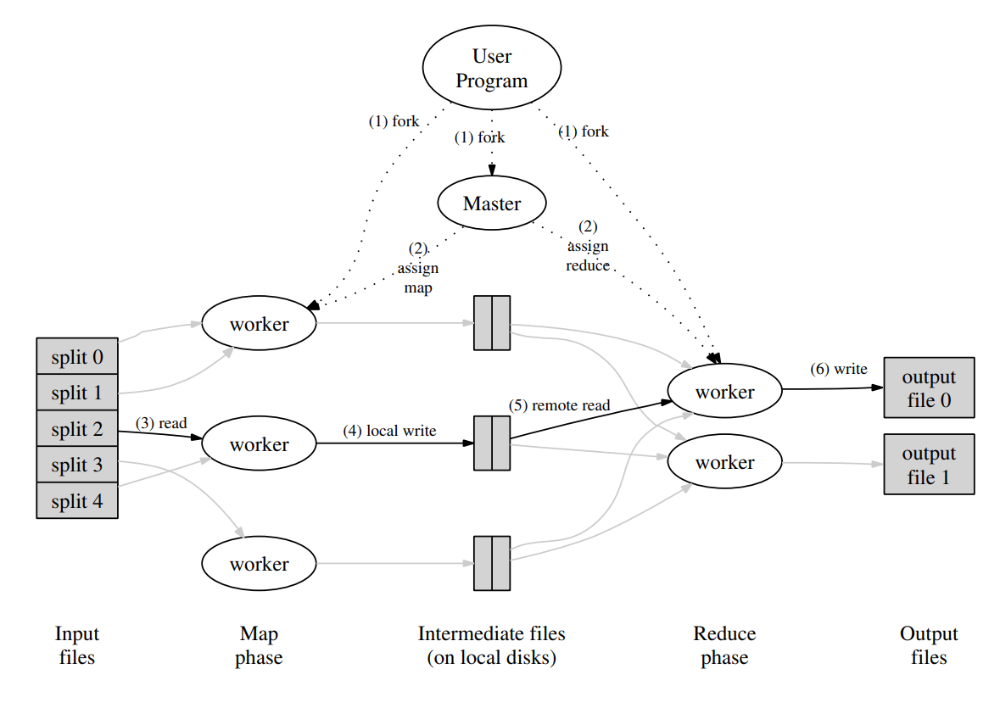
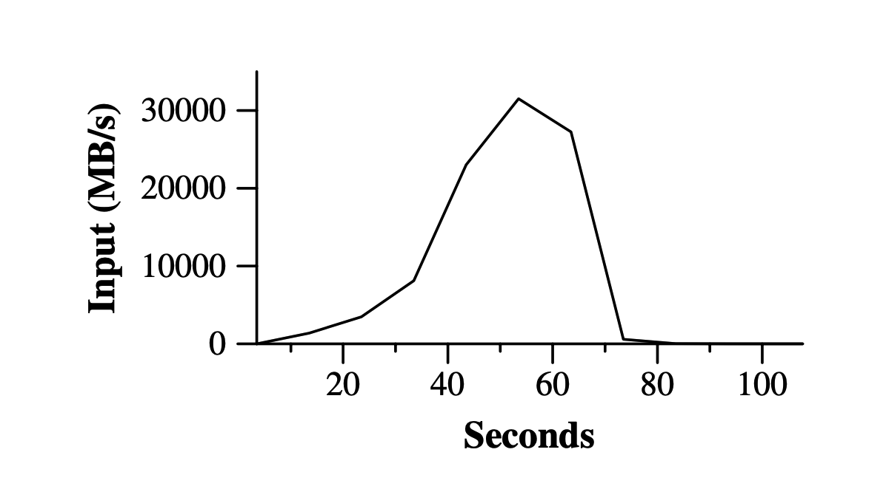
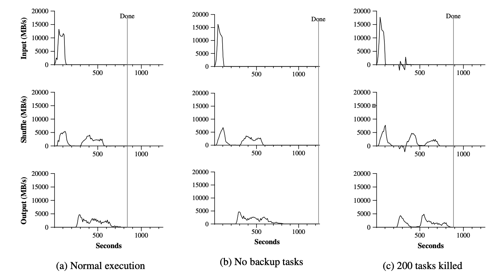
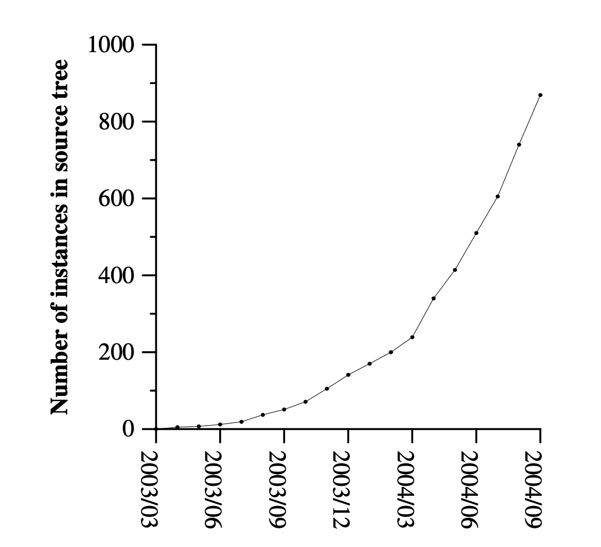
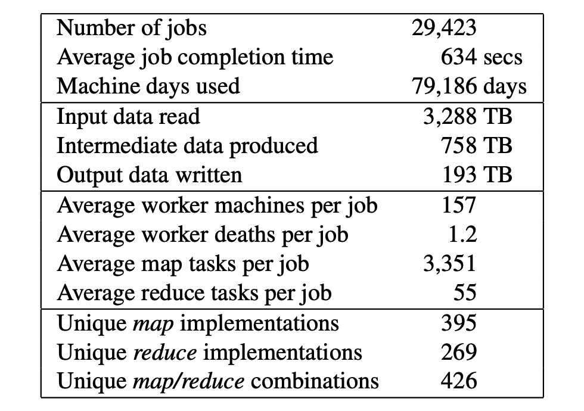

[[TOC]]

# MapReduce: 大型集群上的简化数据处理

著作信息:

- Jeffrey Dean and Sanjay Ghemawat
- jeff@google.com, sanjay@google.com
- Google, Inc.

# 摘要

MapReduce是一种编程模型和相关的实现，用于处理和生成大型数据集。用户指定一个Map函数，该函数处理一个键/值对以生成一组中间键/值对，以及一个归约函数，该函数合并与同一中间键相关联的所有中间值。许多现实世界的任务都可以在这个模型中表达出来，如本文所示。

以这种功能风格编写的程序被自动并行化，并在一大群并行机器上执行。运行时系统负责对输入数据进行分区、在一组机器上调度程序的执行、处理机器故障以及管理所需的机器间通信等细节。这使得没有任何并行和分布式系统经验的程序员可以轻松地利用大型分布式系统的资源。

我们的MapReduce实现运行在大型商用机器集群上，并且具有高度可伸缩性:典型的MapReduce计算在数千台机器上处理大量数据。程序员发现这个系统很容易使用:数百个MapReduce程序已经实现，每天有超过1000个MapReduce作业在谷歌的集群上执行。

# 1. 简介

在过去的五年里，作者和Google的许多其他人已经实现了数百个特殊用途的计算，处理大量的原始数据，如抓取的文档，Web请求日志等。计算各种导出数据，例如倒排索引、Web文档的图形结构的各种表示、每个主机爬行的页面数量的汇总、给定一天中最频繁查询的集合等。大多数这样的计算在概念上是简单明了的。然而，输入数据通常很大，计算必须分布在数百或数千台机器上，以便在合理的时间内完成。如何并行计算、分配数据和处理故障的问题，使得处理这些问题的大量复杂代码模糊了原始的简单计算。

作为对这种复杂性的反应，我们设计了一种新的抽象，允许我们表达我们试图执行的简单计算，但隐藏了库中并行化、容错、数据分布和负载平衡的混乱细节。我们的抽象受Lisp和许多其他函数式语言中的map和reduce原语的启发。我们意识到，我们的大部分计算涉及对输入中的每个逻辑“记录”应用Map操作，以便计算一组中间键/值对，然后对共享同一键的所有值应用归约操作，以便适当地组合导出的数据。我们使用具有用户指定的map和reduce操作的功能模型，这使我们能够轻松地并行化大型计算，并使用重新执行作为容错的主要机制。

这项工作的主要贡献是一个简单而强大的接口，支持大规模计算的自动并行化和分布，并结合该接口的实现，在大型商用PC集群上实现高性能。

第2节描述了基本的编程模型，并给出了几个例子。第3节描述了MapReduce接口的实现，该接口是为我们基于集群的计算环境定制的。第4节描述了我们发现有用的编程模型的几个改进。第5节对我们的各种任务的实现进行了性能测量。第6节探讨了MapReduce在Google中的使用，包括我们使用它作为重写生产索引系统的基础的经验。第7节讨论了相关的和未来的工作。

# 2. 编程模型

该计算采用一组输入键/值对，并产生一组输出键/值对。MapReduce库的用户将计算表示为两个函数：Map和Reduce。

由用户编写的Map接受一个输入对，并产生一组中间键/值对。MapReduce库将与同一中间密钥I相关联的所有中间值组合在一起，并将它们传递给归约函数。

Reduce函数也是由用户编写的，它接受一个中间键I和该键的一组值。它将这些值合并在一起，形成一个可能更小的值集。通常每次Reduce调用只产生零个或一个输出值。中间值通过迭代程序提供给用户的归约函数。这使我们能够处理太大而不适合内存的值列表。

## 2.1 例子

考虑在大量文档中计算每个单词出现的次数的问题。用户将编写类似于以下伪代码的代码:

```
map(String key, String value):
	// key: document name
	// value: document contents
	for each word w in value:
		EmitIntetabrmediate(w, "1");

reduce(String key, Iterator values):
	// key: a word
	// values: a list of counts
	int result = 0;
	for each v in values:
		result += ParseInt(v);
	Emit(AsString(result));
```

``map`` 函数输出每个单词上加一个关联的次数（在这个例子中只有1），Reduce函数输出对于特定单词所有计数相加的和。

此外，用户编写代码，用输入和输出文件的名称以及可选的调优参数来填充MapReduce对象，然后，用户调用MapReduce函数，将规范化对象传入。用户代码与MapReduce库（使用C++实现）链接到一起。附录A包含了这个例子的完整代码。

## 2.2 类型

尽管前面的伪代码是根据字符串输入和输出编写的，但从概念上讲，用户提供的map和reduce函数具有关联的类型:

```
map(k1, v1) --> list(k2, v2)
reduce(k2, list(v2)) --> list(v2)
```

即，输入键和值是从与输出键和值不同的域中提取的。此外，中间键和值与输出键和值来自同一个域。

我们的C++实现在用户定义的函数之间来回传递字符串，并让用户代码在字符串和适当类型之间进行转换。

## 2.3 更多例子

这里有几个简单的有趣程序的例子，可以很容易地表达为MapReduce计算。

- 分布式过滤：如果与提供的模式匹配，map函数会发出一条线。reduce函数是一个恒等函数，它只是将提供的中间数据复制到输出中。
- 计算URL的访问频率：map函数处理网页请求的日志并输出<URL,1>。reduce函数将同一URL的所有值加在一起，并输出一个<URL,total,count>对。
- 反向网络链接图：map函数对于指向在名为source的页面中找到每个目标URL的链接, 输出<target,source>对。reduce函数连接与给定目标URL相关联的所有源URL的列表，并发出一对: <target,list(source)>。
- 每台主机的检索词向量：术语向量将在一个文档或一组文档中出现的最重要的单词概括为<word,frequency>对的列表。map函数为每个输入文档发出一个<hostname,term,vector>对(其中主机名是从文档的URL中提取的)。reduce函数被传递给给定主机的所有每个文档的术语向量。它将这些术语向量相加，丢弃不常用的术语，然后输出最终的 <hostname,term,vector>对。
- 倒排索引：map函数解析每个文档，并且输出一个<word,document id>对序列。reduce函数接受给定单词全部的对。所有输出对的集合形成了一个简单的倒排索引。很容易增加这种计算来跟踪单词的位置。
- 分布式排序：map函数从每个记录中提取键，并输出一个<key,record>对。reduce函数不变地输出所有对。该计算取决于4.1节中描述的分区工具和4.2节中描述的排序属性。

# 3. 实现

MapReduce接口可能存在许多不同的实现。正确的选择依赖于环境。例如：一个正确的实现可能处于小型共享内存设备，另一个是大型的NUMA多处理上，并且另一个是更大的网络机器集合。

这一章描述并实现一个目的用于Google的广泛的计算环境：通过交换式以太网连接在一起的大型商用PC集群。在我们的环境中：

1. 机器是典型的运行Linux的多核心x86处理器，每个机器带有2-4GB的内存。
2. 使用商用网络硬件：在机器层面使用典型的以太网100Mbps或1Gbps，但是在整个二等分带宽上的平均要小得多。
3. 一个集群由成百上千的机器组成，因此机器故障是常见的
4. 存储由直接连接到单个机器的廉价IDE磁盘提供。内部开发的分布式文件系统用于管理存储在这些磁盘上的数据。文件系统使用复制在不可靠的硬件上提供可用性和可靠性。
5. 用户向调度系统提交作业。每个作业由一组任务组成，由调度程序映射到集群中的一组可用机器。

## 3.1 执行概述



通过将输入数据自动划分为一组M个部分，Map调用分布在多台机器上。输入拆分可以由不同的机器并行处理。通过使用分区函数(例如，hash(key) mod R)将中间密钥空间划分成R个部分，来分布Reduce调用。分区数量(R)和分区函数由用户指定。图1显示了我们实现中MapReduce操作的整体流程。当用户程序调用MapReduce函数时，会发生以下一系列操作(图1中的编号标签对应于下面列表中的编号)：

1. 用户程序中的MapReduce库首先将输入文件分成M段，每段通常为16MB到64MB(可由用户通过可选参数控制)。然后，它在一组机器上启动程序的许多副本。
2. 程序的一个副本是特殊的——Master。其余的是由Master分配工作的Worker。有M个Map任务和R个Reduce任务要分配。Master挑选空闲的Worker，给每个Worker分配一个Map任务或一个Reduce任务。
3. 被分配了Map任务的Worker读取相应输入分割的内容。它从输入数据中解析出键/值对，并将每一对传递给用户定义的Map函数。由Map函数产生的中间键/值对被缓冲在内存中。
4. 周期性地，缓冲对被写入本地磁盘，由Reduce函数划分成R个区域。这些缓冲对在本地磁盘上的位置被传递回Master，Master负责将这些位置转发给Reduce Worker。
5. 当Master通知Reduce Worker这些位置时，它使用远程过程调用从Map Workers的本地磁盘读取缓冲数据。当Reduce Worker读取了所有的中间数据后，它会按照中间键对数据进行排序，以便将所有出现的相同键组合在一起。需要进行排序，因为通常许多不同的键映射到同一个Reduce任务。如果中间数据量太大，不适合内存，就使用外部排序。
6. Reduce Worker遍历排序后的中间数据，对于遇到的每个唯一的中间键，它会将该键和相应的一组中间值传递给用户的Reduce函数。Reduce函数的输出被附加到这个Reduce分区的最终输出文件中。
7. 当所有的Map任务和Reduce任务完成后，Master唤醒用户程序。此时，用户程序中的MapReduce调用返回到用户代码。

成功完成后，MapReduce执行的输出在R输出文件中可用(每个Reduce任务一个，文件名由用户指定)。通常，用户不需要将这些R输出文件合并到一个文件中——他们通常将这些文件作为输入传递给另一个MapReduce调用，或者从另一个能够处理被划分为多个文件的输入的分布式应用程序中使用它们。

## 3.2 Master的数据结构

Master保持几种数据结构。对于每个Map任务和Reduce任务，保存状态（空闲，处理中，完成）并且标识Worker的身份信息（非空闲任务）。

Master是中间文件区域的位置从Map任务传播到Reduce任务的通道。因此，对于每个完成的Map任务，Master由Map任务产生的R个中间文件区域的位置和大小。当Map任务完成时，接收到对该位置和大小信息的更新。这些信息会以增量方式推送给正在执行Reduce任务的Worker。

## 3.3 容错

因为MapReduce库被设计成使用成百上千的机器来帮助处理非常大量的数据，所以该库必须适度地容忍机器故障。

### Worker故障

Master会定期Ping每个Worker。如果在一定时间内没有收到来自Worker的响应，则Master将该Worker标记为失败。由该Worker完成的任何Map任务被重置回它们的初始空闲状态，因此变得有资格在其他Worker上进行调度。类似地，失败的Worker上正在进行的任何Map任务或Reduce任务也会被重置为空闲，并有资格进行重新调度。

完成的Map任务在失败时重新执行，因为它们的输出存储在失败机器的本地磁盘上，因此不可访问。完成的Reduce任务不需要重新执行，因为它们的输出存储在全局文件系统中。

当一个Map任务首先由Worker A执行，然后由Worker B执行(因为A失败)时，所有执行Reduce任务的Worker都会收到重新执行的通知。任何尚未从Worker A读取数据的Reduce任务都将从Worker B读取数据。

MapReduce对大规模Worker故障具有弹性。例如，在一次MapReduce操作中，正在运行的群集上的网络维护导致一次80台机器的组在几分钟内无法访问。MapReduce的Master只是重新执行无法访问的Worker所做的工作，并继续前进，最终完成MapReduce操作。

### Master故障

很容易使Master写入上述Master数据结构的周期性检查点。如果Master任务终止，可以从最后一个检查点状态开始新的拷贝。但是，鉴于只有一个Master服务器，它不太可能失败；因此，如果Master出现故障，我们当前的实现将中止MapReduce计算。如果需要，客户端可以检查这种情况并重试MapReduce操作。

### 存在失败时的语义

当用户提供的Map和Reduce操作符是其输入值的确定性函数时，我们的分布式实现会产生与整个程序的无故障顺序执行所产生的相同的输出。

我们依靠Map和Reduce任务输出的原子提交来实现这个属性。每个进行中的任务都将其输出写入私有临时文件。Reduce任务产生一个这样的文件，Map任务产生R个这样的文件(每个Reduce任务一个)。当Map任务完成时，Worker向Master发送一条消息，并在消息中包含R个临时文件的名称。如果Master收到已完成的Map任务的完成消息，它将忽略该消息。否则，它在Master数据结构中记录R文件的名称。

当一个Reduce任务完成时，Reduce Worker自动将其临时输出文件重命名为最终输出文件。如果在多台机器上执行同一个Reduce任务，那么将对同一个最终输出文件执行多次重命名调用。我们依靠底层文件系统提供的原子重命名操作来保证最终的文件系统状态只包含一次执行Reduce任务所产生的数据。

我们的绝大多数Map和Reduce操作符都是确定性的，在这种情况下，我们的语义等价于顺序执行，这使得程序员很容易推断出他们程序的行为。当Map或Reduce运算符不确定时，我们提供较弱但仍然合理的语义。在存在非确定性操作符的情况下，特定Reduce任务R1的输出等价于由非确定性程序的顺序执行产生的R1的输出。然而，不同的Reduce任务R2的输出可以对应于由非确定性程序的不同顺序执行产生的R2的输出。

考虑Map任务M，减少任务R1和R2。设e(Ri)是提交的Ri的执行(正好有一个这样的执行)。出现较弱的语义是因为e(R1)可能已经读取了M的一次执行所产生的输出，而e(R2)可能已经读取了M的不同执行所产生的输出。

## 3.4 位置

网络带宽在我们的计算环境中是一种相对稀缺的资源。我们利用输入数据(由GFS管理)存储在构成集群的机器的本地磁盘上这一事实来节省网络带宽。GFS将每个文件分成64 MB的块，并在不同的计算机上存储每个块的多个副本(通常为3个副本)。MapReduce Master会考虑输入文件的位置信息，并尝试在包含相应输入数据副本的机器上安排Map任务。如果失败，它会尝试将Map任务安排在该任务的输入数据的副本附近(例如，在与包含数据的机器位于同一网络交换机上的工作机器上)。当在集群中的大部分工作机上运行大型MapReduce操作时，大多数输入数据都是在本地读取的，不消耗网络带宽。

## 3.5 任务粒度

如上所述，我们将Map阶段细分为M段，将Reduce阶段细分为R段。理想情况下，M和R应该远大于Worker的数量。让每个Worker执行许多不同的任务可以改善动态负载平衡，还可以在一个Worker出现故障时加快恢复速度: 它已经完成的许多Map任务可以分散到所有其他Worker机器上。

在我们的实现中，对于M和R有多大可以有实际的限制，因为如上所述，Master必须做出O(M + R)个调度决定，并且在存储器中保持O(M * R)个状态。(然而，内存使用的常数因子很小: 状态的O(M * R)部分由每个Map任务/Reduce任务对大约一个字节的数据组成)。

此外，R经常受到用户的约束，因为每个Reduce任务的输出最终都在一个单独的输出文件中。在实践中，我们倾向于选择M，以便每个单独的任务大约有16 MB到64 MB的输入数据(以便上面描述的局部性优化是最有效的)，并且我们使R成为我们期望使用的Worker数量的一个小倍数。我们经常在M = 200000和R = 5000的情况下，使用2000台Worker来执行MapReduce计算。

## 3.6 备份任务

延长MapReduce操作总时间的一个常见原因是“掉队者”: 一台机器在计算中花费异常长的时间来完成最后几个Map或Reduce任务之一。掉队者的出现有很多原因。例如，具有坏磁盘的机器可能会经常遇到可纠正的错误，从而使其读取性能从30 MB/s降低到1 MB/s。集群调度系统可能已经在机器上调度了其他任务，从而由于对CPU、内存、本地磁盘或网络带宽的竞争而导致其执行MapReduce代码的速度变慢。我们最近遇到的一个问题是机器初始化代码中的一个错误，它导致处理器缓存被禁用: 受影响机器上的计算速度降低了100倍以上。

我们有一个通用的机制来缓解掉队者的问题。当MapReduce操作接近完成时，Master会安排剩余正在进行的任务的备份执行。只要主或备执行完成，该任务就会被标记为已完成。我们已经对这种机制进行了调整，这样它通常会增加操作所使用的计算资源不超过百分之几。我们发现这大大减少了完成大型MapReduce操作的时间。例如，当备份任务机制被禁用时，第5.3节中描述的排序程序需要多花44%的时间来完成。

# 4. 改进

虽然简单地编写Map和Reduce函数所提供的基本功能对于大多数需求来说已经足够了，但是我们发现一些扩展非常有用。本节将对此进行描述。

## 4.1 分区函数

MapReduce的用户指定他们想要的Reduce任务/输出文件的数量(R)。使用中间键上的分区函数在这些任务之间对数据进行分区。提供了使用散列的默认分区函数(例如“hash(key) mod R”)。这往往会导致相当均衡的分区。但是，在某些情况下，通过键的其他功能对数据进行分区是很有用的。例如，有时输出键是URL，我们希望单个主机的所有条目都出现在同一个输出文件中。为了支持这种情况，MapReduce库的用户可以提供一个特殊的分区函数。例如，使用“hash(Hostname(urlkey)) mod R”作为分区函数会导致来自同一主机的所有URL都出现在同一个输出文件中。

## 4.2 顺序保证

我们保证在一个给定的分区内，中间的键/值对以递增的键顺序进行处理。这种排序保证使得为每个分区生成一个排序的输出文件变得很容易，当输出文件格式需要支持通过键进行高效的随机访问查找，或者输出的用户发现对数据进行排序很方便时，这是很有用的。

## 4.3 合并函数

在某些情况下，每个Map任务产生的中间键中存在大量重复，并且用户指定的Reduce函数是可交换的和关联的。一个很好的例子是2.1节中的单词计数例子。因为词频往往遵循Zipf分布(只有少数英文单词经常被使用，大部分的单词很少被使用)，所以每个Map任务将产生数百或数千条<the,1>形式的记录。所有这些计数都将通过网络发送到单个Reduce任务，然后由Reduce函数相加产生一个数字。我们允许用户指定一个可选的Combiner函数，在数据通过网络发送之前对其进行部分合并。

Combiner功能在每台执行Map任务的机器上执行。通常使用相同的代码来实现Combiner和Reduce功能。reduce函数和combiner函数之间的唯一区别是MapReduce库如何处理函数的输出。Reduce函数的输出被写入最终输出文件。Combiner函数的输出被写入一个中间文件，该文件将被发送给一个Reduce任务。

部分合并大大加快了某些MapReduce操作的速度。附录A包含了一个使用Combiner的例子。

## 4.4 输入和输出类型

MapReduce库支持读取多种不同格式的输入数据。例如，“文本”模式输入将每一行视为一个键/值对: 键是文件中的偏移量，值是该行的内容。另一种常见的支持格式存储按键排序的键/值对序列。每个输入类型实现都知道如何将其自身分割成有意义的范围，以便作为单独的Map任务进行处理(例如，文本模式的范围分割确保范围分割仅发生在线边界)。用户可以通过提供一个简单的Reader接口的实现来添加对新输入类型的支持，尽管大多数用户只使用少量预定义输入类型中的一种。

Reader不一定需要提供从文件中读取的数据。例如，很容易定义一个从数据库或从内存中映射的数据结构读取记录的Reader。

以类似的方式，我们支持一组输出类型来产生不同格式的数据，并且用户代码很容易添加对新输出类型的支持。

## 4.5 副作用

在某些情况下，MapReduce的用户发现从他们的Map或Reduce操作符生成辅助文件作为附加输出很方便。我们依靠应用程序作者来使这种副作用原子化和幂等化。通常，应用程序会写入临时文件，并在文件完全生成后自动重命名该文件。

我们不支持由单个任务产生的多个输出文件的原子两阶段提交。因此，产生具有跨文件一致性要求的多个输出文件的任务应该是确定性的。这一限制在实践中从未成为问题。

## 4.6 跳过坏记录

有时，用户代码中的错误会导致Map或Reduce函数在某些记录上决定性地崩溃。此类错误会阻止MapReduce操作完成。通常的做法是修复bug，但有时这是不可行的；也许bug在第三方库中，没有源代码。此外，有时忽略一些记录是可以接受的，例如在对大型数据集进行统计分析时。我们提供了一种可选的执行模式，在这种模式下，MapReduce库会检测哪些记录会导致确定性崩溃，并跳过这些记录以继续前进。

每个Worker进程安装一个信号处理程序，用于捕获分段冲突和总线错误。在调用用户Map或Reduce操作之前，MapReduce库将参数的序列号存储在一个全局变量中。如果用户代码生成了一个信号，信号处理器会向MapReduce的Master发送一个包含序列号的“last gasp”UDP数据包(这个序列号的意思是“最后一博”)。当Master在特定记录上发现一个以上的故障时，表明在发出下一次重新执行相应的Map或Reduce任务时，应跳过该记录。

## 4.7 本地执行

Map或Reduce函数中的调试问题可能很棘手，因为实际的计算是在分布式系统中进行的，通常是在几千台机器上进行的，工作分配由Master动态决定。为了便于调试、分析和小规模测试，我们开发了MapReduce库的替代实现，它在本地机器上顺序执行MapReduce操作的所有工作。向用户提供控制，使得计算可以限于特定的Map任务。用户用一个特殊的标志调用他们的程序，然后可以很容易地使用任何他们认为有用的调试或测试工具(例如gdb)。

## 4.8 状态信息

Master运行内部HTTP服务器，并导出一组状态页面供人们使用。状态页面显示了计算的进度，例如已经完成了多少任务，正在进行多少任务，输入字节数，中间数据字节数，输出字节数，处理速率等。这些页面还包含到每个任务生成的标准错误和标准输出文件的链接。用户可以使用这些数据来预测计算需要多长时间，以及是否应该向计算中添加更多的资源。这些页面也可用于计算何时计算比预期慢得多。

此外，顶级状态页面显示哪些Worker失败，以及失败时正在处理哪些Map和Reduce任务。当试图诊断用户代码中的错误时，此信息非常有用。

## 4.9 计数器

MapReduce库提供了一个计数器工具来计算各种事件的发生次数。例如，用户代码可能想要计算处理的总字数或索引的德语文档数等。

为了使用这个工具，用户代码创建一个命名的Counter对象，然后在Map或Reduce函数中适当地递增Counter。例如:

```
Counter* uppercase;
uppercase =  GetCounter("uppercase");

map(String name, String content):
	for each word w in contents:
		if(IsCapitalized(w)):
			uppercase->Increment();
		EmitIntermediate(w, "1");
```

来自单个Worker的Counter值被周期性地传播到Master(附带在Ping响应上)。当MapReduce操作完成时，Master从成功的Map和Reduce任务中聚合Counter值，并将它们返回给用户代码。当前的Counter值也显示在Master状态页面上，以便人们可以观察实时计算的进度。当合计Counter值时，Master消除相同Map或Reduce任务的重复执行的影响，以避免重复计数。(重复执行可能来自我们对备Worker的使用以及由于失败而重新执行任务)。

一些Counter值由MapReduce库自动维护，例如处理的输入键/值对的数量和产生的输出键/值对的数量。

用户发现Counter工具对于检查MapReduce操作的行为非常有用。例如，在一些MapReduce操作中，用户代码可能希望确保生成的输出对的数量正好等于处理的输入对的数量，或者确保处理的德语文档的比例在处理的文档总数的某个可容忍的比例之内。

# 5. 性能

在这一节中，我们测量了MapReduce在大型机器集群上运行的两个计算的性能。一种计算通过搜索大约1TB的数据来寻找特定的模式。另一个计算对大约1TB的数据进行排序。

这两个程序是MapReduce用户编写的真实程序的一个大子集的代表，一类程序将数据从一种表示形式打乱到另一种表示形式，另一类程序从大型数据集中提取少量有趣的数据。

## 5.1 集群配置

所有的程序都在由大约1800台机器组成的集群上执行。每台机器都有两个支持超线程的2GHz英特尔至强处理器、4GB内存、两个160GB IDE磁盘和一个千兆以太网链路。这些机器被安排在一个两级树形交换网络中，在根节点上有大约100-200Gbps的总带宽。所有的机器都在同一个托管设施中，因此任何一对机器之间的往返时间都不到一毫秒。

在4GB内存中，大约有1-1.5GB是为集群上运行的其他任务保留的。这些程序是在周末下午执行的，当时CPU、磁盘和网络大多处于空闲状态。

## 5.2 过滤

过滤程序扫描1010条100字节的记录，搜索相对罕见的三字符模式(该模式出现在92337条记录中)。输入被分成大约64MB的片段(M = 15000)，整个输出放在一个文件中(R = 1)。



图2显示了计算随时间的进展。Y轴显示输入数据的扫描速率。随着越来越多的机器被分配给这个MapReduce计算，这个速度逐渐加快，当分配了1764个Worker时，这个速度达到30 GB/s。随着Map任务的完成，速率开始下降，并在计算进行到大约80秒时降到零。整个计算从开始到结束大约需要150秒。这包括大约一分钟的启动开销。开销是由于将程序传播到所有Worker机器，以及延迟与GFS的交互以打开1000个输入文件并获取局部性优化所需的信息。

## 5.3 排序

排序程序对1010条100字节的记录进行排序(大约1TB的数据)。这个程序是模仿TeraSort基准的。

分类程序包含不到50行用户代码。三行Map函数从文本行中提取一个10字节的排序键，并将该键和原始文本行作为中间键/值对发出。我们使用一个内置的标识函数作为Reduce操作符。这个函数将中间的键/值对作为输出的键/值对传递。最终排序的输出被写入一组双向复制的GFS文件(即，2TB被写入作为程序的输出)。

和以前一样，输入数据被分割成64MB(M = 15000)。我们将排序后的输出分成4000个文件(R = 4000)。Partition函数使用关键字的初始字节将其分成R个片段中的一个。
我们在这个基准测试中使用的分区函数内置了键的分布知识。在一般的排序程序中，我们会添加一个prepass MapReduce操作来收集键的样本，并使用样本键的分布来计算最后一次排序的拆分点。



图3(a)显示了排序程序的正常执行过程。左上图显示了读取输入的速率。该速率在大约13 GB/s时达到峰值，并很快消失，因为所有映射任务都在200秒之前完成。请注意，输入速率小于过滤。

这是因为排序映射任务花费了大约一半的时间和I/O带宽将中间输出写入本地磁盘。过滤的相应中间产出规模可以忽略不计。

左中图显示了数据通过网络从Map任务发送到Reduce任务的速率。第一个Map任务一完成，这种洗牌就开始了。图中的第一个峰是第一批大约1700个Reduce任务(整个MapReduce被分配了大约1700台机器，每台机器一次最多执行一个reduce任务)。大约300秒后，第一批Reduce任务中的一些完成了，我们开始为剩余的Reduce任务转移数据。所有的洗牌在计算的600秒内完成。

左下方的图表显示了Reduce任务将排序后的数据写入最终输出文件的速率。在第一混洗周期的结束和写入周期的开始之间存在延迟，因为机器正忙于对中间数据进行分类。写入会以大约2-4 GB/s的速度持续一段时间。所有写入都在计算的大约850秒后完成。包括启动开销，整个计算需要891秒。这类似于TeraSort基准测试目前报告的1057秒的最好结果。

需要注意的几点是: 由于我们的位置优化，输入速率高于混洗速率和输出速率，大多数数据都是从本地磁盘读取的，并绕过了我们相对带宽受限的网络。混洗率高于输出率，因为输出阶段会写入已排序数据的两个副本(出于可靠性和可用性原因，我们会制作输出的两个副本)。我们写两个副本，因为这是底层文件系统提供的可靠性和可用性机制。如果底层文件系统使用擦除编码而不是复制，写入数据的网络带宽需求将会降低。

## 5.4 备份任务的影响

在图3(b)中，我们显示了禁用备Worker的排序程序的执行。执行流程类似于图3(a)所示，除了有一个很长的尾巴，几乎没有任何写活动发生。960秒后，除5个缩减任务外，其他所有任务均已完成。然而，这些最后的落伍者直到300秒后才完成。整个计算需要1283秒，耗时增加了44%。

## 5.5 机器故障

在图3(c)中，我们展示了一个排序程序的执行，我们在计算的几分钟内故意杀死了1746个Worker中的200个。底层集群调度程序立即在这些机器上重新启动新的Worker(因为只有Worker被终止，所以机器仍然正常工作)。

Worker死亡显示为负输入率，因为一些先前完成的Map工作消失了(因为相应的Map Worker被杀)并且需要重做。这个Map工作的重新执行相对较快。包括启动开销在内，整个计算在933秒内完成(只比正常执行时间增加了5%)。

# 6. 经验

我们在2003年2月编写了MapReduce库的第一个版本，并在2003年8月对其进行了重大改进，包括局部性优化、跨工作机的任务执行的动态负载平衡等。从那时起，我们惊喜地发现MapReduce库对于我们处理的各种问题是如此的适用。它已经在Google内部的多个领域得到应用，包括:

- 大规模机器学习问题
- Google新闻和Froogle产品的聚类问题，
- 提取用于生成流行查询报告的数据(例如Google Zeitgeist)，
- 网页属性的提取用于新的实验和产品(例如，从大型网页语料库中提取地理位置用于本地化搜索)，以及大规模图形计算。

## 6.1 大规模索引



图4显示了登记到我们的主要源代码管理系统中的独立MapReduce程序的数量随着时间的推移而显著增长，从2003年初的0个增加到2004年9月底的将近900个。MapReduce如此成功是因为它使得编写一个简单的程序并在半小时内在一千台机器上高效运行成为可能，大大加快了开发和原型制作周期。此外，它允许没有分布式和/或并行系统经验的程序员轻松利用大量资源。



在每个作业结束时，MapReduce库记录关于该作业所使用的计算资源的统计信息。在表1中，我们展示了2004年8月在Google上运行的MapReduce作业子集的一些统计数据。

# 7. 相关任务

到目前为止，MapReduce最重要的用途之一是完全重写生产索引系统，该系统产生用于Google Web搜索服务的数据结构。索引系统将我们的爬行系统检索到的大量文档作为输入，存储为一组GFS文件。这些文档的原始内容超过20TB的数据。索引过程由五到十个MapReduce操作组成。使用MapReduce(而不是以前版本中的临时分布式过程)适合:

- 索引代码更简单、更小、更容易理解，因为处理容错、分布和并行化的代码隐藏在MapReduce库中。例如，当使用MapReduce表示时，计算的一个阶段的大小从大约3800行C++代码下降到大约700行。
- MapReduce库的性能足够好，我们可以将概念上不相关的计算分开，而不是将它们混合在一起以避免额外的数据传递。这使得改变索引过程变得容易。例如，在我们的旧索引系统中需要几个月才能完成的一项更改，在新系统中只需要几天就可以实现。
- 索引过程变得更容易操作，因为由机器故障、机器速度慢和网络中断引起的大多数问题都由MapReduce库自动处理，无需操作员干预。此外，通过向索引集群添加新的机器，很容易提高索引过程的性能。

许多系统已经提供了受限编程模型，并使用这些限制来自动并行化计算。例如，可以使用并行前缀计算在N个处理器上在log N时间内对N元素数组的所有前缀计算关联函数。MapReduce可以被认为是基于我们在大型现实世界计算中的经验对其中一些模型的简化和提炼。更重要的是，我们提供了可扩展至数千个处理器的容错实施方案。相比之下，大多数并行处理系统只在较小的规模上实现，并将处理机器故障的细节留给程序员。

批量同步编程和一些MPI原语提供了更高级别的抽象，使程序员更容易编写并行程序。这些系统与MapReduce之间的一个关键区别在于，MapReduce利用一个受限的编程模型来自动并行化用户程序，并提供透明的容错。

我们的局部性优化从活动磁盘等技术中获得灵感，在这些技术中，计算被推到靠近本地磁盘的处理元素中，以减少通过I/O子系统或网络发送的数据量。我们在直接连接少量磁盘的商用处理器上运行，而不是直接在磁盘控制器处理器上运行，但一般方法是相似的。

我们的备份任务机制类似于Charlotte系统中采用的急切调度机制。简单急切调度的缺点之一是，如果给定的任务导致重复失败，整个计算将无法完成。我们用跳过不良记录的机制修复了这个问题的一些实例。

MapReduce实现依赖于一个内部集群管理系统，该系统负责在大量共享机器上分发和运行用户任务。尽管不是本文的重点，集群管理系统在本质上与其他系统(如Condor)相似。

作为MapReduce库一部分的排序工具在操作上类似于NOW-Sort。源机器(map workers)对要排序的数据进行分区，并将其发送给R个reduce workers中的一个。每个reduce worker都在本地(如果可能，在内存中)对其数据进行排序。当然，NOW-Sort没有用户可定义的Map和Reduce函数，这使得我们的库可以广泛应用。

River提供了一个编程模型，其中进程通过分布式队列发送数据来相互通信。像MapReduce一样，River系统试图提供良好的平均情况性能，即使存在由异构硬件或系统扰动引入的不均匀性。

River通过仔细安排磁盘和网络传输来实现平衡的完成时间。MapReduce有一个不同的方法。通过限制编程模型，MapReduce框架能够将问题划分成大量细粒度的任务。这些任务被动态地安排在可用的工作人员上，以便更快的工作人员处理更多的任务。受限编程模型还允许我们在接近工作结束时调度任务的冗余执行，这在出现不一致的情况下(例如缓慢或停滞的工人)极大地减少了完成时间。

BAD-FS具有与MapReduce非常不同的编程模型，并且与MapReduce不同，它的目标是在广域网上执行作业。然而，有两个基本的相似之处。

1. 两个系统都使用冗余执行来恢复由故障引起的数据丢失。
2. 两者都使用位置感知调度来减少通过拥塞网络链路发送的数据量。

TACC是一个旨在简化高可用性网络服务构建的系统。像MapReduce一样，它依赖重新执行作为实现容错的机制。

# 8. 结论

MapReduce编程模型已经在Google成功地用于许多不同的目的。我们把这一成功归因于几个原因。首先，该模型易于使用，即使对于没有并行和分布式系统经验的程序员也是如此，因为它隐藏了并行化、容错、局部性优化和负载平衡的细节。第二，各种各样的问题很容易表达为MapReduce计算。例如，MapReduce用于为Google的生产web搜索服务生成数据，用于排序、数据挖掘、机器学习和许多其他系统。第三，我们开发了一个MapReduce实现，可以扩展到包含数千台机器的大型机器集群。该实现有效地利用了这些机器资源，因此适用于Google遇到的许多大型计算问题。

我们从这项工作中学到了一些东西。首先，限制编程模型使得并行化和分布计算变得容易，并且使得这样的计算具有容错性。第二，网络带宽是稀缺资源。因此，我们系统中的许多优化旨在减少通过网络发送的数据量:局部性优化允许我们从本地磁盘读取数据，将中间数据的单个副本写入本地磁盘可以节省网络带宽。第三，冗余执行可以用来减少慢速机器的影响，并处理机器故障和数据丢失。

Josh Levenberg根据他使用MapReduce的经验和其他人对增强的建议，在修改和扩展用户级MapReduce API方面发挥了重要作用。MapReduce从Google文件系统读取输入，并将其输出写入Google文件系统。我们要感谢Mohit Aron、Howard Gobioff、Markus Gutschke、David Kramer、ShunTak Leung和Josh Redstone在开发GFS方面所做的工作。我们还要感谢Percy Liang和Olcan Sercinoglu在开发MapReduce使用的集群管理系统方面所做的工作。迈克·布伦斯、威尔逊·谢、乔希·莱文伯格、莎伦·佩尔、罗布·派克和王思然·沃勒克对本文的早期草稿提供了有益的评论。匿名的OSDI评论者和我们的牧羊人Eric Brewer提供了许多有用的建议，指出了论文需要改进的地方。最后，我们感谢Google工程组织中所有MapReduce用户提供的有用反馈、建议和错误报告。

# 9. 参考
