# 寻找一个可理解的共识算法（扩展版本）

著作信息:

- Diego Ongaro and John Ousterhout
- Stanford University

# 摘要

Raft是管理复制日志的一致算法。它产生一个等价于(mutli-)Paxos的结果，它与Paxos一样有效，但它的结构与Paxos不同；这使得Raft比Paxos更容易理解，也为构建实际系统提供了更好的基础。为了增强可理解性，Raft分离了共识的关键元素，例如领导者选举、日志复制和安全性，并且它强制实施了更强的一致性，以减少必须考虑的状态的数量。一项用户研究的结果表明，Raft比Paxos更容易让学生学习。Raft还包括一个改变集群成员的新机制，它使用重叠多数来保证安全。

# 1. 简介

共识算法允许一组机器作为一个连贯的群体工作，能够经受住一些成员的失败。正因为如此，它们在构建可靠的大规模软件系统中起着关键作用。在过去十年中，Paxos主导了关于共识算法的讨论: 大多数共识的实现都基于Paxos或受其影响，并且Paxos已成为用于向学生教授共识的主要工具。

不幸的是，Paxos很难理解，尽管有无数次尝试让它变得更容易理解。此外，它的体系结构需要复杂的变化来支持实际的系统。因此，系统构建者和学生都在为Paxos而奋斗。

在与Paxos斗争之后，我们开始寻找一种新的共识算法，这种算法可以为系统构建和教育提供更好的基础。我们的方法是不寻常的，因为我们的主要目标是可理解性: 我们能为实际系统定义一个一致的算法，并以一种比Paxos更容易学习的方式来描述它吗? 此外，我们希望算法能够促进直觉的发展，这对于系统构建者来说是必不可少的。重要的不仅仅是算法的工作，还有它为什么会工作。

这项工作的结果是一个共识算法称为Raft。在设计Raft时，我们应用了特殊的技术来提高可理解性，包括分解(Raft将领导者选举、日志复制和安全性分开)和状态空间缩减(相对于Paxos，Raft减少了不确定性的程度和服务器之间不一致的方式)。一项针对两所大学43名学生的用户研究表明，Raft明显比Paxos更容易理解:在学习了这两种算法后，其中33名学生能够更好地回答关于Raft的问题。

Raft在许多方面类似于现有的共识算法(最显著的是Oki和Liskov的视图标记复制)，但它有几个新颖的特性:

- 强大的领导者: Raft使用比其他共识算法更强的领导者形式。例如，日志条目仅从领导者流向其他服务器。这简化了复制日志的管理，并使Raft更容易理解。
- 领导者选举: Raft使用随机计时器来选举领导者。这仅向任何共识算法已经需要的心跳增加了少量机制，同时简单快速地解决冲突。
- 成员变化: Raft改变集群中服务器集合的机制使用了一种新的联合共识方法，在这种方法中，两种不同配置的多数在过渡期间重叠。这允许群集在配置更改期间继续正常运行。

我们认为Raft优于Paxos和其他共识算法，无论是出于教育目的还是作为实现的基础。比其他算法更简单，更容易理解；它被完整地描述以满足实际系统的需要；它有几个开源的实现，被几家公司使用；它的安全性能已经正式规定和证明；其效率可与其他算法相媲美。

本文的其余部分介绍了复制状态机问题(第2节)，讨论了Paxos的优缺点(第3节)，描述了我们理解的一般方法(第4节)，介绍了Raft共识算法(第5-8节)，评估了Raft(第9节)，并讨论了相关工作(第10节)。

# 2. 复制状态机

一致性算法通常出现在复制状态机的环境中。在这种方法中，一组服务器上的状态机计算相同状态的完全相同的副本，并且即使一些服务器停机也可以继续运行。复制状态机用于解决分布式系统中的各种容错问题。例如，具有单个集群领导者的大规模系统，如GFS、HDFS和RAMCloud，通常使用单独的复制状态机来管理领导者选举，并存储领导者崩溃后必须存在的配置信息。复制状态机的例子包括Chubby和ZooKeeper。

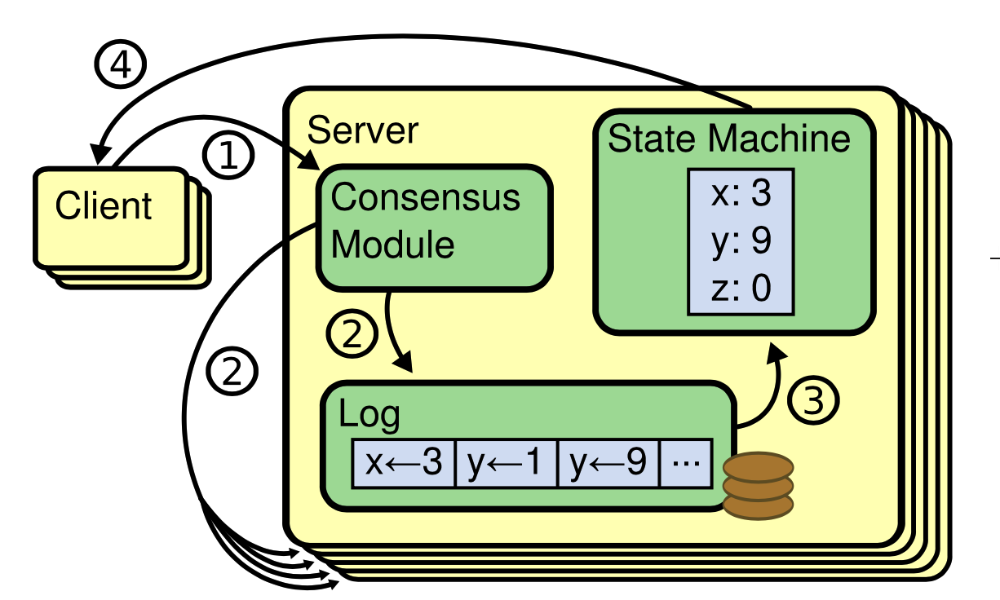

> 共识算法管理包含来自客户端的状态机命令的复制日志。状态机处理来自日志的相同命令序列，因此它们产生相同的输出。

**复制状态机通常使用复制日志来实现** ，如图1所示。每个服务器存储一个包含一系列命令的日志，其状态机按顺序执行这些命令。每个日志包含相同顺序的相同命令，因此每个状态机处理相同的命令序列。由于状态机是确定性的，每个状态机都计算相同的状态和相同的输出序列。

**保持复制日志的一致性是一致性算法的工作。** 服务器上的共识模块接收来自客户端的命令，并将它们添加到其日志中。它与其他服务器上的共识模块通信，以确保每个日志最终都以相同的顺序包含相同的请求，即使一些服务器出现故障。一旦命令被正确复制，每个服务器的状态机就按日志顺序处理它们，并将输出返回给客户机。因此，这些服务器似乎形成了一个高度可靠的状态机。

实际系统的一致性算法通常具有以下特性:

- 它们确保在所有非复杂条件下的安全性(从不返回错误结果)，包括网络延迟、分区、数据包丢失、复制和重新排序。
- 只要大多数服务器都在运行，并且可以相互通信以及与客户端通信，它们就可以完全正常工作(可用)。因此，一个典型的五个服务器的集群可以容忍任何两个服务器的故障。假设服务器因停止而出现故障；稍后，它们可能会从稳定存储的状态中恢复，并重新加入群集。
- 它们 **不依赖于时间来确保日志的一致性** : 错误的时钟和极端的消息延迟在最坏的情况下会导致可用性问题。
- 在一般情况下，一个命令可以在大多数集群已经响应一轮RPC时完成；少数慢速服务器不需要影响整体系统性能。

# 3. Paxos存在什么问题?

在过去的十年里，Leslie Lamport的Paxos协议几乎成了一致性的同义词: 它是课程中最常教的协议，一致性的大多数实现都以它为起点。Paxos首先定义了一个协议，该协议能够就单个决策(如单个复制日志条目)达成一致。我们称这个子集为单决策Paxos。然后，Paxos组合该协议的多个实例，以促进一系列决策，例如日志(Multi Paxos)。Paxos确保了安全性和活性，并且支持集群成员的变化。其正确性已被证明，并且在正常情况下是有效的。

不幸的是，Paxos有两个明显的缺点。第一个缺点是 **Paxos特别难懂** 。众所周知，完整的解释是不透明的；很少有人能够理解，只有付出巨大的努力才能理解。因此，有人试图用更简单的术语来解释Paxos。这些解释集中在单决策子集，但它们仍然具有挑战性。在对2012年NSDI会议与会者的非正式调查中，我们发现很少有人对Paxos感到舒服，即使是经验丰富的研究人员。我们自己也和Paxos斗争过；在阅读了几个简化的解释并设计了我们自己的替代方案之前，我们无法理解完整的方案，这个过程花了将近一年的时间。

我们假设Paxos的不透明性来源于它选择单决策子集作为基础。单决策Paxos是密集而微妙的: 它分为两个阶段，没有简单直观的解释，不能独立理解。正因为如此，我们很难直觉地理解为什么单决策协议会起作用。Multi Paxos的组成规则显著增加了额外的复杂性和微妙性。我们认为，在多个决策上达成共识的总体问题(即，日志而不是单个条目)可以用其他更直接和明显的方式来分解。

Paxos的第二个问题是，它 **没有为构建实际的实现提供良好的基础** 。一个原因是，对于Multi Paxos，还没有一个广泛认可的算法。Lamport的描述大多是关于单决策的Paxos；它勾画了Multi Paxos的可能途径，但缺少许多细节。已经有一些尝试去筛选和优化Paxos，比如【26】、【39】和【13】，但是这些都是互不相同的，也不同于Lamport的草图。Chubby等系统已经实现了类似Paxos的算法，但在大多数情况下，它们的细节尚未公布。

此外，Paxos架构对于构建实用系统来说是一个糟糕的架构；这是一阶分解的另一个结果。例如，独立地选择一组日志条目，然后将它们合并成一个顺序日志，这样做没有什么好处；这只会增加复杂性。围绕日志设计一个系统更简单、更有效，其中新的条目以受约束的顺序依次追加。另一个问题是，Paxos在其核心使用对称的点对点方法(尽管它最终建议将弱形式的领导作为性能优化)。这在一个简化的世界中是有意义的，在这个世界中只需要做出一个决定，但是很少有实际的系统使用这种方法。如果必须做出一系列决策，首先选举一个领导者，然后让领导者协调决策，这样更简单、更快捷。

因此，实际系统与Paxos几乎没有相似之处。每个实现都从Paxos开始，发现实现中的困难，然后开发一个显著不同的架构。这既费时又容易出错，而且理解Paxos的困难加剧了这个问题。Paxos的公式可能是证明其正确性的一个很好的公式，但是实际实现与Paxos是如此不同，以至于证明没有什么价值。来自Chubby实现者的以下评论是典型的:

> 在对Paxos算法的描述和现实世界系统的需求之间有很大的差距....最终的系统将基于一个未经证实的协议。

由于这些问题，我们得出结论，Paxos没有为系统建设或教育提供良好的基础。鉴于一致性在大规模软件系统中的重要性，我们决定看看是否可以设计一种比Paxos性能更好的替代一致性算法。Raft就是那个实验的结果。

# 4. 为易于理解而设计

我们在设计Raft时有几个目标: 它必须为系统构建提供一个完整而实用的基础，这样它就能显著减少开发人员所需的设计工作量；它必须在所有条件下都是安全的，并且在典型操作条件下可用；并且对于普通操作必须是高效的。但是我们最重要的目标——也是最困难的挑战——是可理解性。大量观众必须能够轻松理解该算法。此外，必须有可能开发关于算法的直觉，以便系统构建者可以进行在现实世界实现中不可避免的扩展。

在Raft的设计中，有许多地方我们必须在可供选择的方法中进行选择。在这些情况下，我们基于可理解性来评估备选方案: 解释每个备选方案有多难(例如，它的状态空间有多复杂，它是否有微妙的含义？)，读者完全理解这种方法及其含义有多容易？

我们承认这种分析有很大的主观性；尽管如此，我们还是使用了两种普遍适用的技术。第一种技术是众所周知的问题分解方法: 只要有可能，我们就将问题分成可以相对独立地解决、解释和理解的独立部分。例如，在Raft中，我们将领导者选举、日志复制、安全和成员变更分离开来。

我们的第二个方法是通过减少要考虑的状态数来简化状态空间，使系统更加一致，并尽可能消除不确定性。具体来说，日志不允许有间隙，Raft限制了日志之间变得不一致的方式。虽然在大多数情况下，我们试图消除不确定性，但在一些情况下，不确定性实际上提高了可理解性。特别地，随机化方法引入了不确定性，但是它们倾向于通过以相似的方式处理所有可能的选择来减少状态空间(“选择任意；没关系”)。我们使用随机化来简化Raft选举算法。

# 5. Raft一致性算法

> 以下是图2的内容翻译: Raft一致性算法的简明摘要(不包括成员资格更改和日志压缩)。左上角框中的服务器行为被描述为一组独立重复触发的规则。章节号，如5.2，表示讨论特定功能的位置。正式规范【31】更精确地描述了该算法。

- State
    - 所有服务器上的持久状态（在响应RPC之前在稳定存储上更新）:
        - ``currentTerm``: 服务器看到的最新任期(首次启动时初始化为0，单调增加)。
        - ``votedFor``: 在当前任期内获得投票的候选者ID，如果没有，则为空)。
        - ``log[]``: 日志条目，每个条目包含状态机的命令，以及当条目被领导者接收时的期限(第一个索引是1)。
    - 所有服务器上的不稳定状态:
        - ``commitIndex``: 已知提交的最高日志条目的索引(初始化为0，单调增加)。
        - ``lastApplied``: 应用于状态机的最高日志条目的索引(初始化为0，单调增加)。
    - 领导者的不稳定状态（当领导者发生选举之后，会重新初始化）:
        - ``nextIndex[]``: 对于每个服务器，发送到该服务器的下一个日志条目的索引(初始化为领导者最后一个日志索引 + 1)。
        - ``matchIndex[]``: 对于每个服务器，已知要在服务器上复制的最高日志条目的索引(初始化为0，单调增加)。
- RequestVote RPC（候选者用来收集选票(5.2)）。
    - 参数:
        - ``term``: 候选者任期。
        - ``candidateId``: 要求投票的候选者。
        - ``lastLogIndex``: 候选者最后日志条目的索引(5.4)。
        - ``lastLogTerm``: 候选者最后日志条目的期限(5.4)。
    - 结果:
        - ``term``: currentTerm，用于候选者自我更新。
        - ``voteGranted``: ``true`` 表示候选者获得了投票。
    - 接收器实现:
        - 如果 ``term < currentTerm`` (5.1)，则回复 ``false`` 。
        - 如果 ``votedFor`` 为 ``null`` 或 ``candidateId`` ，并且候选者的日志至少与接收者的日志一样是最新的，则授予 ``vote`` (5.2,5.4)。
- AppendEntries RPC（由领导者调用以复制日志条目(5.3), 也用作心跳(5.2)）:
    - 参数:
        - ``term``: 领导者的任期。
        - ``leaderId``: 所以追随者可以重定向客户。
        - ``prevLogIndex``: 紧接在新条目之前的日志条目的索引。
        - ``prevLogTerm``: prevLogIndex条目的任期。
        - ``entries[]``: 要存储的日志条目(心跳为空, 为了效率可以发送多个)。
        - ``leaderCommit``: 领导者的commitIndex。
    - 结果:
        - ``term``: currentTerm，供领导者自我更新。
        - ``success``: 如果跟随者包含匹配 ``prevLogIndex`` 和 ``prevLogTerm`` 的条目，则为 ``true`` 。
    - 接收器实现:
        - 如果 ``term < currentTerm`` (5.1)，则回复 ``false`` 。
        - 如果日志在 ``prevLogIndex`` 处不包含其术语与 ``prevLogTerm`` (5.3)匹配的条目，则回复 ``false`` 。
        - 如果现有条目与新条目冲突(相同的索引但不同的术语)，则删除现有条目及其后的所有条目(5.3)。
        - 添加日志中没有的任何新条目。
        - 如果 ``leaderCommit > commitIndex`` ，则设置 ``commitIndex = min(leaderCommit，最后一个新条目的索引)`` 。
- 服务器规则
    - 全部的服务器:
        - 如果 ``commitIndex > lastApplied`` : 递增 ``lastApplied`` ，将 ``log[lastApplied]`` 应用到状态机(5.3)。
        - 如果RPC请求或响应包含术语 ``T > currentTerm`` : ``set currentTerm = T`` ，转换为追随者( 5.1)。
    - 追随者:
        - 回复候选者和领导者的RPC。
        - 如果选举超时而没有收到来自当前领导者的AppendEntries RPC或授予候选者投票权: 转换为候选者。
    - 候选者:
        - 在转换为候选者时，开始选举: 
            - 增加 ``currentTerm`` 。
            - 为自己投票。
            - 重置选举计时器。
            - 向所有其他服务器发送RequestVote RPC。
        - 如果收到大多数服务器的投票: 成为领导者。
        - 如果从新领导者收到AppendEntries RPC: 转换为追随者。
        - 如果选举超时:开始新的选举。
    - 领导者:
        - 选择后:向每个服务器发送初始空AppendEntries RPCs(心跳);在空闲期间重复以防止选举超时(5.2)。
        - 如果从客户端收到命令:将条目附加到本地日志，在条目应用到状态机后响应(5.3)。
        - 如果跟随者的 ``最后一个日志索引 ≥ nextIndex`` : 发送AppendEntries RPC，日志条目从 ``nextIndex`` 开始。
            - 如果成功: 更新跟随者的 ``nextIndex`` 和 ``matchIndex`` (5.3)。
            - 如果AppendEntries由于日志不一致而失败: 递减 ``nextIndex`` 并重试(5.3)。
        - 如果存在N，使得 ``N > commitIndex`` ，则多数 ``matchIndex[i] ≥ N`` ，并且``log[N].term == currentTerm``: 设置 ``commit index = N`` (5.3，5.4)。

Raft是一种用于管理复制日志的算法，其形式如第2节所述。图2以简明的形式总结了该算法以供参考，图3列出了该算法的关键属性；这些图的元素将在本节的剩余部分逐段讨论。

> 以下是图3的内容翻译: Raft保证这些属性在任何时候都是真实的。章节号表示每个属性的讨论位置。

- 选举安全: 在一个特定的任期内，最多只能选举一名领导者。(5.2)
- 领导者只能追加: 领导者从不覆盖或删除日志中的条目，它只追加新条目。(5.3)
- 日志匹配: 如果两个日志包含具有相同索引和术语的条目，则日志在给定索引的所有条目中都是相同的。(5.3)
- 领导者完整性: 如果在给定项中提交了日志条目，则该条目将出现在所有较高编号项的领导者的日志中。(5.4)
- 状态机安全: 如果一个服务器已经将一个给定索引处的日志条目应用到它的状态机，那么没有其他服务器会对同一索引应用不同的日志条目。(5.4.3)

Raft通过首先选举一个杰出的领导者来实现共识，然后 **让领导者完全负责管理复制的日志** 。leader接受来自客户机的日志条目，将它们复制到其他服务器上，并告诉服务器何时将日志条目应用到它们的状态机是安全的。有一个领导者简化了复制日志的管理。例如，领导者可以决定在日志中何处放置新条目，而无需咨询其他服务器，并且数据以简单的方式从领导者流向其他服务器。领导者可能会失败或与其他服务器断开连接，在这种情况下，将选举新的领导者。

考虑到领导者的方法，Raft将共识问题分解为三个相对独立的子问题，这将在下面的小节中讨论:

- **领导者选举** : 当现有领导者失败时，必须选择新的领导者(第5.2节)。
- **日志复制** : 领导者必须接受来自客户端的日志条目，并在整个集群中复制它们，迫使其他日志与自己的一致(第5.3节)。
- **安全** : Raft的关键安全属性是图3中的状态机安全属性: 如果任何服务器已经将特定的日志条目应用到它的状态机，那么没有其他服务器可以对相同的日志索引应用不同的命令。第5.4节描述了Raft如何确保这一特性；该解决方案包括对5.2节中描述的选举机制的附加限制。

在介绍了一致性算法之后，这一部分讨论了可用性问题和系统中定时的作用。

## 5.1 Raft基础

图4为服务器状态。追随者只响应来自其他服务器的请求。如果追随者没有收到任何信息，它将成为候选者并开始选举。获得整个集群大多数人投票的候选者成为新的领导者。领导者通常会一直运行到失败。

一个Raft集群包含几个服务器，5是一个典型的数字，它允许系统容忍2个故障。在任何给定的时间，每个服务器都处于三种状态之一: **领导者、追随者或候选者** 。在正常操作中，正好有一个领导者，所有其他服务器都是追随者。追随者是被动的:他们不主动发出请求，只是简单地回应领导者和候选者的请求。领导者处理所有客户端请求(如果客户端联系追随者，追随者将其重定向到领导者)。第三个状态，候选，用于选举新的领导者，如5.2节所述。图4显示了这些状态及其转换；下面将讨论这些转换。

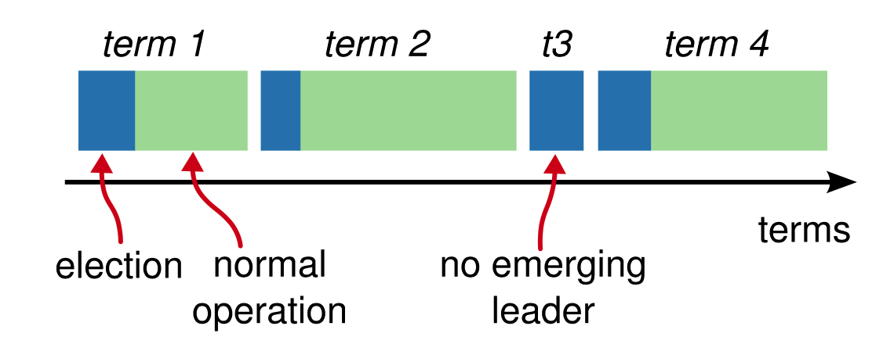

时间是分任期的，每一任期都是从选举开始的。选举成功后，一个领导者管理集群直到任期结束。一些选举失败，在这种情况下，任期结束时没有选出领导者。可以在不同的时间在不同的服务器上观察到任期之间的转换。

Raft将时间划分为任意长度的项，如图5所示。任期用连续的整数编号。每个任期以选举开始，在选举中，一个或多个候选者试图成为第5.2节所述的领导者。如果一个候选者赢得选举，那么它将在余下的任期内担任领导者。在某些情况下，选举会导致分裂投票。在这种情况下，任期将结束，没有领导者；新的任期(新的选举)即将开始。Raft确保在给定的任期内最多有一个领导者。

不同的服务器可能在不同的时间观察任期之间的转换，并且在某些情况下，服务器可能不观察选举或者甚至整个任期。在Raft中，任期就像一个逻辑时钟[14],它们允许服务器检测过时的信息，比如过时的前导。每个服务器存储一个当前的任期数，该任期数随时间单调增加。每当服务器通信时，交换当前任期；如果一台服务器的当前项小于另一台服务器的当前项，则它会将其当前项更新为较大的值。如果候选者或领导者发现自己的任期已经过时，就会立即回到追随者状态。如果服务器收到带有过期任期编号的请求，它会拒绝该请求。

**Raft服务器使用远程过程调用(RPC)进行通信** ，基本的一致性算法只需要两种类型的RPC。RequestVote RPCs由候选者在选举期间发起(第5.2节)，AppendEntries RPCs由领导者发起以复制日志条目并提供一种心跳形式(第5.3节)。第7节添加了第三个RPC，用于在服务器之间传输快照。如果服务器没有及时收到响应，它们会重试RPC，并并行发出RPC以获得最佳性能。

## 5.2 领导者选举

**Raft使用心跳机制来触发领导者选举。** 当服务器启动时，它们开始作为跟随者。只要服务器接收到来自领导者或候选者的有效RPC，它就保持在追随者状态。领导者定期向所有追随者发送心跳(不携带日志条目的AppendEntries RPCs)以维护他们的权威。如果追随者在一段称为选举超时的时间内没有收到通信，则它认为没有可行的领导者，并开始选举以选择新的领导者。

为了开始选举，追随者增加其当前任期并过渡到候选者状态。然后，它为自己投票，并向集群中的每个其他服务器并行发出RequestVote RPCs。候选者继续处于这种状态，直到发生以下三种情况之一:

- (a)它赢得了选举。
- (b)另一个服务器确立了自己的领导地位。
- (c)一段时间过去了，没有赢家。

这些结果将在以下段落中单独讨论。

如果候选者在同一任期内从整个集群中的大多数服务器获得选票，则该候选者赢得选举。在给定的期限内，每个服务器将按照先到先得的原则投票给最多一名候选者(注:第5.4节增加了对投票的额外限制)。多数规则确保了在特定的任期内，至多有一个候选者能够赢得选举(图3中的选举安全属性)。候选者一旦赢得选举，就成为领导者。然后，它向所有其他服务器发送心跳消息，以建立其权威并阻止新的选举。

在等待投票时，候选者可能会收到来自另一台声称是领导者的服务器的AppendEntries RPC。如果领导者的任期(包括在其RPC中)至少与候选者的当前任期一样长，则候选者认为领导者是合法的，并返回到追随者状态。如果RPC中的任期小于候选者的当前任期，则候选者拒绝RPC并继续处于候选状态。

第三种可能的结果是，候选者既不会赢得选举，也不会输掉选举: 如果许多追随者同时成为候选者，选票可能会被分割，从而没有候选者获得多数票。当这种情况发生时，每个候选者将超时，并通过增加其任期和启动另一轮RequestVote RPCs来开始新的选举。然而，如果没有额外的措施，分裂投票可能会无限期重复。

**Raft使用随机选举暂停来确保分裂投票很少发生，并且很快得到解决。** 为了首先防止分裂投票， **选举超时是从固定的时间间隔(例如150-300ms)中随机选择的** 。这分散了服务器，因此在大多数情况下，只有一台服务器会超时；它赢得选举，并在任何其他服务器超时之前发送心跳。相同的机制用于处理分裂投票。每个候选者在选举开始时重新启动其随机选举超时，并在开始下一次选举之前等待该超时过去；这降低了新一轮选举中再次出现分裂投票的可能性。第9.3节表明，这种方法能迅速选出领导者。

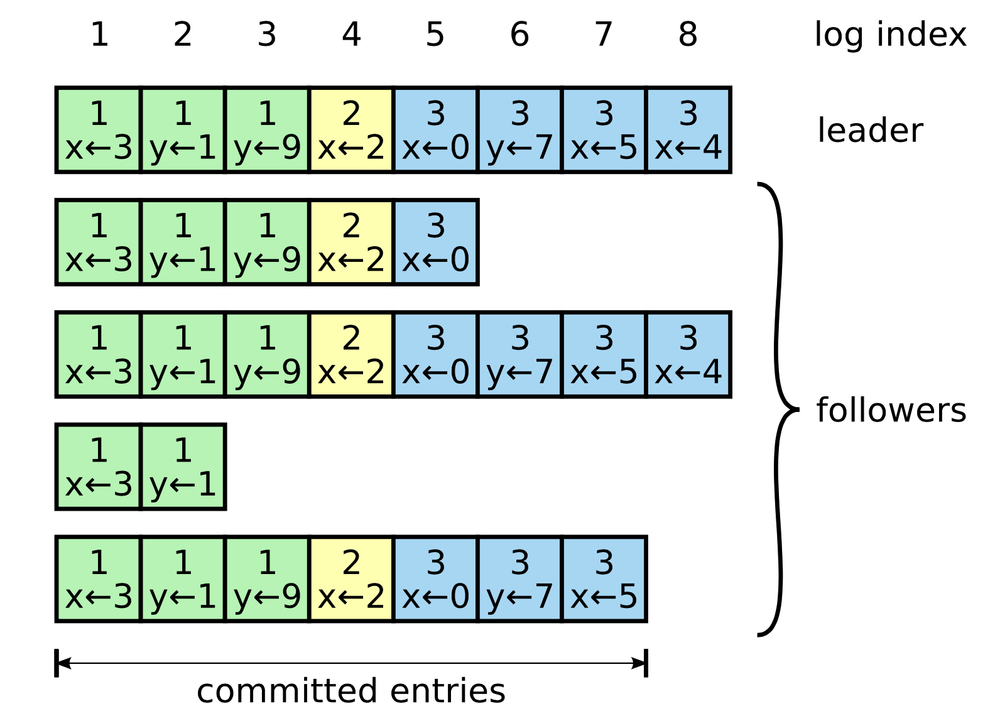

日志由条目组成，这些条目按顺序编号。 **每个条目包含创建它的任期(每个框中的数字)和状态机的命令。** 如果一个条目应用于状态机是安全的，则该条目被认为是提交的。

选举是一个例子，说明可理解性是如何引导我们在设计方案中做出选择的。最初我们计划使用排名系统: 每个候选者被分配一个独特的排名，用于在竞争候选者之间进行选择。如果一个候选者发现了另一个排名更高的候选者，它将返回到追随者状态，以便排名更高的候选者可以更容易地赢得下一次选举。我们发现这种方法在可用性方面产生了微妙的问题(如果排名较高的服务器失败，排名较低的服务器可能需要超时并再次成为候选服务器，但如果它太快这样做，它可能会重新设置选举领导者的进程)。我们对算法进行了几次调整，但每次调整后都会出现新的极限情况。最终我们得出结论，随机重试方法更明显，更容易理解。

## 5.3 日志复制

一旦领导者被选出，它就开始为客户端的要求服务。每个客户端请求包含一个将由复制的状态机执行的命令。 **领导者将该命令作为新条目添加到其日志中，然后并行地向每个其他服务器发出AppendEntries RPCs以复制该条目。** 当条目被安全复制后(如下所述)，领导者将条目应用到其状态机，并将执行结果返回给客户机。如果追随者崩溃或运行缓慢，或者如果网络数据包丢失，领导者无限期地重试AppendEntries RPCs(即使在它已经响应客户端之后)，直到所有追随者最终存储所有日志条目。

日志的组织如图6所示。每个日志条目存储一个状态机命令以及当条目被领导者接收时的任期号。日志条目中的任期数字用于检测日志之间的不一致，并确保图3中的一些属性。每个日志条目还有一个整数索引，用于标识它在日志中的位置。

领导者决定何时将日志条目应用到状态机是安全的；这样的条目称为已提交。Raft保证提交的条目是持久的，并且最终会被所有可用的状态机执行。 **一旦创建条目的领导者已经在大多数服务器上复制了它，就提交日志条目** (例如，图6中的条目7)。这还会提交领导者日志中所有以前的条目，包括由以前的领导者创建的条目。第5.4节讨论了在领导者变更后应用这一规则时的一些微妙之处，它也表明这一承诺定义是安全的。领导者跟踪它知道要提交的最高索引，并且它将该索引包含在将来的AppendEntries RPCs(包括心跳)中，以便其他服务器最终发现。一旦跟随者得知日志条目被提交，它就将该条目应用到其本地状态机(按日志顺序)。

我们设计了Raft日志机制来维护不同服务器上的日志之间的高度一致性。这不仅简化了系统的行为，使其更可预测，而且是确保安全的重要组成部分。Raft维护以下属性，这些属性共同构成了图3中的日志匹配属性:

- 如果不同日志中的两个条目具有相同的索引和任期，则它们存储相同的命令。
- 如果不同日志中的两个条目具有相同的索引和任期，则这些日志在所有前面的条目中都是相同的。

第一个属性来自于这样一个事实，即领导者在给定项中最多创建一个具有给定日志索引的条目，并且日志条目从不改变它们在日志中的位置。第二个属性由AppendEntries执行的简单一致性检查来保证。当发送AppendEntries RPC时，领导者在其日志中包含紧接在新条目之前的条目的索引和任期。如果跟随者没有在其日志中找到具有相同索引和任期的条目，那么它拒绝新的条目。一致性检查充当归纳步骤: 日志的初始空状态满足日志匹配属性，并且每当日志被扩展时，一致性检查保持日志匹配属性。因此，每当AppendEntries成功返回时，领导者就知道跟随者的日志与它自己通过新条目记录的日志是相同的。

在正常操作期间，领导者和追随者的日志保持一致，因此AppendEntries一致性检查永远不会失败。但是，领导者崩溃会导致日志不一致(旧的领导者可能没有完全复制其日志中的所有条目)。这些不一致会导致一系列领导者和追随者的崩溃。图7展示了追随者的日志与新领导者的日志的不同之处。跟随者可能缺少领导者上存在的条目，也可能有领导者上不存在的额外条目，或者两者都有。日志中缺失和无关的条目可能跨越多个任期。

**在Raft中，领导者通过强迫追随者复制自己的日志来处理不一致。这意味着追随者日志中的冲突条目将被领导者日志中的条目覆盖。** 第5.4节将说明当再加上一个限制时，这是安全的。

为了使跟随者的日志与其自己的日志一致，领导者必须找到两个日志一致的最新日志条目，删除跟随者日志中在该点之后的任何条目，并将该点之后领导者的所有条目发送给跟随者。所有这些操作都是响应AppendEntries RPCs执行的一致性检查而发生的。领导者为每个跟随者维护一个nextIndex，这是领导者将发送给该跟随者的下一个日志条目的索引。当领导者第一次掌权时，它将所有nextIndex值初始化为其日志中最后一个值之后的索引(图7中的11)。如果跟随者的日志与领导者的日志不一致，则AppendEntries一致性检查将在下一次AppendEntries RPC中失败。 **拒绝后，领导者递减nextIndex并重试AppendEntries RPC。** 最终，nextIndex将达到领导者和追随者日志匹配的点。当这种情况发生时，AppendEntries将成功，这将删除追随者日志中的任何冲突条目，并追加领导者日志中的条目(如果有)。一旦AppendEntries成功，跟随者的日志与领导者的日志保持一致，并且在任期的剩余时间内保持一致。

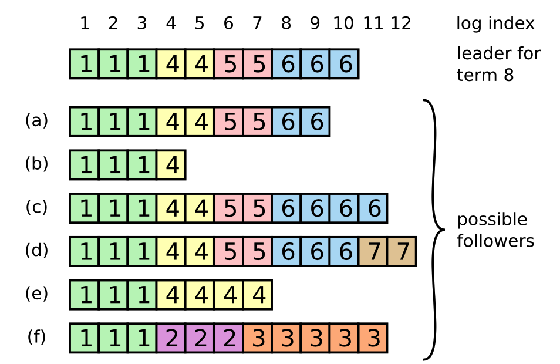

> 图7: 当处于顶端的领导者掌权时，追随者日志中可能会出现任何一种情况(a–f)。每个框代表一个日志条目；盒子里的数字是它的任期。追随者可能缺少条目(a–b)，可能有额外的未提交条目(c–d)，或者两者都有(e–f)。例如，如果该服务器是第2项的领导者，向其日志中添加了几个条目，然后在提交其中任何条目之前崩溃，则可能发生情况(f );它很快重新启动，成为第三任期的领导者，并在其日志中增加了一些条目；在第2项或第3项中的任何条目提交之前，服务器再次崩溃，并在几项中保持停机状态。

如果需要，可以优化协议以减少被拒绝的AppendEntries RPC的数量。例如，当拒绝AppendEntries请求时，跟随者可以包含冲突条目的任期和它为该任期存储的第一个索引。有了这个信息，领导者可以递减nextIndex以绕过该项中所有冲突的条目；具有冲突条目的每个任期将需要一个AppendEntries RPC，而不是每个条目一个RPC。在实践中，我们认为这种优化是必要的，因为失败很少发生，而且不太可能会有许多不一致的条目。

通过这种机制，领导者在掌权时不需要采取任何特殊措施来恢复日志一致性。它只是开始正常的操作，并且响应于AppendEntries一致性检查的失败，日志自动聚合。领导者从不覆盖或删除自己日志中的条目(图3中的领导者仅附加属性)。

这种日志复制机制展示了第2节中描述的理想的一致性属性: 只要大多数服务器都运行，Raft就可以接受、复制和应用新的日志条目；在正常情况下，一个新条目可以通过一次RPC请求复制到集群的大部分，并且单个慢速跟随者不会影响性能。

## 5.4 安全性

前面几节描述了Raft如何选择领导者和复制日志条目。然而，到目前为止描述的机制还不足以确保每个状态机以相同的顺序执行完全相同的命令。例如，当领导者提交几个日志条目时，追随者可能不可用，那么它可以被选为领导者并用新的条目覆盖这些条目；因此，不同的状态机可能会执行不同的命令序列。

本节通过添加对哪些服务器可以被选为领导者的限制来完善Raft算法。这种限制确保了任何给定项的领导者都包含先前项中提交的所有条目(图3中的领导者完整性属性)。给定选举限制，然后我们使承诺的规则更加精确。最后，我们给出了领导者完全性的证明草图，并展示了它如何导致复制状态机的正确行为。

### 5.4.1 选举限制

在任何基于领导者的共识算法中，领导者必须最终存储所有提交的日志条目。在一些共识算法中，如视图标记复制[22]，即使它最初不包含所有提交的条目，也可以选举一个领导者。这些算法包含额外的机制来识别丢失的条目，并在选举过程中或选举后不久将它们传送给新的领导者。不幸的是，这导致了相当大的附加机制和复杂性。Raft使用一种更简单的方法，它保证从每个新的领导者当选的那一刻起，来自先前任期的所有承诺条目都存在于每个新的领导者上，而不需要将那些条目转移到领导者。这意味着日志条目只在一个方向上流动，从领导者到追随者，领导者永远不会覆盖他们日志中的现有条目。

Raft使用投票过程来阻止候选者赢得选举，除非其日志包含所有提交的条目。候选者必须联系集群的大多数成员才能当选，这意味着每个提交的条目必须至少存在于其中一个服务器中。如果候选者的日志至少与大多数日志中的任何其他日志一样是最新的(其中“最新”的定义如下)，那么它将保存所有提交的条目。RequestVote RPC实现了这一限制: RPC包含有关候选者日志的信息，如果投票人自己的日志比候选者的日志更新，投票者将拒绝其投票。

Raft通过比较日志中最后条目的索引和任期来确定两个日志中哪一个更新。如果日志的最后条目具有不同的任期，则具有较晚任期的日志是最新的。如果日志以相同的任期结尾，则时间越长的日志越新。

### 5.4.2 提交以前任期中的条目

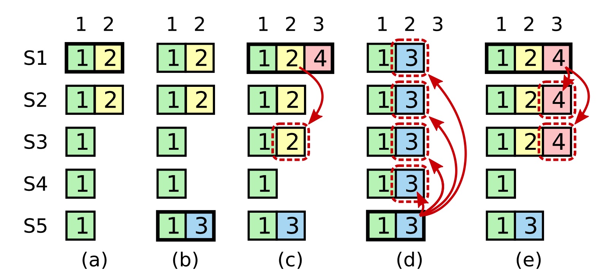

> 图8: 一个时间序列显示了为什么一个领导者不能使用旧条款的日志条目来确定承诺。在(a)中，S1是领导者，并且部分复制索引2处的日志条目。在(b) S1崩溃；S5以来自S3、S4及其自身的选票当选为第3项的领导者，并接受日志索引2处的不同条目。在(c)中，S5崩溃；S1重新开始，被选为领导者，并继续复制。此时，任期2中的日志条目已经在大多数服务器上复制，但是还没有提交。如果S1像(d)中那样崩溃，则S5可以被选为领导者(来自S2、S3和S4的选票)并用其自己的来自第3任期的条目来覆盖该条目。然而，如果S1在崩溃之前在大多数服务器上复制其当前条目，如在(e)中，则该条目被提交(S5不能赢得选举)。此时，日志中所有前面的条目也会被提交。

如5.3节所述，一旦条目被存储在大多数服务器上，领导者就知道来自其当前条目的条目被提交。如果一个领导者在提交一个条目之前崩溃，那么未来的领导者将试图完成该条目的复制。然而，一旦来自前一项的条目被存储在大多数服务器上，领导者不能立即断定该条目被提交。图8示出了一种情况，其中旧的日志条目存储在大多数服务器上，但是仍然可以被未来的领导者覆盖。

为了消除类似图8中的问题，Raft从不通过计算副本来提交以前条目的日志。通过对副本进行计数，仅提交领导者当前任期的日志条目；一旦以这种方式提交了当前条目，则由于日志匹配属性，所有先前的条目都被间接提交。在某些情况下，领导者可以安全地断定一个旧的日志条目被提交了(例如，如果那个条目被存储在每个服务器上)，但是Raft为了简单起见采取了一种更保守的方法。

Raft在承诺规则中引入了这种额外的复杂性，因为当领导者从以前的条款中复制条目时，日志条目会保留它们的原始任期编号。在其他共识算法中，如果一个新的领导者从以前的“任期”中重复条目，它必须用新的“任期号”来这样做Raft的方法使得对日志条目进行推理变得更加容易，因为它们随着时间的推移和日志之间保持相同的任期编号。此外，与其他算法相比，Raft中的新的领导者发送的来自以前任期的日志条目更少(其他算法必须发送冗余的日志条目，以便在提交之前对它们进行重新编号)。

### 5.4.3 安全参数

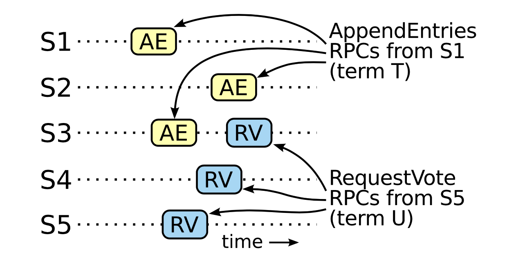

图9: 如果S1(任期T的领导者)从其任期提交新的日志条目，并且S5被选为下一任期U的领导者，则必须有至少一个服务器(S3)接受该日志条目并且也投票给S5。

给定完整的Raft算法，我们现在可以更精确地论证领导者完整性性质成立(这个论证是基于安全性证明的；参见第9.2节)。我们假设领导者完全性不成立，那么我们证明了一个矛盾。假设项T (领导者T)的领导者提交来自其项的日志条目，但是该日志条目没有被某个未来项的领导者存储。考虑其领导者(领导者U)不存储条目的最小项 ``U > T`` 。

1. 提交的条目必须在当选时不在领导者U的日志中(领导者U从不删除或覆盖条目)。
2. 领导者T在大多数集群上复制条目，领导者U从大多数集群接收投票。因此，至少有一个服务器(“投票者”)既接受了来自领导者T的条目，又为领导者U投票，如图9所示。投票人是达成矛盾的关键。
3. 投票者必须在投票给领导者U之前接受领导者T提交的条目；否则，它将拒绝来自领导者T的AppendEntries请求(其当前项将高于T)。
4. 投票者在投票给领导者U时仍然存储该条目，因为每个介入的领导者都包含该条目(根据假设)，领导者从不删除条目，追随者仅在条目与领导者冲突时才删除条目。
5. 投票人将其投票授权给领导者U，因此领导者U的日志必须与投票人的日志一样是最新的。这导致了两个矛盾之一。
6. 首先，如果投票者和领导者U共享相同的最后一个日志期限，那么领导者U的日志必须至少与投票者的日志一样长，因此它的日志包含投票者日志中的每个条目。这是一个矛盾，因为投票者包含提交的条目，而领导者U被认为不包含。
7. 否则，领导者U的最后一个日志任期一定比投票人的大。此外，它大于T，因为投票者的最后一个日志项至少是T(它包含来自项T的提交条目)。创建领导者U的最后一个日志条目的较早的领导者必须在其日志中包含提交的条目(根据假设)。那么，通过日志匹配属性，领导者U的日志也必须包含提交的条目，这是一个矛盾。
8. 这就完成了矛盾。因此，所有大于T的项的首项必须包含来自项T的、在项T中提交的所有条目。
9. 日志匹配属性保证了未来的领导者也将包含间接提交的条目，例如图8(d)中的索引2。

给定领导者完整性属性，我们可以从图3中证明状态机的安全属性，图3表明，如果一个服务器已经将一个给定索引处的日志条目应用到它的状态机，那么没有其他服务器会对同一索引应用不同的日志条目。当服务器将日志条目应用到其状态机时，其日志必须与领导者通过该条目记录的日志相同，并且该条目必须被提交。现在考虑任何服务器应用给定日志索引的最低期限；日志完整性属性保证了所有较高术语的首项将存储相同的日志条目，因此在后面的术语中应用索引的服务器将应用相同的值。因此，状态机安全属性成立。

最后，Raft要求服务器按照日志索引顺序应用条目。结合状态机安全属性，这意味着所有服务器将以相同的顺序将完全相同的一组日志条目应用到它们的状态机。

## 5.5 追随者和候选人崩溃

到目前为止，我们一直关注领导者的失败。跟随者和候选者崩溃比领导者崩溃更容易处理，并且它们都以相同的方式处理。如果追随者或候选人崩溃，那么将来发送给它的RequestVote和AppendEntries RPCs将失败。Raft通过无限重试来处理这些故障；如果崩溃的服务器重新启动，RPC将成功完成。如果服务器在完成RPC后但在响应前崩溃，那么它将在重新启动后再次收到相同的RPC。Raft RPCs是幂等的，所以这不会造成伤害。例如，如果跟随者收到的AppendEntries请求包含其日志中已经存在的日志条目，则它会忽略新请求中的那些条目。

## 5.6 时间和可用性

我们对Raft的一个要求是安全性不能依赖于时间:系统不能仅仅因为某个事件发生得比预期的快或慢而产生错误的结果。然而，可用性(系统及时响应客户的能力)必然依赖于时间。例如，如果消息交换的时间比服务器崩溃之间的典型时间长，候选人就不会一直持续到赢得选举；没有一个稳定的领导者，Raft就不能前进。

领导者选举是Raft的一个方面，时机是最关键的。只要系统满足以下时间要求，Raft将能够选出并保持一个稳定的领导者: broadcastTime ≪ electionTimeout ≪ MTBF。

在这个不等式中，broadcastTime是服务器向群集中的每个服务器并行发送RPC并接收它们的响应所用的平均时间；electionTimeout是5.2节中描述的选举超时；MTBF是单台服务器的平均故障间隔时间。广播时间应比选举超时短一个数量级，以便领导者能够可靠地发送阻止追随者开始选举所需的心跳消息；鉴于选举暂停采用的随机方法，这种不平等也使得分裂投票不太可能发生。选举超时应该比MTBF小几个数量级，以便系统稳步前进。当领导者崩溃时，系统将在大致的选举超时时间内不可用；我们希望这只是总时间的一小部分。

广播时间和MTBF是底层系统的属性，而选举超时是我们必须选择的。Raft的RPC通常要求接收方将信息保存到稳定的存储器中，因此广播时间可能从0.5毫秒到20毫秒不等，这取决于存储技术。因此，选举超时可能在10ms到500ms之间。典型的服务器MTBFs是几个月或更长时间，这很容易满足时间要求。

# 6. 集群成员资格更改

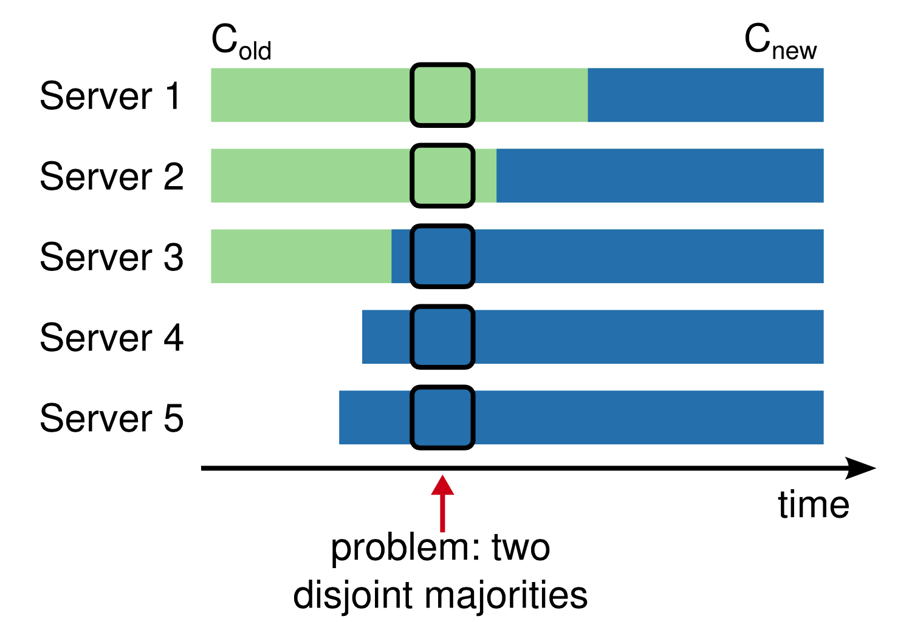

> 图10: 从一种配置直接切换到另一种配置是不安全的，因为不同的服务器会在不同的时间进行切换。在本例中，集群从三台服务器增加到五台。不幸的是，有一个时间点，两个不同的领导者可以当选为同一任期，一个拥有旧配置的多数(C_old)，另一个拥有新配置的多数(C_new)。

到目前为止，我们一直假设集群配置(参与一致性算法的一组服务器)是固定的。在实践中，有时需要更改配置，例如在服务器出现故障时更换服务器，或者更改复制程度。虽然这可以通过使整个群集脱机、更新配置文件，然后重新启动群集来实现，但这将使群集在转换期间不可用。此外，如果有任何手动步骤，它们有操作员出错的风险。为了避免这些问题，我们决定自动化配置更改，并将它们合并到Raft共识算法中。

为确保配置变更机制的安全性，在过渡期间，不得出现两个领导者可能当选为同一任期的情况。不幸的是，任何服务器直接从旧配置切换到新配置的方法都是不安全的。不可能一次自动切换所有的服务器，因此在转换过程中，集群可能会分裂成两个独立的主体(参见图10)。

为了确保安全，配置更改必须使用两阶段方法。有多种方法可以实现这两个阶段。例如，一些系统(例如[22])使用第一阶段来禁用旧配置，因此它不能处理客户端请求；然后第二阶段启用新配置。在Raft中，集群首先切换到一个过渡配置，我们称之为联合一致。一旦提交了联合共识，系统就转换到新的配置。联合共识结合了新旧两种配置:

- 在这两种配置中，日志条目被复制到所有服务器。
- 任一配置中的任何服务器都可以充当领导者。
- (选举和参与承诺方面的)协议要求新老组合分别获得多数票。

联合共识允许单独的服务器在不同的时间在配置之间转换，而不损害安全性。此外，联合共识允许集群在整个配置更改过程中继续为客户端请求提供服务。

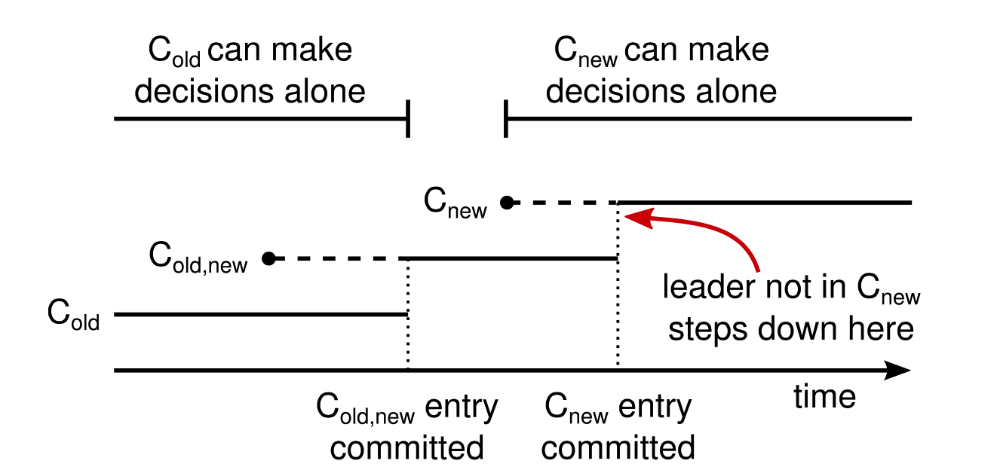

> 图11: 配置变更的时间表。虚线显示已经创建但尚未提交的配置条目，实线显示最新提交的配置条目。领导者首先在其日志中创建C_old，new配置条目，并将其提交给C _ old _ new(C _ old的大部分和C_new的大部分)。然后，它创建C_new条目，并将其提交给C_new的多数。不存在C_old和C_new都可以独立决策的时间点。

使用复制日志中的特殊条目来存储和传送集群配置；图11展示了配置更改过程。当领导者接收到将配置从C_old更改为C_new的请求时，它将联合共识的配置(图中的C_old_new)存储为日志条目，并使用前面描述的机制复制该条目。一旦给定的服务器将新的配置条目添加到其日志中，它就将该配置用于所有将来的决策(服务器总是使用其日志中的最新配置，而不管条目是否被提交)。这意味着领导者将使用C_old_new的规则来确定何时提交C_old_new的日志条目。如果领导者崩溃，可以在C_old或C_old_new下选择新的领导者，这取决于获胜的候选人是否收到了C_old_new。无论如何，C_new在此期间不能单方面做出决定。

一旦提交了C_old_new，C_old和C_new都不能在没有对方同意的情况下做出决定，并且领导者完整性属性确保只有具有C_old_new日志条目的服务器才能被选为领导者。现在，领导者可以安全地创建描述C_new的日志条目，并将其复制到集群。同样，一旦看到此配置，它将在每台服务器上生效。当在C_new规则下提交新配置时，旧配置是不相关的，并且不在新配置中的服务器可以被关闭。如图11所示，不存在C_old和C_new都可以单边决策的时候；这保证了安全。

对于重新配置，还有三个问题需要解决。第一个问题是新服务器最初可能不会存储任何日志条目。如果在这种状态下将它们添加到集群，它们可能需要一段时间才能跟上，在此期间可能无法提交新的日志条目。为了避免可用性差距，Raft在配置更改之前引入了一个额外的阶段，在这个阶段中，新服务器作为无投票权的成员加入集群(领导者将日志条目复制给它们，但它们不被视为多数)。一旦新的服务器赶上了集群的其余部分，就可以如上所述进行重新配置。

第二个问题是集群领导者可能不是新配置的一部分。在这种情况下，一旦提交了C_new日志条目，领导者就退出(返回到追随者状态)。这意味着将有一段时间(当它正在提交C_new时)领导者正在管理不包括它自己的集群；它复制日志条目，但不把自己算作多数。当C_new被提交时发生领导者转换，因为这是新配置可以独立操作的第一点(总是可以从C_new中选择领导者)。在这一点之前，可能是只有C_old的服务器才能当选领导者的情况。

第三个问题是被移除的服务器(那些不在C_new中的)会破坏集群。这些服务器不会接收心跳，因此它们将超时并开始新的选举。然后，他们将发送带有新条款编号的RequestVote RPC，这将导致当前领导者回复到追随者状态。最终会选出新的领导者，但是被移除的服务器会再次超时，并且该过程会重复，从而导致可用性差。

为了防止这个问题，当服务器认为当前领导者存在时，它们会忽略RequestVote RPC。具体来说，如果服务器在听取当前领导者意见的最短选举超时时间内收到RequestVote RPC，它不会更新其任期或授予其投票。这不会影响正常的选举，在正常的选举中，每台服务器在开始选举之前至少要等待一段最短的选举超时时间。然而，它有助于避免被移除的服务器造成的中断:如果一个领导者能够获得其集群的心跳，那么它就不会被更大的任期数所取代。

# 7. 日志压缩

Raft的日志在正常操作期间会增长，以容纳更多的客户端请求，但是在实际系统中，它不会无限制地增长。随着日志变得越来越长，它会占用更多的空间，需要更多的时间来重放。如果没有某种机制来丢弃日志中积累的过时信息，这最终会导致可用性问题。

快照是最简单的压缩方法。在快照中，整个当前系统状态被写入稳定存储上的快照，然后直到该点的整个日志被丢弃。快照在Chubby和ZooKeeper中使用，本节的剩余部分将描述Raft中的快照。

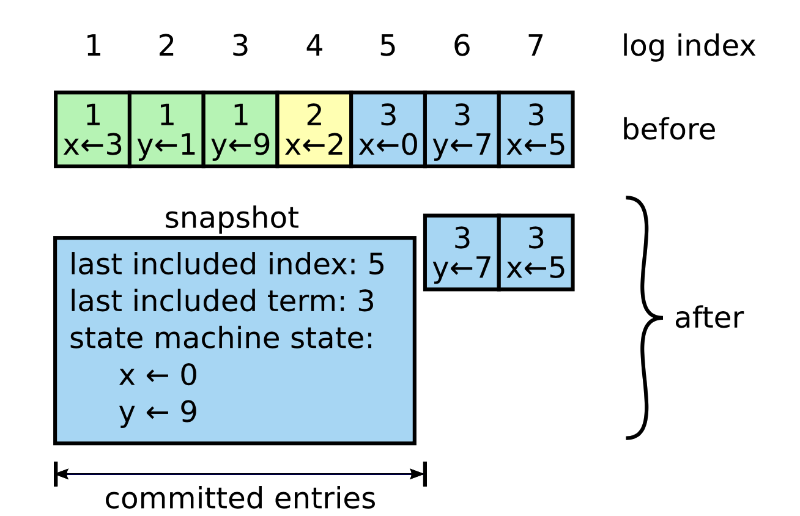

> 图12: 服务器用新的快照替换其日志中已提交的条目(索引1到5)，新的快照仅存储当前状态(本例中的变量x和y)。快照的最后包括的索引和术语用于将快照定位在条目6之前的日志中。

增量压缩方法，如日志清理[36]和日志结构合并树[30，5]也是可行的。这些方法一次只对一小部分数据进行操作，因此可以在一段时间内更均匀地分配压缩负载。他们首先选择一个积累了许多已删除和已覆盖对象的数据区域，然后更紧凑地重写该区域中的活动对象，并释放该区域。与快照相比，这需要大量额外的机制和复杂性，快照通过始终对整个数据集进行操作来简化问题。虽然日志清理需要对Raft进行修改，但是状态机可以使用与快照相同的接口来实现LSM树。

图12显示了Raft中快照的基本思想。每台服务器独立拍摄快照，仅覆盖其日志中已提交的条目。大部分工作包括状态机将其当前状态写入快照。Raft还在快照中包含少量元数据:最后包含的索引是快照替换的日志中最后一个条目的索引(状态机应用的最后一个条目)，最后包含的术语是这个条目的术语。保留这些内容是为了支持对快照之后的第一个日志条目进行AppendEntries一致性检查，因为该条目需要以前的日志索引和术语。为了启用集群成员关系更改(第6节)，快照还包括日志中截至最后包含的索引的最新配置。一旦服务器完成了快照的写入，它可以删除直到最后包括的索引的所有日志条目，以及任何先前的快照。

虽然服务器通常独立拍摄快照，但领导者必须偶尔向落后的追随者发送快照。当领导者已经丢弃了需要发送给跟随者的下一个日志条目时，就会发生这种情况。幸运的是，这种情况在正常操作中不太可能发生: 一个已经跟上领导者的跟随者已经有了这个条目。然而，特别慢的跟随者或加入集群的新服务器(第6节)不会。使这样的追随者更新的方法是领导者通过网络向其发送快照。

> 图13: InstallSnapshot RPC的摘要。快照被分割成块进行传输；这给了跟随者一个生命的信号，所以它可以重置它的选举计时器。下面是图13的翻译:

InstallSnapshot RPC: 由领导者调用，向追随者发送快照块。领导总是按顺序发大块。

- 参数:
    - ``term``: 领导者的任期。
    - ``leaderId``: 所以追随者可以重定向客户。
    - ``lastIncludedIndex``: 快照将替换该索引中的所有条目。
    - ``lastIncludedTerm``: ``lastIncludedIndex`` 的期限。
    - ``offset``: 区块在快照文件中的位置的字节偏移量。
    - ``data[]``: 快照区块的原始字节，从偏移量开始。
    - ``done``: 如果这是最后一块，则为 ``true`` 。
- 结果:
    - ``term``: ``currentTerm`` , 领导者自我更新。
- 接收器实现:
    - 如果 ``term < currentTerm`` ，就立即回复。
    - 如果是第一个块，则创建新的快照文件( ``offset`` 为0)。
    - 将数据写入快照文件中给定的 ``offset`` 。
    - 如果 ``done`` 为 ``false`` ，则回复并等待更多的数据块。
    - 保存快照文件，丢弃索引较小的任何现有或部分快照。
    - 如果现有日志条目与快照最后包含的条目具有相同的索引和任期，则保留其后的日志条目并回复。
    - 丢弃整个日志。
    - 使用快照内容重置状态机(并加载快照的群集配置)。

领导者使用名为 InstallSnapshot 的新RPC向落后太多的追随者发送快照；参见图13。当跟随者收到这个RPC的快照时，它必须决定如何处理它现有的日志条目。通常，快照会包含收件人日志中尚未包含的新信息。在这种情况下，跟随者丢弃它的整个日志；它全部被快照取代，并且可能具有与快照冲突的未提交条目。相反，如果跟随者接收到描述其日志前缀的快照(由于重传或错误)，则快照覆盖的日志条目被删除，但是快照之后的条目仍然有效，并且必须被保留。

这种抓拍方法背离了Raft的强领导者原则，因为追随者可以在领导者不知情的情况下抓拍照片。然而，我们认为这种背离是合理的。虽然有一个领导者有助于在达成共识时避免决策冲突，但在拍摄快照时已经达成共识，因此没有决策冲突。数据仍然只从领导者流向追随者，只是追随者现在可以重组他们的数据。

我们考虑了另一种基于领导者的方法，其中只有领导者会创建快照，然后它会将该快照发送给它的每个追随者。然而，这有两个缺点。首先，向每个跟随者发送快照会浪费网络带宽，并减慢快照过程。每个跟随者都已经拥有了生成自己的快照所需的信息，并且对于服务器来说，从其本地状态生成快照通常比通过网络发送和接收快照要便宜得多。第二，领导者的实现会更复杂。例如，领导者需要向追随者发送快照，同时向他们复制新的日志条目，以便不阻塞新的客户端请求。

还有两个问题会影响快照性能。首先，服务器必须决定何时拍摄快照。如果服务器快照太频繁，会浪费磁盘带宽和能源；如果它拍摄快照的频率太低，就会有耗尽其存储容量的风险，并且会增加重启期间重播日志所需的时间。一个简单的策略是当日志达到固定的字节大小时拍摄快照。如果此大小设置为明显大于快照的预期大小，则快照的磁盘带宽开销将会很小。

第二个性能问题是，写入快照会花费大量时间，我们不希望这会延迟正常操作。解决方案是使用写入时复制技术，以便在不影响正在写入的快照的情况下接受新的更新。例如，用函数式数据结构构建的状态机自然支持这一点。或者，操作系统的写时复制支持(例如，Linux上的fork)可以用来创建整个状态机的内存快照(我们的实现使用这种方法)。

# 8. 客户端交互

本节描述了客户端如何与Raft交互，包括客户端如何找到集群领导者以及Raft如何支持线性化语义[10]。这些问题适用于所有基于共识的系统，Raft的解决方案与其他系统类似。

Raft的客户将他们所有的请求发送给领导者。当客户端第一次启动时，它连接到随机选择的服务器。如果客户机的第一选择不是领导者，该服务器将拒绝客户机的请求，并提供它所听到的最近领导者的信息(AppendEntries请求包括领导者的网络地址)。如果领导者崩溃，客户端请求将超时；然后客户端用随机选择的服务器再试一次。

Raft的目标是实现可线性化的语义(每个操作看起来都是瞬间执行的，恰好一次，在调用和响应之间的某个点)。然而，如上所述，Raft可以多次执行一个命令:例如，如果leader在提交日志条目之后但在响应客户机之前崩溃，客户机将使用新的leader重试该命令，导致它被第二次执行。解决方案是让客户端为每个命令分配唯一的序列号。然后，状态机跟踪为每个客户端处理的最新序列号，以及相关的响应。如果它接收到一个序列号已经被执行的命令，它会立即响应，而不会重新执行请求。

可以处理只读操作，而无需向日志中写入任何内容。然而，如果没有额外的措施，这将冒返回陈旧数据的风险，因为响应请求的领导者可能已经被它不知道的较新的领导者所取代。可线性化的读取不能返回陈旧的数据，Raft需要两个额外的预防措施来保证不使用日志。首先，领导者必须拥有关于哪些条目被提交的最新信息。领导者完整性属性保证领导者具有所有提交的条目，但是在其任期开始时，它可能不知道这些条目是什么。为了找到答案，它需要提交一个条目。Raft通过让每个领导者在其任期开始时在日志中提交一个空白的无操作条目来处理这个问题。第二，领导者必须在处理只读请求之前检查它是否已经被废弃(如果最近的领导者被选举，它的信息可能是陈旧的)。Raft通过让领导者在响应只读请求之前与集群的大多数成员交换心跳消息来处理这个问题。或者，领导者可以依靠心跳机制来提供某种形式的租用[9]，但这将依赖于安全的定时(它假设有限的时钟偏移)。

# 9. 实施和评估

我们已经实现了Raft作为复制状态机的一部分，它存储RAMCloud [33]的配置信息，并协助RAMCloud协调器的故障转移。Raft实现包含大约2000行C++代码，不包括测试、注释或空行。源代码可以免费获得[23]。基于本文的草稿，还有大约25个独立的第三方开放源码实现[34]处于不同的开发阶段。此外，不同的公司正在部署基于筏的系统[34]。

本节的剩余部分使用三个标准评估Raft: 可理解性、正确性和性能。

## 9.1 可理解性

为了衡量Raft相对于Paxos的可理解性，我们使用斯坦福大学高级操作系统课程和加州大学伯克利分校分布式计算课程的高年级本科生和研究生进行了一项实验研究。我们录制了Raft和Paxos的视频讲座，并制作了相应的测验。Raft讲座涵盖了除日志压缩之外的所有内容；Paxos讲座涵盖了足够的材料来创建一个等效的复制状态机，包括单决策Paxos、多决策Paxos、重新配置以及实践中需要的一些优化(如领导人选举)。测验测试了对算法的基本理解，还要求学生对极限情况进行推理。每个学生观看一个视频，参加相应的测验，观看第二个视频，参加第二次测验。大约一半的参与者先做Paxos部分，另一半先做Raft部分，以说明从研究的第一部分获得的表现和经验的个体差异。我们比较了参与者每次测验的分数，以确定参与者是否对Raft有更好的理解。

我们试图尽可能公平地比较Paxos和Raft。该实验在两个方面有利于Paxos:43名参与者中有15人报告说之前有一些使用Paxos的经验，Paxos视频比Raft视频长14%。如表1所示，我们已经采取措施减少潜在的偏差来源。我们所有的材料都可供审查[28，31]。

> 表1: 研究中对Paxos可能存在偏见的担忧、采取的应对措施以及可用的其他材料。

|涉及|为减少偏见而采取的措施|审查材料[28，31]|
|-|-|-|
|同等授课质量|两者的讲师相同。Paxos讲座基于并改进了几所大学使用的现有材料。Paxos讲座时长14%。|视频|
|同等测验难度|问题按难度分组并在考试中配对。|询问|
|公平评分|使用标题。随机评分，在测验之间交替进行。|题目|

平均而言，参与者在Raft测验中的得分比Paxos测验高4.9分(满分为60分，Raft平均得分为25.7分，Paxos平均得分为20.8分)；图14显示了他们的个人得分。配合T检验表明，在95%的置信度下，Raft分数的真实分布比Paxos分数的真实分布平均大至少2.5点。

> 图14: 一个散点图，比较了43名参与者在Raft和Paxos测验中的表现。对角线(33)以上的点代表Raft得分较高的参与者。

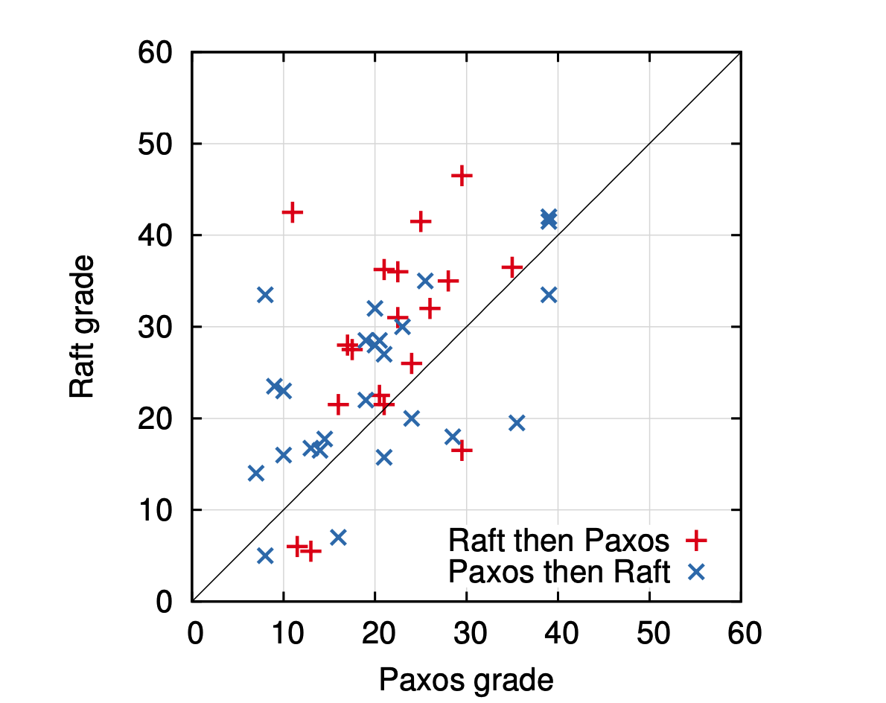

我们还创建了一个线性回归模型，该模型根据三个因素预测新生的测验分数:他们参加了哪个测验，他们之前对Paxos的体验程度，以及他们学习算法的顺序。该模型预测，测验的选择会产生12.5点的有利于Raft的差异。这明显高于观察到的4.9分的差异，因为许多实际的学生之前有Paxos经验，这对Paxos有很大帮助，而对Raft的帮助稍小。奇怪的是，该模型还预测，已经参加过Paxos测验的人在Raft上的得分会低6.3分；虽然我们不知道为什么，但这似乎在统计上是显著的。

> 图15: 使用5分制，参与者被问及(左)他们认为在一个正常、正确和有效的系统中，哪种算法更容易实现，以及(右)哪种算法更容易向计算机科学研究生解释。

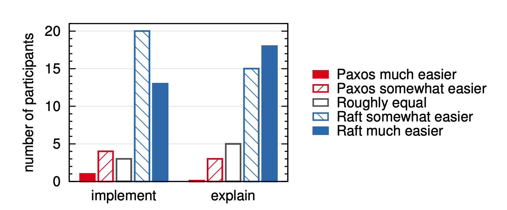

我们还在参与者的测验后对他们进行了调查，看看他们认为哪种算法更容易实现或解释；这些结果如图15所示。绝大多数参与者报告说Raft更容易实现和解释(每个问题41个中有33个)。然而，这些自我报告的感觉可能不如参与者的测验分数可靠，参与者可能因我们假设Raft更容易理解的知识而有所偏差。

Raft用户研究的详细讨论见[31]。

## 9.2 正确性

我们已经为第5节中描述的共识机制开发了一个正式的规范和一个安全性证明。正式规范[31]使用TLA+规范语言[17]使图2中总结的信息完全精确。它大约有400行长，是证明的主题。对于任何实现Raft的人来说，它本身也是有用的。我们已经用TLA证明系统机械地证明了对数完全性[7]。然而，这种证明依赖于没有经过机械检查的不变量(例如，我们还没有证明规范的类型安全)。此外，我们已经写了一个状态机安全属性的非正式证明[31]，它是完整的(仅依赖于规范)并且相对精确的(大约3500字长)。

## 9.3 性能

Raft的性能类似于Paxos等其他共识算法。对于性能来说，最重要的情况是当一个已确立的领导者正在复制新的日志条目时。Raft使用最少数量的消息(从领导者到半个集群的一次往返)实现了这一点。也有可能进一步提高Raft的性能。例如，它很容易支持批处理和流水线请求，以获得更高的吞吐量和更低的延迟。在文献中已经为其他算法提出了各种优化；其中许多可以应用于Raft，但是我们把它留给未来的工作。

我们使用我们的Raft实现来测量Raft的领导者选举算法的性能，并回答两个问题。第一，选举过程收敛快吗？第二，leader崩溃后可以实现的最小停机时间是多少？

为了测验领导者选举，我们重复地使一个由五个服务器组成的集群的领导者崩溃，并记录检测崩溃和选举新领导者所花费的时间(见图16)。为了产生最坏的情况，每个试验中的服务器有不同的日志长度，所以一些候选人没有资格成为领导者。此外，为了鼓励分割投票，我们的测试脚本在终止进程之前触发了来自领导者的心跳RPC的同步广播(这近似于领导者在崩溃之前复制新日志条目的行为)。领导者在其心跳间隔内均匀随机崩溃，该间隔是所有测试的最小选举超时的一半。因此，最小的可能停机时间大约是最小选举超时的一半。

> 图16: 检测和替换崩溃的领导者的时间。上图显示了选举超时的随机性，下图显示了最小选举超时。每行代表1000次试验(除了“150-150毫秒”的100次试验)，并且对应于选举超时的特定选择；例如，“150–155毫秒”意味着选举超时是在150毫秒和155毫秒之间随机统一选择的。这些测量是在一个由5台服务器组成的集群上进行的，广播时间大约为15毫秒。九个服务器的集群的结果是相似的。

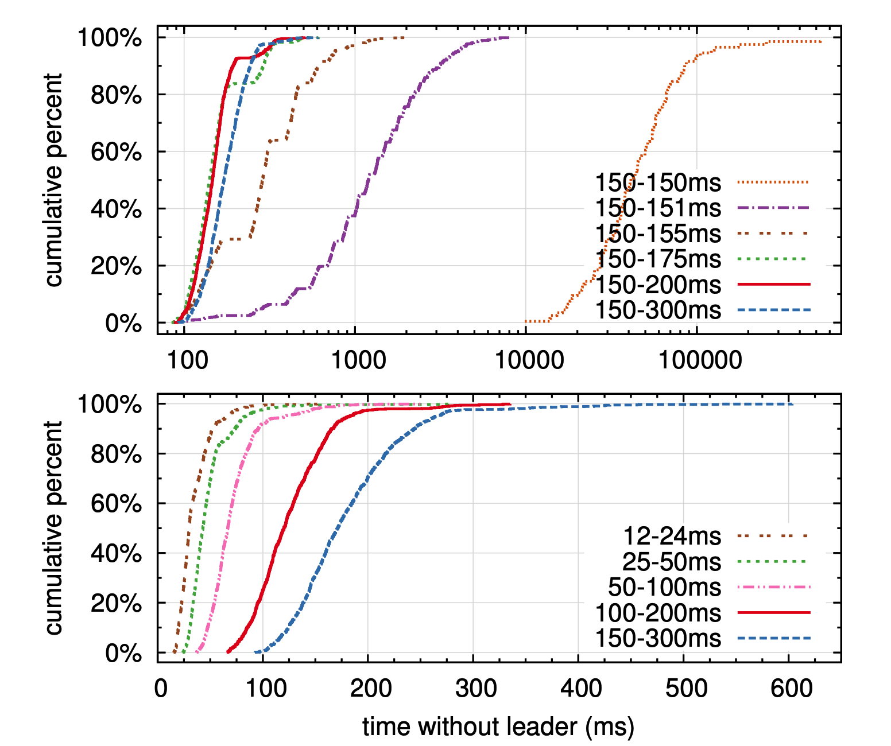

图16中的上图显示，选举超时中的少量随机化足以避免选举中的分裂投票。在缺乏随机性的情况下，在我们的测试中，由于许多分裂投票，领袖选举持续花费超过10秒。仅仅增加5毫秒的随机性就有很大帮助，导致平均停机时间为287毫秒。使用更多的随机性可以改善最坏情况下的行为:使用50毫秒的随机性，最坏情况下的完成时间(超过1000次试验)是513毫秒。

图16中的下图显示了通过减少选举超时可以减少停机时间。选举超时时间为12-24毫秒，平均只需35毫秒就能选出一名领导人(最长的审判时间为152毫秒)。然而，降低超时时间会违反Raft的时间要求:领导者很难在其他服务器开始新的选举之前广播心跳。这可能会导致不必要的领导者更换和整体系统可用性降低。我们建议使用保守的选举超时，如150-300毫秒；这种超时不太可能导致不必要的领导者变更，并且仍将提供良好的可用性。

# 10. 相关工作

有许多与共识算法相关的出版物，其中许多属于以下类别之一:

- Lamport对Paxos的原始描述[15]，并试图更清楚地解释它[16，20，21]。
- Paxos的阐述，它填补了缺失的细节并修改了算法，为实现提供了更好的基础[26，39，13]。
- 实现共识算法的系统，比如Chubby [2，4]，ZooKeeper [11，12]，Spanner [6]。Chubby和Spanner的算法尚未公布细节，尽管两者都声称基于Paxos。ZooKeeper的算法已经公布的比较详细了，但是和Paxos差别很大。
- 可应用于Paxos的性能优化[18，19，3，25，1，27]。
- Oki和Liskov的Viewstamped Replication (VR)是一种替代共识的方法，大约与Paxos同时开发。最初的描述[29]与分布式事务的协议交织在一起，但是核心共识协议在最近的更新中被分离出来[22]。VR使用基于领导的方法，与Raft有许多相似之处。

Raft和Paxos之间最大的区别是Raft的强大领导力: Raft使用领导者选举作为共识协议的重要组成部分，它将尽可能多的功能集中在领导者身上。这种方法产生了更简单、更容易理解的算法。例如，在Paxos中，领导者选举与基本共识协议正交: 它仅作为性能优化，并不是达成共识所必需的。然而，这导致了额外的机制:Paxos包括用于基本共识的两阶段协议和用于领导人选举的单独机制。相比之下，Raft将领导者选举直接纳入共识算法，并将其作为共识两个阶段的第一个阶段。这导致比Paxos更少的机制。

和Raft一样，VR和ZooKeeper都是基于领导者的，因此分享了Raft相对于Paxos的许多优势。然而，Raft的机制比VR或ZooKeeper少，因为它最小化了非领导者的功能。例如，Raft中的日志条目只向一个方向流动: 从AppendEntries RPCs中的领导者向外。在VR中，日志条目双向流动(领导人可以在选举过程中接收日志条目)；这导致了额外的机制和复杂性。ZooKeeper的公开描述也在leader之间来回传输日志条目，但是实现方式显然更像Raft [35]。

就我们所知，Raft的消息类型比任何其他基于共识的日志复制算法都要少。例如，我们统计了VR和ZooKeeper用于基本共识和成员变化的消息类型(不包括日志压缩和客户端交互，因为这些几乎与算法无关)。VR和ZooKeeper各自定义了10种不同的消息类型，而Raft只有4种消息类型(两个RPC请求及其响应)。Raft的消息比其他算法的要密集一点，但总体来说更简单。此外，VR和ZooKeeper在领导者变更期间传输整个日志方面进行了描述；将需要附加的消息类型来优化这些机制，以便它们是实用的。

Raft强有力的领导方法简化了算法，但是它排除了一些性能优化。例如，平等派Paxos (EPaxos)在某些情况下可以通过无领导方法实现更高的绩效[27]。EPaxos利用状态机命令中的交换性。任何服务器都可以只通过一轮通信就提交命令，只要同时提交的其他命令与它交换。然而，如果同时提出的命令不能相互交换，EPaxos需要额外的一轮通信。因为任何服务器都可以提交命令，所以EPaxos可以很好地平衡服务器之间的负载，并能够在WAN环境中实现比Raft更低的延迟。然而，这大大增加了Paxos的复杂性。

在其他工作中，包括Lamport的原始提案[15]、VR [22]和SMART [24]，已经提出或实现了几种不同的集群成员变更方法。我们为Raft选择了联合共识方法，因为它利用了共识协议的其余部分，因此成员变更只需要很少的额外机制。Lamport的基于α的方法不是Raft的选项，因为它假设没有领导者也能达成共识。与VR和SMART相比，Raft的重新配置算法具有这样的优点，即可以在不限制正常请求处理的情况下改变成员资格；相比之下，VR在配置更改期间停止所有正常处理，SMART对未完成请求的数量施加类似α的限制。Raft的方法也比VR或SMART增加了更少的机制。

# 11. 结论

算法的设计通常以正确性、效率和简洁性为主要目标。虽然这些都是有价值的目标，但我们认为可理解性同样重要。其他目标都无法实现，直到开发人员将算法转化为实际的实现，这将不可避免地偏离并扩展已发布的形式。除非开发人员对算法有深刻的理解，并能对其产生直觉，否则他们将很难在实现中保留其所需的属性。

在本文中，我们讨论了分布式共识的问题，其中一个被广泛接受但难以理解的算法Paxos已经挑战学生和开发人员很多年了。我们开发了一种新的算法Raft，我们已经证明它比Paxos更容易理解。我们也相信Raft为系统构建提供了更好的基础。将可理解性作为主要设计目标改变了我们设计Raft的方式；随着设计的进展，我们发现自己重复使用了一些技术，比如分解问题和简化状态空间。这些技术不仅提高了Raft的可理解性，也使我们更容易相信它的正确性。

# 12. 鸣谢

没有Ali Ghodsi、David Mazie'res以及伯克利CS 294-91和斯坦福CS 240的学生的支持，用户研究是不可能的。Scott Klemmer帮助我们设计了用户研究，Nelson Ray为我们提供了统计分析方面的建议。用于用户研究的Paxos幻灯片大量借鉴了Lorenzo Alvisi最初创建的幻灯片。特别感谢gotoDavidMazie寻找Raft中细微错误的努力。许多人对论文和用户研究材料提供了有益的反馈，包括Ed Bugnion, Michael Chan, Hugues Evrard,Daniel Giffin, Arjun Gopalan, Jon Howell, Vimalkumar Jeyakumar, Ankita Kejriwal, Aleksandar Kracun, Amit Levy, Joel Martin, Satoshi Matsushita, Oleg Pesok, David Ramos, Robbert van Renesse, Mendel Rosenblum, Nico- las Schiper, Deian Stefan, Andrew Stone, Ryan Stutsman, David Terei, Stephen Yang, Matei Zaharia, 24位匿名会议评审员(有重复)在推特上发布了一份早期草稿的链接，这让Raft获得了大量曝光。这项工作得到了Gigascale Systems Research Center 和 the Multiscale Systems Center的支持，这两个研究中心是由半导体研究公司计划Focus Center Research Program资助的六个研究中心中的两个，得到了MARCO和DARPA资助的半导体研究公司计划STARnet的支持，得到了国家科学基金会0963859号拨款的支持，并得到了脸书、谷歌、Mellanox、NEC、NetApp、SAP和三星的资助。Diego Ongaro得到了Junglee公司斯坦福研究生奖学金的支持。

