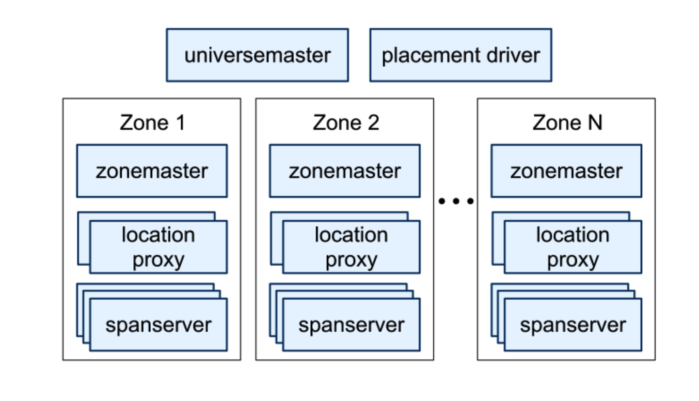
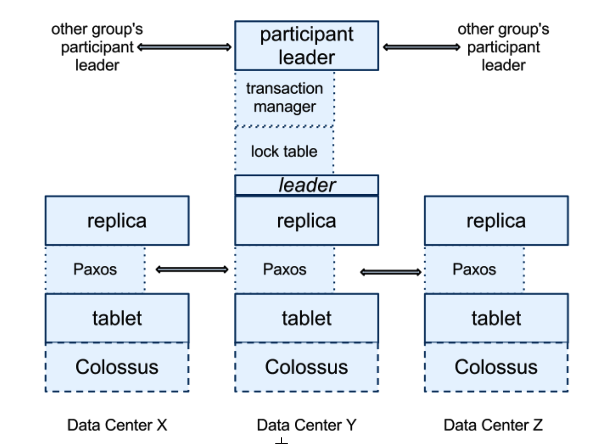
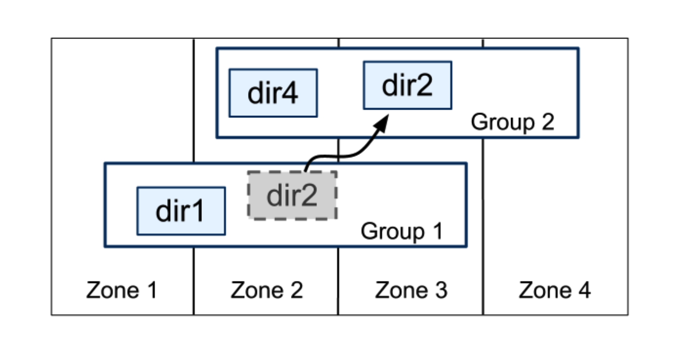
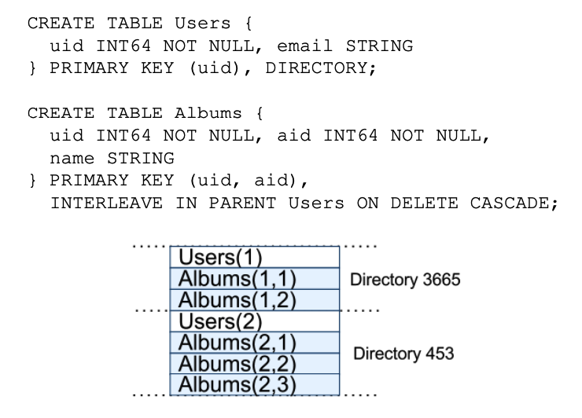
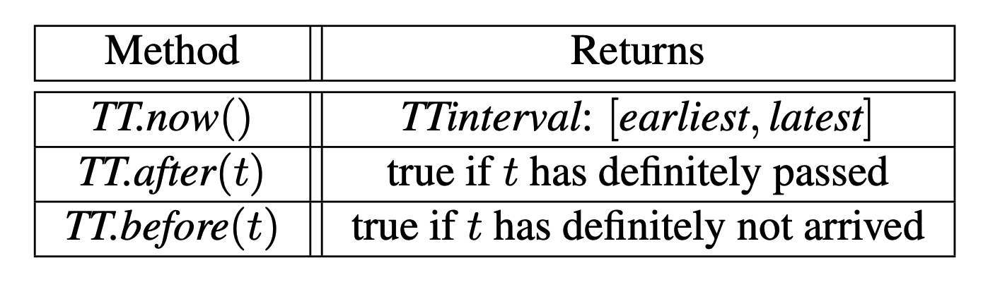
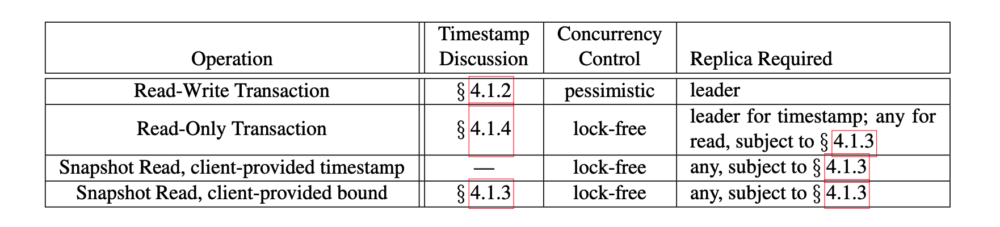

[[TOC]]

# Spanner: Google全球分布式数据库

著作信息：

- James C. Corbett, Jeffrey Dean, Michael Epstein, Andrew Fikes, Christopher Frost, JJ Furman,
- Sanjay Ghemawat, Andrey Gubarev, Christopher Heiser Peter Hochschild, Wilson Hsieh,
- Sebastian Kanthak, Eugene Kogan, Hongyi Li, Alexander Lloyd, Sergey Melnik, David Mwaura,
- David Nagle, Sean Quinlan, Rajesh Rao, Lindsay Rolig, Yasushi Saito, Michal Szymaniak,
- Christopher Taylor, Ruth Wang, Dale Woodford
- Google, Inc.

# 摘要

Spanner是Google的**可扩展、多版本、全球分布、同步复制的数据库**。它是第一个在全球范围内分发数据并支持外部一致的分布式事务的系统。本文描述了Spanner的结构、特性集、各种设计决策的基本原理，以及揭示时钟不确定性的新型时间API。这个API及其实现对于支持外部一致性和各种强大的功能至关重要: 过去的非阻塞读取、无锁只读事务和原子模式更改，跨所有Spanner。

# 1. 简介

Spanner是一个可扩展的全球分布式数据库，由Google设计、构建和部署。在最高的抽象层次上，它是一个数据库，**将分布在世界各地的数据中心中的多组Paxos状态机的数据进行分片**。复制用于全球可用性和地理位置；客户端会自动在副本之间进行故障切换。随着数据量或服务器数量的变化，Spanner会自动在机器之间重新排列数据，并自动在机器之间(甚至在数据中心之间)迁移数据，以平衡负载和应对故障。Spanner旨在扩展到跨越数百个数据中心和数万亿个数据库行的数百万台机器。

应用程序可以使用Spanner实现高可用性，即使面对大范围的自然灾害，也可以通过在各大洲内甚至跨洲复制数据来实现。我们最初的客户是F1，这是对Google广告后端的改写。F1使用遍布美国的五个复制品。大多数其他应用程序可能会在一个地理区域的3到5个数据中心之间复制其数据，但具有相对独立的故障模式。也就是说，大多数应用程序会选择较低的延迟而不是较高的可用性，只要它们能够承受1到2次数据中心故障。

Spanner的主要工作是**管理跨数据中心的复制数据**，但是我们也花费了大量的时间在分布式系统基础设施之上设计和实现重要的数据库特性。尽管许多项目都乐于使用BigTable，但我们也不断收到用户的抱怨，说BigTable可能难以用于某些类型的应用程序: 那些具有复杂的、不断发展的模式的应用程序，或者那些希望在广域复制中保持高度一致性的应用程序。(其他作者也提出了类似的主张)。Google的许多应用程序都选择使用Megastore，因为它的半关系数据模型和对同步复制的支持，尽管它的写吞吐量相对较差。因此，Spanner已经从一个类似BigTable的版本化键值存储发展成为一个时态多版本数据库。数据存储在模式化的半关系表中；数据被版本化，并且每个版本自动地用其提交时间标记时间戳；旧版本的数据受制于可配置的垃圾收集策略；应用程序可以读取旧时间戳的数据。Spanner支持通用事务，并提供了一种基于SQL的查询语言。

作为一个全球分布的数据库，Spanner提供了几个有趣的特性。首先，应用程序可以精细地动态控制数据的复制配置。应用程序可以指定约束来控制哪些数据中心包含哪些数据、数据离其用户有多远(以控制读取延迟)、副本之间有多远(以控制写入延迟)以及维护多少副本(以控制持久性、可用性和读取性能)。系统还可以在数据中心之间动态透明地移动数据，以平衡数据中心之间的资源使用。其次，Spanner有两个在分布式数据库中难以实现的特性: 它提供外部一致的读写，以及在时间戳上跨数据库的全局一致的读取。这些特性使Spanner能够支持一致的备份、一致的MapReduce执行和原子模式更新，所有这些都在全局范围内进行，甚至在正在进行的事务中也是如此。

这些特性之所以能够实现，是因为Spanner将全局有意义的提交时间戳分配给事务，即使事务可能是分布式的。时间戳反映了序列化顺序。此外，串行化次序满足外部一致性(或等价地，线性化): 如果一个事务在另一个事务T开始之前提交，那么T1的提交时间戳小于T2的提交时间戳。Spanner是第一个在全局范围内提供这种保证的系统。

这些特性的关键促成因素是新的TrueTime API及其实现。API直接暴露了时钟的不确定性，对Spanner的times-tamps的保证取决于实现提供的界限。如果不确定性很大，扳手会减速等待不确定性消失。Google的集群管理软件提供了TrueTime API的实现。这种实现通过使用多个现代时钟参考(GPS和原子钟)来保持较小的不确定性(通常小于10ms)。

第2节描述了Spanner实现的结构、它的特性集以及设计中的工程决策。第3节描述了我们新的TrueTime API，并简述了它的实现。第4节描述了Spanner如何使用TrueTime实现外部一致的分布式事务、无锁只读事务和原子模式更新。第5节提供了关于Spanner的性能和实时行为的一些基准，并讨论了F1的经验。第6、7和8节描述了相关的和未来的工作，并总结了我们的结论。

# 2. 实现

本节描述了Spanner实现的结构和原理。然后描述目录抽象，它用于管理复制和位置，是数据移动的单位。最后，它描述了我们的数据模型，为什么Spanner看起来像关系数据库而不是键值存储，以及应用程序如何控制数据局部性。

Spanner部署被称为一个Universe。鉴于Spanner在全球范围内管理数据，运行的Universe将屈指可数。我们目前运行着一个测试/游戏Universe、一个开发/生产Universe和一个纯生产Universe。

Spanner被组织成一组区域，其中每个区域都是BigTable服务器部署的粗略模拟。区域是管理部署的单位。这组区域也是一组位置，数据可以跨这些位置进行复制。随着新数据中心投入使用和旧数据中心关闭，可以分别在运行的系统中添加或删除分区。区域也是物理隔离的单位: 例如，如果不同应用程序的数据必须在同一数据中心的不同服务器组之间进行分区，则数据中心中可能有一个或多个区域。



图1展示了Spanner Universe中的服务器。一个区域有一个ZoneMaster和一百到几千个SpanServer。**前者将数据分配给SpanServer，后者向客户端提供数据。**客户端使用每个区域的Location Proxy来定位为其数据提供服务的SpanServers。**Universe Master和Placement驱动目前是单一的。**Universe Master主要是一个控制台，它显示所有区域的状态信息，以便进行交互式调试。Placement驱动处理以分钟为时间刻度的跨区域的数据自动移动。Placeent驱动定期与SpanServer通信，以找到需要移动的数据，从而满足更新的复制约束或平衡负载。出于篇幅原因，我们将只详细描述SpanServer。

## 2.1 SpanServer软件栈



这一节重点介绍SpanServer实现，以说明复制和分布式事务是如何分层到我们基于BigTable的实现中的。软件堆栈如图2所示。在底部，每个SpanServer负责100到1000个名为tablet的数据结构实例。tablet类似于BigTable的tablet抽象，因为它实现了以下映射:

```
(key: String, Timestamp: int64) --> string
```

与BigTable不同，Spanner为数据分配时间戳，这是Spanner更像多版本数据库而不是键值存储的重要方式。tablet的状态存储在一组类似B树的文件和一个WAL中，所有这些都存储在一个名为Colossus(Google文件系统的继承者)的分布式文件系统中。

为了支持复制，每个SpanServer在每个Tablet上实现一个Paxos状态机。(早期的Spanner化身支持每台tablet多个Paxos状态机，这允许更灵活的复制配置。那个设计的复杂性使我们放弃了它。)每个状态机将它的元数据和日志存储在它相应的tablet中。我们的Paxos实现支持基于时间的长期领导者租约，其长度默认为10秒。当前的Spanner实现将每个Paxos写操作记录两次:一次在Tablet的日志中，一次在Paxos日志中。这个选择是出于经验，我们最终可能会补救。我们的Paxos实现是流水线式的，以便在存在WAN延迟的情况下提高Spanner的吞吐量；但是写入是由Paxos按顺序应用的(这一点我们将在第4节中讨论)。

Paxos状态机用于实现一致复制的映射。每个副本的键-值映射状态都存储在其对应的tablet中。写操作必须在领导者处启动Paxos协议；在任何足够新的副本上直接从底层tablet读取访问状态，这组副本统称为Paxos组。

在作为领导者的每个副本上，每个SpanServer实现一个锁表来实现并发控制。锁表包含两阶段锁的状态: 它将键的范围映射到锁状态。(请注意，拥有一个长寿的Paxos领导者对于高效管理锁表至关重要。)在BigTable和Spanner中，我们都是为长期事务设计的(例如，报告生成，可能需要几分钟的时间)，这些事务在存在冲突的情况下，在乐观并发控制下性能很差。需要同步的操作，比如事务性读取，在锁表中获取锁；其他操作绕过锁表。

在作为领导者的每个副本上，每个SpanServer还实现了一个事务管理器来支持分布式事务。事务管理器用于实现参与者领导者；该组中的其他复制品将被称为参与者从设备。如果一个事务只涉及一个Paxos组(大多数事务都是这样)，它可以绕过事务管理器，因为锁表和Paxos一起提供事务性。如果一个事务涉及一个以上的Paxos组，这些组的领导者协调执行两阶段提交。其中一个参与者组被选为协调者:该组的参与者领导者将被称为协调者领导者，该组的从者被称为协调者从者。每个事务管理器的状态都存储在底层的Paxos组中(因此是复制的)。

## 2.2 Directory和Placement

在键值映射的顶部，Spanner实现支持称为Directory的分桶抽象，这是一组共享一个公共前缀的连续键。(目录这个词的选择是历史的偶然；一个更好的术语可能是Bucket。)我们将在2.3节解释那个前缀的来源。支持目录允许应用程序通过仔细选择键来控制数据的局部性。



Directory是数据放置的单位。Directory中的所有数据都具有相同的复制配置。当数据在Paxos组之间移动时，它是逐Directory移动的，如图3所示。Spanner可能会移动一个Directory来减轻Paxos组的负载；将频繁访问的Directory放在同一个组中；或者将Directory移动到更靠近其访问者的组中。当客户端操作正在进行时，可以移动Directory。人们可以预期50MB的Directory可以在几秒钟内被移动。

Paxos组可能包含多个Directory这一事实意味着Spanner tablet不同于BigTable tablet:前者不一定是行空间的单个字典序连续分区。相反，Spanner tablet是一个可以封装行空间的多个分区的容器。我们做出这个决定是为了能够将多个频繁访问的目录放在一起。


Movedir是用于在Paxos组之间移动Directory的后台任务。Movedir还用于添加或删除Paxos组的副本，因为Spanner尚不支持Paxos中的配置更改。Movedir不是作为单个事务来实现的，以避免在大数据移动时阻塞正在进行的读取和写入。相反，Movedir会记录它开始移动数据的事实，并在后台移动数据。当它移动了除标称数量之外的所有数据时，它使用一个事务自动移动标称数量，并更新两个Paxos组的元数据。

Directory也是其地理复制属性(或简称为Placement)可以由应用程序指定的最小单位。我们的放置规范语言的设计分离了管理复制配置的职责。管理员控制两个方面: 副本的数量和类型，以及这些副本的地理位置。他们在这两个维度中创建命名选项的菜单(例如，北美，用1个见证复制5种方式)。应用程序通过结合使用这些选项来标记每个数据库和/或单个Directory，从而控制数据的复制方式。例如，应用程序可能将每个最终用户的数据存储在自己的Directroy中，这将使用户A的数据在欧洲有三个副本，而用户B的数据在北美有五个副本。

为了说明的清晰，我们过度简化了。事实上，如果Directory变得太大，Spanner会将它分割成多个片段。片段可以由不同的Paxos组提供(因此由不同的服务器提供)。Movedir实际上是在组之间移动片段，而不是整个Directory。

## 2.3 数据模型

Spanner向应用程序公开了以下一组数据特性:基于模式化半关系表的数据模型、查询语言和通用事务。支持这些特性的趋势是由许多因素驱动的。Megastore的流行支持对模式化半关系表和同步复制的需求。Google内部至少有300个应用程序使用Megastore(尽管它的性能相对较低),因为它的数据模型比Bigtable的数据模型更易于管理，还因为它支持跨数据中心的同步复制。
(BigTable仅支持跨数据中心的最终一致复制。)使用Megastore的知名谷歌应用有Gmail、Picasa、Calendar、Android Market和AppEngine。考虑到Dremel作为交互式数据分析工具的流行，Spanner中支持类似SQL的查询语言的需求也是显而易见的。最后，Bigtable中缺少跨行事务导致投诉频繁；Percolator在某种程度上就是为了解决这个问题而建造的。一些作者声称支持一般的两阶段提交代价太高，因为它会带来性能或可用性问题。我们认为，最好让应用程序程序员处理由于瓶颈出现时过度使用事务而导致的性能问题，而不是总是围绕事务的缺乏进行编码。在Paxos上运行两阶段提交减轻了可用性问题。

应用程序数据模型位于实现所支持的目录分桶键值映射之上。一个应用程序在一个宇宙中创建一个或多个数据库。每个数据库可以包含无限数量的模式化表。表看起来像关系数据库表，有行、列和版本值。我们不会详细讨论Spanner的查询语言。它看起来像带有一些支持协议缓冲区值字段的扩展的SQL。

Spanner的数据模型不是纯关系的，因为行必须有名称。更准确地说，每个表都需要有一个或多个主键列的有序集合。这个需求就是Spanner看起来像一个键值存储的地方:主键构成了一行的名称，每个表定义了一个从主键列到非主键列的映射。只有为行的键定义了某个值(即使该值为NULL),该行才存在。采用这种结构很有用，因为它允许应用程序通过选择键来控制数据局部性。

图4包含一个示例Spanner模式，用于在每个用户、每个album的基础上存储照片元数据。模式语言类似于Megastore的模式语言，附加要求是每个Spanner数据库都必须由客户机划分成一个或多个表层次结构。客户端应用程序通过INTERLEAVE IN声明来声明数据库模式中的层次结构。层次结构顶部的表是一个目录表。键为K的目录表中的每一行，以及后代表中按字典顺序以K开头的所有行，构成了一个目录。ON DELETE CASCADE表示删除目录表中的一行会删除所有关联的子行。该图还说明了示例数据库的交叉布局：



例如，Albums(2, 1)表示相册表中user_id为2，albumid为1的行。表的这种交错形成目录是很重要的，因为它允许客户机描述多个表之间存在的位置关系，这对于分片的分布式数据库的良好性能是必要的。没有它，Spanner就不知道最重要的位置关系。

# 3. 真时



本节描述了TrueTime(真时) API并概述了它的实现。我们将大部分细节留给另一篇文章: 我们的目标是展示拥有这样一个API的强大之处。表1列出了API的方法。TrueTime将时间显式地表示为一个TTinterval，它是一个具有有限时间不确定性的时间间隔(不像标准时间接口那样给客户没有不确定性的概念)。TTinterval的端点属于TTstamp类型。TT.now()方法返回一个TTinterval，它保证包含调用TT.now()的绝对时间。时间点类似于带有闰秒的UNIX时间。将瞬时误差界限定义为e，它是间隔宽度的一半，将平均误差界限定义为ttafter(和TT.before()方法是now().的便捷包装。

通过功能标签(e)表示事件e的绝对时间。用更正式的术语来说，TrueTime保证对于一个调用，tt = TTnow()，TT.earliest < t_abs(e_now) < TT.latest，其中e_now是调用事件。
TrueTime使用的基本时间基准是GPS和原子钟。TrueTime使用两种形式的时间参考，因为它们有不同的故障模式。GPS参考源漏洞包括天线和接收器故障、本地无线电干扰、相关故障(例如，不正确的闰秒处理和欺骗等设计故障)以及GPS系统中断。原子钟可能以与GPS和彼此不相关的方式发生故障，并且在长时间内可能由于频率误差而显著漂移。

TrueTime由每个数据中心的一组时间主机和每台机器的一个时间服务守护程序实现。大多数Master机器有带专用天线的GPS接收器；这些主机在物理上是分开的，以减少天线故障、无线电干扰和欺骗的影响。剩下的Master(我们称之为Armageddon Master)装备有原子钟。一个原子钟并不昂贵: 一个Armageddon Master的成本和一个GPS Master的成本是一样的。所有Master的时间基准会定期相互比较。每个主机还会对照自己的本地时钟交叉检查其参考的时间推进速率，如果存在实质性差异，则会将其自身逐出。在两次同步之间，Armageddon Master会公布一个缓慢增加的时间不确定性，这个时间不确定性来源于保守应用的最坏情况时钟漂移。GPS Master宣传不确定性通常接近于零。

每个守护进程都轮询各种主设备，以减少任何一个主设备出错的可能性。有些是从附近的数据中心挑选出来的GPS大师；其余的是来自更远的数据中心的GPS大师，以及一些Armageddon Master。守护程序应用Marzullo算法的变体来检测和拒绝骗子，并将本地机器时钟与非骗子同步。为了防止本地时钟损坏，表现出频率偏移大于由组件规格和操作环境得出的最坏情况界限的机器将被淘汰。

在同步之间，一个守护进程通告一个缓慢增加的时间不确定性。e来自保守应用的最差情况本地时钟漂移。e还取决于时间主机的不确定性和与时间主机的通信延迟。在我们的生产环境中，e通常是时间的锯齿函数，在每个轮询间隔内从1到7 ms不等。因此，大部分时间e为4ms。守护程序的轮询间隔当前为30秒，当前应用的漂移速率设置为200微秒/秒，这两个值共同构成了0到6毫秒的锯齿边界。剩余的1毫秒来自与时间主机的通信延迟。出现故障时，可能会偏离锯齿波。例如，偶尔的时间主机不可用会导致数据中心范围内的e增加。类似地，过载的机器和网络链接会导致偶尔的局部e峰值。

# 4 并发控制

本节描述了如何使用TrueTime来保证并发控制的正确性属性，以及如何使用这些属性来实现外部一致事务、无锁只读事务和非阻塞读取等功能。例如，这些特性保证了在时间戳t读取的整个数据库审计将准确地看到截至t提交的每个事务的影响。

接下来，将Paxos看到的写入(除非上下文清楚，否则我们称之为Paxos写入)与Spanner客户端写入区分开来将非常重要。例如，两阶段提交为没有相应Spanner客户端写入的准备阶段生成Paxos写入。

## 4.1 时间戳管理



表2列出了Spanner支持的操作类型。Spanner实现支持读写事务、只读事务(预声明的快照隔离事务)和快照读取。独立写入被实现为读写事务；非快照独立读取作为只读事务来实现。两者都是内部重试的(客户端不需要编写自己的重试循环)。

只读事务是一种具有快照隔离性能优势的事务。只读事务必须预先声明为没有任何写操作；它不仅仅是一个没有任何写入的读写事务。在只读事务中的读取在系统选择的时间戳执行，没有锁定，因此传入的写入不会被阻止。只读事务中的读取可以在足够新的任何副本上执行(4.1.3节)。

快照读取是过去执行的没有锁定的读取。客户端既可以为快照读取指定时间戳，也可以提供所需时间戳过期时间的上限，让Spanner选择时间戳。在任一情况下，快照读取的执行都在足够新的任何复制副本上进行。

对于只读事务和快照读取，一旦选择了时间戳，提交是不可避免的，除非该时间戳处的数据已被垃圾收集。因此，客户端可以避免在重试循环中缓冲结果。当服务器出现故障时，客户端可以通过重复时间戳和当前读取位置，在不同的服务器上继续查询。

### 4.1.1 Paxos领导者租约

Spanner的Paxos实现使用定时租约来使领导地位长期存在(默认为10秒)。潜在的领导者发送对定时租赁投票的请求；一旦收到法定人数的租约投票，领导者就知道它有一个租约。复制副本在成功写入时隐式延长其租约投票，如果租约投票即将到期，领导者会请求延长租约投票。将领导者的租用间隔定义为从发现其拥有法定租用票数时开始，到不再拥有法定租用票数时结束(因为有些已经过期)。Spanner依赖于以下不相交不变量:对于每个Paxos组，每个Paxos领导者的租约间隔与每个其他领导者的租约间隔不相交。附录A描述了这个不变量是如何实施的。

Spanner实现允许Paxos领袖通过释放其奴隶的租约投票来退位。为了保持不相交性不变，Spanner约束何时放弃是允许的。将smax定义为领导者使用的最大时间戳。随后的章节将描述smax何时被提升。在退位之前，领导者必须等到TT.after(smax)为真。

### 4.1.2 为读写事务分配时间戳

事务性读取和写入使用两阶段锁定。因此，可以在获取所有锁之后，但在释放任何锁之前的任何时候为它们分配时间戳。对于一个给定的事务，Spanner给它分配一个时间戳，这个时间戳是Paxos给代表事务提交的Paxos写操作分配的。

Spanner取决于以下单调性不变量: 在每个Paxos组内，Spanner以单调递增的顺序为Paxos写操作分配时间戳，甚至跨领导者。单个领导者副本可以单调递增的顺序分配时间戳。通过利用不连续不变量，这种不变量在领导者之间强制实施: 领导者必须仅在其领导者租约的间隔内分配时间戳。请注意，无论何时分配时间戳s，s_max都会前进到s以保持不连续。

Spanner还实施以下外部一致性不变量: 如果事务T2的开始发生在事务T1的提交之后，那么T2的提交时间戳必须大于T1的提交时间戳。为T_i,通过e_i^start和e_i^commit定义事务的开始和提交事件；并且S_i提交事务T_i的时间戳。不变量变成了t_abs(e_1^commit) < t_abs(e_2^start) => s1 < s2。执行事务和分配时间戳的协议遵循两条规则，这两条规则共同保证了这个不变量，如下所示。将提交请求的到达事件定义在协调器领导者处，以便将写T_i定义为e_i^server。

Start: 写T_i的协调器领导者分配不小于TT.now()的值的提交时间戳s_i。最新的，在e_i^server.之后计算请注意，参与者的领导者在这里并不重要。第4.2.1节描述了他们如何参与下一个规则的实施。

提交等待协调器负责人确保客户端看不到T_i util TT.after(S_i)为真时提交的任何数据。提交等待确保S_i小于T_i的绝对提交时间，或者S_i < t_abs(e_i^commit)提交等待的实现在4.2.1节中描述。证据:

```
S_1 < t_abs(e_1^commit) (commit wait)
t_abs(e_1^commit) < t_abs(e_2&start) (assumption)
t_abs(e_2^start) <= t_abs(e_2^server) (causality)
t_abs(e_2^server) <= S_2 (start)
S_1 < S_2 (transitivity)
```

### 4.1.3 在时间戳提供读取服务

4.1.2节中描述的单调性不变量允许扳手正确地确定副本的状态是否足够新以满足读取。每个副本跟踪一个名为安全时间t_safe的值，该值是副本最新的最大时间戳。如果t <= t_safe，则复制品可以满足在时间戳t的读取。

### 4.1.4 为只读事务分配时间戳

## 4.2 详情

### 4.2.1 读写事务

### 4.2.2 只读事务

### 4.2.3 模型变更事务

### 4.2.4 改进

# 5. 评估

## 5.1 微基准

## 5.2 可用性

## 5.3 真时

## 5.4 F1

# 6. 相关工作

# 7. 未来工作

# 8. 结论

# 9. 参考
