# WiscKey:在SSD感知存储中分离键和值

著作信息：

- Lanyue Lu
- Thanumalayan Sankaranarayana Pillai
- Andrea C. Arpaci-Dusseau
- Remzi H. Arpaci-Dusseau
- University ofWisconsin Madison

本文收录在第14届USENIX文件和存储技术会议(FAST '16)的会议录中。2016年2月22日至25日 Santa Clara, CA, USA。第14届USENIX文件和存储技术会议记录的开放获取由USENIX赞助。

# 摘要

我们展示了WiscKey, 这是一个基于LSM树的持久键值存储, 具有面向性能的数据布局, 将键和值分开, 以最小化I/O放大。WiscKey的设计经过高度固态硬盘优化, 充分利用了设备的顺序和随机性能特征。我们通过微基准测试和YCSB工作负载展示了WiscKey的优势。微基准测试结果显示, WiscKey在加载数据库时比LevelDB快2.5×–111倍, 在随机查找时快1.6×–14倍。在所有六个YCSB工作负载中, WiscKey都比LevelDB和RocksDB快。

# 1. 概述

持久性键值存储在各种现代数据密集型应用中发挥着关键作用, 包括web索引[16, 48]、电子商务[24]、重复数据删除[7, 22]、照片存储[12]、云数据[32]、社交网络[9, 25, 51]、在线游戏[23]、消息传递[1, 29]、软件存储库[2]和广告[20]。通过支持高效的插入、点查找和范围查询, 键值存储成为这一不断增长的重要应用程序群的基础。

对于写密集型工作负载, 基于日志结构合并树(LSM树)[43]的键值存储已经成为最先进的技术。基于LSM树构建的各种分布式和本地存储广泛部署在大规模生产环境中, 例如Google的BigTable [16]和LevelDB [48], 脸书的Cassandra [33], HBase [29]和RocksDB [25], 雅虎的PNUTS [20], 和Riak [4]在巴绍。LSM树相对于其他索引结构(如B树)的主要优势在于, 它们维护了写入的顺序访问模式。B树上的小更新可能涉及许多随机写入, 因此在固态存储设备或硬盘驱动器上效率不高。

为了提供高写入性能, LSM树批量处理键值对并顺序写入它们。随后, 为了实现高效查找(针对单个键和范围查询), LSM树在后台连续读取、排序和写入键值对, 从而保持键和值的排序顺序。因此, 相同的数据在其整个生命周期中被多次读取和写入；正如我们后面(2)所示, 典型LSM采油树中的这种I/O放大可以达到50倍或更高[39, 54]。

基于LSM的技术的成功与其在传统硬盘驱动器(HDD)上的使用紧密相关。在硬盘中, 随机I/o比顺序I/o慢100倍以上[43]；因此, 执行额外的顺序读取和写入来连续排序键并实现高效查找是一个很好的权衡。

然而, 存储领域正在快速变化, 现代固态存储设备(SSD)正在许多重要的使用案例中取代HDD。与硬盘相比, 固态硬盘在性能和可靠性方面有着根本的不同；在考虑键值存储系统设计时, 我们认为以下三个差异是至关重要的。首先, 随机和顺序性能之间的差异不像硬盘那样大；因此, 执行大量顺序I/o以减少后续随机I/o的LSM树可能会不必要地浪费带宽。第二, 固态硬盘内部并行度大；构建在固态硬盘之上的LSM必须经过精心设计, 以利用上述并行性[53]。第三, 固态硬盘可以通过重复写入而磨损[34, 40]；LSM树中的高写入放大会显著缩短器件寿命。正如我们将在论文(4)中展示的那样, 这些因素的结合极大地影响了固态硬盘上的LSM树性能, 使吞吐量降低了90%, 写入负载增加了10倍以上。虽然在LSM树下用SSD替换HDD确实提高了性能, 但在当前的LSM树技术下, SSD的真正潜力在很大程度上没有实现。

在本文中, 我们介绍了WiscKey, 这是一个SSD感知的持久键值存储, 源自流行的LSM树实现LevelDB。WiscKey背后的中心思想是键和值的分离[42]；只有键在LSM树中保持排序, 而值则单独存储在日志中。换句话说, 我们在WiscKey中将键排序和垃圾收集解耦, 而LevelDB将它们捆绑在一起。这种简单的技术可以在排序时避免不必要的值移动, 从而显著降低写入放大。此外, LSM树的大小明显减小, 从而减少了设备读取次数, 提高了查找过程中的缓存效率。WiscKey保留了LSM树技术的优势, 包括出色的插入和查找性能, 但没有过度的I/O放大。

将键和值分开会带来许多挑战和优化机会。首先, 范围查询(扫描)性能可能会受到影响, 因为值不再按排序顺序存储。WiscKey利用SSD设备丰富的内部并行性解决了这一挑战。其次, WiscKey需要垃圾收集来回收无效值使用的空闲空间。WiscKey提出了一个在线的轻量级垃圾收集器, 它只涉及顺序I/o, 对前台工作负载的影响最小。第三, 分离键和值使得崩溃一致性具有挑战性；WiscKey利用了现代文件系统中一个有趣的特性, 即在崩溃时追加不会导致垃圾数据。WiscKey优化了性能, 同时提供了与现代LSM系统相同的一致性保证。

我们比较了WiscKey与LevelDB [48]和RocksDB [25]这两家流行的LSM树键值存储的性能。对于大多数工作负载, WiscKey的表现要好得多。使用LevelDB自己的微基准测试, WiscKey加载数据库的速度比LevelDB快2.5×–111倍, 具体取决于键值对的大小；对于随机查找, WiscKey比LevelDB快1.6×–14倍。威斯基的表现并不总是优于标准的LSM树；如果小值是以随机顺序写入的, 而大数据集是按顺序进行范围查询的, 那么WiscKey的性能比LevelDB差。然而, 这种工作负载并不反映真实世界的用例(主要使用较短范围的查询), 并且可以通过日志重组来改进。根据反映真实使用案例的YCSB宏基准[21], 在所有六个YCSB工作负载中, WiscKey都比LevelDB和RocksDB更快, 并且遵循类似于负载和随机查找微基准的趋势。论文的其余部分组织如下。我们首先在第2节描述背景和动机。

第3节解释了WiscKey的设计, 第4节分析了它的性能。我们在第5节中简要描述了相关工作, 并在第6节中总结。

# 2. 背景和动机

在本节中, 我们首先描述日志结构合并树(LSM树)的概念。然后, 我们解释了LevelDB的设计, 这是一个流行的基于LSM树技术的键值存储。我们研究LevelDB中的读写放大。最后, 我们描述了现代存储硬件的特点。

## 2.1 日志结构的合并树

LSM树是一种持久的结构, 为具有高插入和删除率的键值存储提供有效的索引[43]。它将数据写入延迟并批量处理成大块, 以利用硬盘驱动器的高顺序带宽。由于随机写入比硬盘上的顺序写入慢近两个数量级, LSM树比需要随机访问的传统B树提供更好的写入性能。

> 图1: LSM树和LevelDB架构。该图显示了标准LSM树和LevelDB架构。对于LevelDB, 插入一个键值对需要经过许多步骤:(1)日志文件；(2)记忆表；(3)不可变的memtable(4)L0中的一个表；(5)进一步压缩。

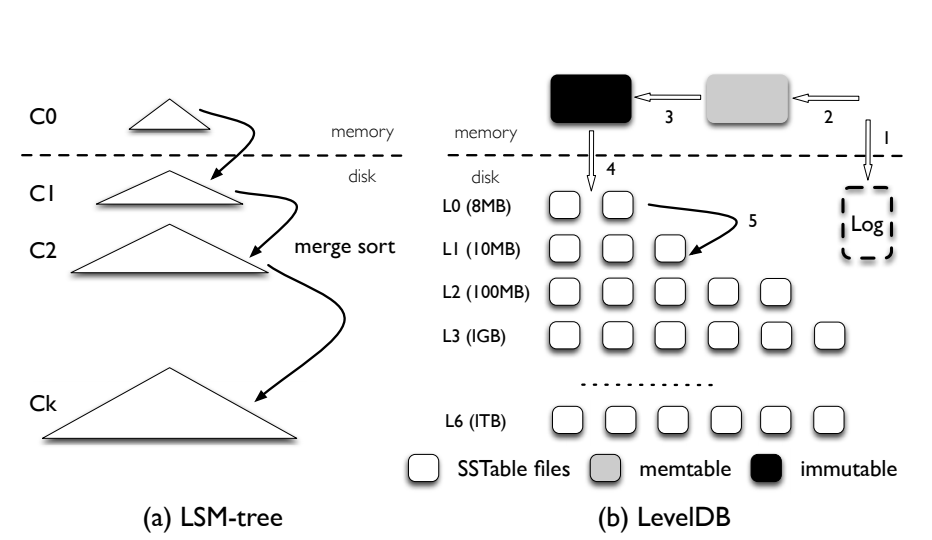

如图1所示, LSM树由从C0到Ck的大量指数增长的组件组成。C0组件是驻留在内存中的就地更新排序树, 而其他组件C1到Ck是驻留在磁盘中的仅附加B树。

在LSM树的插入过程中, 插入的键值对被附加到磁盘上的顺序日志文件, 以便在崩溃时能够恢复。然后, 将键-值对添加到内存中的C0中, 按键排序；C0允许对最近插入的键值对进行有效的查找和扫描。一旦C0达到其大小限制, 它就会以类似于合并排序的方式与磁盘上的C1合并；这一过程被称为压实。新合并的树将被顺序写入磁盘, 替换旧版本的C1。当每个Ci达到其大小限制时, 压缩(即合并排序)也会发生在磁盘组件上。请注意, 压缩仅在相邻级别(Ci和Ci+1)之间执行, 并且可以在后台异步执行。

为了提供查找操作, LSM树可能需要搜索多个组件。请注意, C0包含最新的数据, 其次是C1, 依此类推。因此, 为了检索一个键-值对, LSM树以级联方式从C0开始搜索组件, 直到它在最小的组件Ci中找到所需的数据。与B树相比, LSM树可能需要多次读取来进行点查找。因此, 当插入比查找更常见时, LSM树是最有用的[43]。

## 2.2 LevelDB

LevelDB是一个广泛使用的基于LSM树的键值存储, 其灵感来自BigTable [16, 48]。LevelDB支持范围查询、快照和其他在现代应用程序中有用的特性。在本节中, 我们简要描述LevelDB的核心设计。

LevelDB的整体架构如图1所示。LevelDB中的主要数据结构是一个磁盘上的日志文件、两个内存中排序的跳表(memtable和不可变mem Table)和七个级别(L0到L6)的磁盘上排序的字符串表(SSTable)文件。LevelDB最初将插入的键值对存储在日志文件和内存memtable中。一旦memtable已满, LevelDB将切换到新的memtable和日志文件, 以处理用户的进一步插入。在后台, 以前的memtable被转换为不可变的memtable, 然后压缩线程将其刷新到磁盘, 在0级(l 0)生成新的STable文件(通常约2mb)；先前的日志文件被丢弃。

每个级别中所有文件的大小都是有限的, 并且随着级别数的增加而增加10倍。例如, L1的所有文件的大小限制是10 MB, 而L2的限制是100 MB。为了保持大小限制, 一旦级别Li的总大小超过其限制, 压缩线程将从Li中选择一个文件, 与Li+1的所有重叠文件合并排序, 并生成新的Li+1稳定文件。压缩线程会继续执行, 直到所有级别都在它们的大小限制之内。此外, 在压缩期间, LevelDB确保特定级别中的所有文件(L0除外)不会在它们的键范围中重叠；L0文件中的键可以相互重叠, 因为它们是直接从memtable中刷新的。

为了提供查找操作, LevelDB首先搜索memtable, 接下来搜索不可变的memtable, 然后按顺序将L0填充到L6。定位随机关键字所需的文件搜索次数受最大级别数的限制, 因为除L0外, 关键字在单个级别内的文件之间不会重叠。由于L0中的文件可能包含重叠的键, 因此查找可能会在L0搜索多个文件。为了避免较长的查找延迟, 如果L0的文件数大于8, LevelDB会降低前台写入流量, 以便等待压缩线程将一些文件从L0压缩到L1。

## 2.3 读写放大

读写放大是LevelDB等LSM树中的主要问题。写(读)放大量定义为写入(读取)底层存储设备的数据量与用户请求的数据量之间的比率。在本节中, 我们分析LevelDB中的读写放大。

为了实现主要是顺序的磁盘访问, LevelDB写入了比需要更多的数据(尽管仍然是顺序的), 即LevelDB具有高写入放大。由于Li的大小限制是Li 1的10倍, 因此在压缩期间将Li1的文件合并到Li时, LevelDB可能会在最差情况下从Li读取多达10个文件, 并在排序后将这些文件写回Li。因此, 跨两级移动文件的写入放大倍数最高可达10倍。对于大型数据集, 由于任何新生成的表文件最终都可以通过一系列压缩步骤从L0迁移到L6, 因此写入放大倍数可以超过50(L1到L6之间的每个差距为10)。

由于设计中的折衷, 读取放大一直是LSM树的主要问题。LevelDB中的读取放大有两个来源。首先, 要查找一个键值对, LevelDB可能需要检查多个级别。在最差的情况下, LevelDB需要检查L0中的八个文件, 其余六个级别中的每一个都需要检查一个文件:总共14个文件。其次, 为了在一个表文件中找到一个键值对, LevelDB需要读取文件中的多个元数据块。具体来说, 实际读取的数据量由(索引块+布隆过滤器块+数据块)给出。例如, 为了查找1kb的键值对, LevelDB需要读取16kb的索引块、4kb的bloom-filter块和4kb的数据块；总共24 KB。因此, 考虑到最差情况下的14个稳定文件, LevelDB的读取放大倍数为24× 14 = 336。更小的键值对将导致更高的读取放大。

> 图2:读写放大。此图显示了两种不同数据库大小(1 GB和100 GB)下LevelDB的写入放大和读取放大。密钥大小为16 B, 值大小为1 KB。

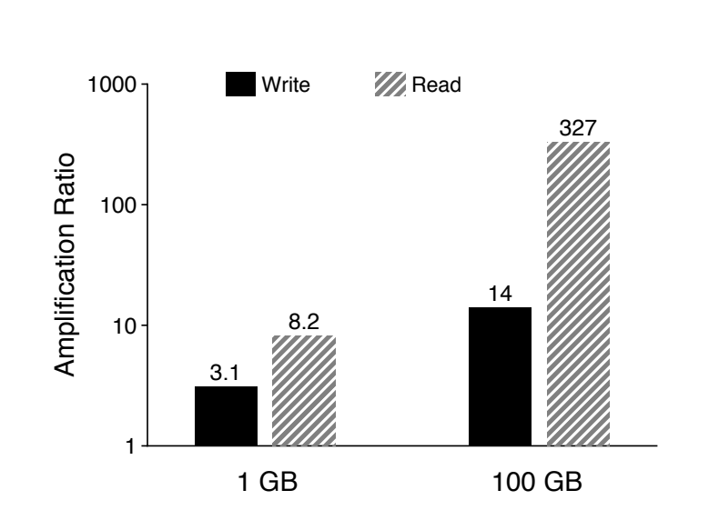

为了测量LevelDB的实际放大量, 我们进行了以下实验。我们首先加载一个包含1kb键值对的数据库, 然后从数据库中查找100, 000个条目；我们使用两种不同大小的数据库进行初始加载, 并从均匀分布中随机选择密钥。图2显示了加载阶段的写放大和查找阶段的读放大。对于1GB数据库, 写放大倍数为3.1, 而对于100GB数据库, 写放大倍数增加到14。读取放大遵循相同的趋势:1GB数据库为8.2, 100 GB数据库为327。写放大随着数据库大小的增加而增加的原因很简单。随着越来越多的数据被插入到数据库中, 键-值对将更有可能在各个级别上走得更远；换句话说, LevelDB在从低级向高级压缩时会多次写入数据。然而, 写放大不会达到之前预测的最差情况, 因为水平位置之间合并的平均文件数通常小于最差情况的10。读取放大也随着数据集的大小而增加, 因为对于小型数据库, 稳定文件中的所有索引块和布隆过滤器都可以缓存在内存中。但是, 对于大型数据库, 每次查找可能会触及不同的表文件, 每次都要支付读取索引块和布隆过滤器的成本。

应该注意的是, 高写入和读取放大倍数是硬盘驱动器的合理权衡。例如, 对于寻道延迟为10毫秒、吞吐量为100 MB/s的给定硬盘, 访问随机1K数据所需的时间大约为10毫秒, 而访问下一个顺序数据块所需的时间大约为10秒, 随机延迟和顺序延迟的比例为1000:1。因此, 与需要随机写访问的B树等替代数据结构相比, 写放大倍数小于1000的顺序只写方案在硬盘上速度更快[43, 49]。另一方面, LSM树的读数放大仍然与B树相当。例如, 考虑一个高度为5、块大小为4 KB的B树, 随机查找一个1kb的键值对需要访问6个块, 导致读取放大倍数为24。

## 2.4 快速存储硬件

许多现代服务器采用SSD设备来实现高性能。与硬盘驱动器类似, 固态硬盘中的随机写入也被认为是有害的[10, 31, 34, 40], 因为它们独特的擦除-写入周期和昂贵的垃圾收集。虽然SSD设备的初始随机写入性能良好, 但在使用保留块后, 性能可能会显著下降。因此, 避免随机写入的LSM树特性是固态硬盘的天然优势；许多固态硬盘优化的键值存储基于LSM树[25, 50, 53, 54]。

> 图3: SSD上的顺序和随机读取。此图显示了现代SSD设备上各种请求大小的顺序和随机读取性能。所有请求都发送到ext4上的100 GB文件。

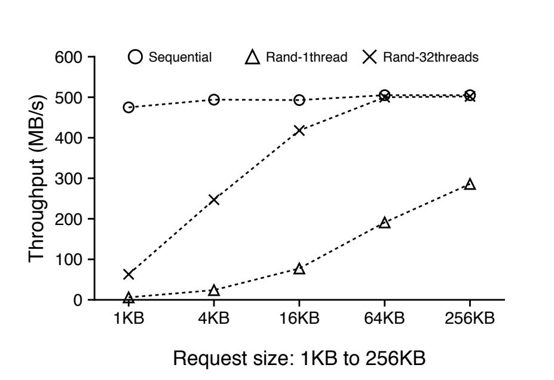

然而, 与硬盘不同, 随机读取的相对性能(与顺序读取相比)在固态硬盘上要好得多；此外, 当SSD中并发发出随机读取时, 对于某些工作负载, 聚合吞吐量可以与顺序吞吐量相匹配[17]。例如, 图3显示了500 GB三星840 EVO固态硬盘在各种请求大小下的顺序和随机读取性能。对于单线程的随机读取, 吞吐量随着请求大小的增加而增加, 达到256 KB的顺序吞吐量的一半。对于32个线程的并发随机读取, 当大小大于16 KB时, 聚合吞吐量与顺序吞吐量相当。对于更高端的固态硬盘, 并发随机读取和顺序读取之间的差距要小得多[3, 39]。

正如我们在本节中所展示的, LSM树具有很高的读写放大能力, 这对于硬盘来说是可以接受的。在高性能固态硬盘上使用LSM树可能会浪费很大一部分设备带宽, 因为读写操作过多。在本文中, 我们的目标是提高SSD设备上LSM树的性能, 以有效利用设备带宽。

# 3. WiscKey

上一节解释了LSM树如何通过提高I/O放大来维持顺序I/O访问。虽然顺序I/O访问和I/O放大之间的这种权衡对于传统硬盘来说是合理的, 但对于使用SSD的现代硬件来说并不是最佳选择。在本节中, 我们将介绍WiscKey的设计, 这是一种键值存储, 可最大限度地降低固态硬盘上的I/O放大。

为了实现SSD优化的键值存储, WiscKey包括四个关键想法。首先, WiscKey将键和值分开, 只将键保存在LSM树中, 将值保存在单独的日志文件中。其次, 为了处理未排序的值(在范围查询期间需要随机访问), WiscKey使用SSD设备的并行随机读取特性。第三, WiscKey利用独特的崩溃一致性和垃圾收集技术来有效管理值日志。最后, WiscKey通过在不牺牲一致性的情况下删除LSM树日志来优化性能, 从而减少了小型写入的系统调用开销。

## 3.1 设计目标

WiscKey是一个单机持久键值存储, 派生自LevelDB。它可以被部署为关系数据库(例如MySQL)或分布式键值存储(例如MongoDB)的存储引擎。它提供了和LevelDB一样的API, 包括Put(key, value)、Get(key)、Delete(key)和Scan(start, end)。威斯基的设计遵循这些主要目标。

低写放大。写放大会引入额外的不必要的写操作。尽管与硬盘相比, SSD设备具有更高的带宽, 但由于有限的擦除周期, 较大的写入放大会消耗大部分写入带宽(超过90%并不少见), 并缩短SSD的寿命。因此, 最大限度地降低写入放大非常重要, 这样可以提高工作负载性能和SSD寿命。

低读数放大。大读取放大会导致两个问题。首先, 通过为每次查找发出多次读取, 查找的吞吐量显著降低。其次, 加载到内存中的大量数据会降低缓存的效率。WiscKey将小的读取放大作为加速查找的目标。固态硬盘优化。WiscKey通过将其I/O模式与SSD设备的性能特征相匹配, 针对SSD设备进行了优化。具体来说, 顺序写入和并行随机读取得到了有效利用, 因此应用程序可以充分利用设备的带宽。

功能丰富的API。WiscKey旨在支持使LSM树流行的现代功能, 如范围查询和快照。范围查询允许扫描键值对的连续序列。快照允许捕获数据库在特定时间的状态, 然后对状态执行查找。

真实的键值大小。在现代工作负载中, 键通常很小(例如, 16 B) [7, 8, 11, 22, 35], 尽管值的大小可能变化很大(例如, 100 B到大于4 KB) [6, 11, 22, 28, 32, 49]。WiscKey旨在为这一组真实的键值大小提供高性能。

## 3.2 键值分离

LSM树的主要性能成本是压缩过程, 该过程不断对稳定文件进行分类。在压缩过程中, 多个文件被读入内存、排序并回写, 这可能会显著影响前台工作负载的性能。然而, 有效检索需要分类；通过排序, 范围查询(即扫描)将主要导致对多个文件的顺序访问, 而点查询将要求在每个级别上最多访问一个文件。

威斯基的动机是一个简单的启示。压缩只需要对键进行排序, 而值可以单独管理[42]。由于键通常小于值, 因此仅压缩键可以显著减少排序过程中所需的数据量。在WiscKey中, 只有值的位置与键一起存储在LSM树中, 而实际值以SSD友好的方式存储在其他地方。通过这种设计, 对于给定大小的数据库, WiscKey的LSM树的大小比LevelDB的小得多。较小的LSM树可以显著降低值大小适中的现代工作负载的写入放大。例如, 假设一个16-B密钥, 一个1 KB值, 密钥的写放大倍数为10(在LSM树中), 值的写放大倍数为1, 则WiscKey的有效写放大倍数仅为(10 × 16 + 1024) / (16 + 1024) = 1.14。除了提高应用程序的写入性能之外, 降低的写入放大倍数还可以减少擦除周期, 从而延长SSD的使用寿命。WiscKey的较小读取放大提高了查找性能。

在查找过程中, WiscKey首先在LSM树中搜索关键字和值的位置；一旦找到, 就发出另一个读取来检索该值。读者可能会认为WiscKey的查找速度会比LevelDB慢, 因为它需要额外的I/O来检索值。然而, 由于WiscKey的LSM树比LevelDB小得多(对于相同的数据库大小), 所以查找可以在LSM树中搜索更少级别的表文件, 并且LSM树的很大一部分可以很容易地缓存在内存中。因此, 每次查找只需要一次随机读取(用于检索值), 从而实现比LevelDB更好的查找性能。例如, 假设16-B个键和1kb个值, 如果整个键-值数据集的大小为100 GB, 那么LSM树的大小仅为2 GB左右(假设值的位置和大小的成本为12-B), 这可以很容易地缓存在具有超过100 GB内存的现代服务器中。

> 图4:固态硬盘上的WiscKey数据布局。此图显示了WiscKey在单个SSD设备上的数据布局。键和值的位置存储在LSM树中, 而值附加到单独的值日志文件中。

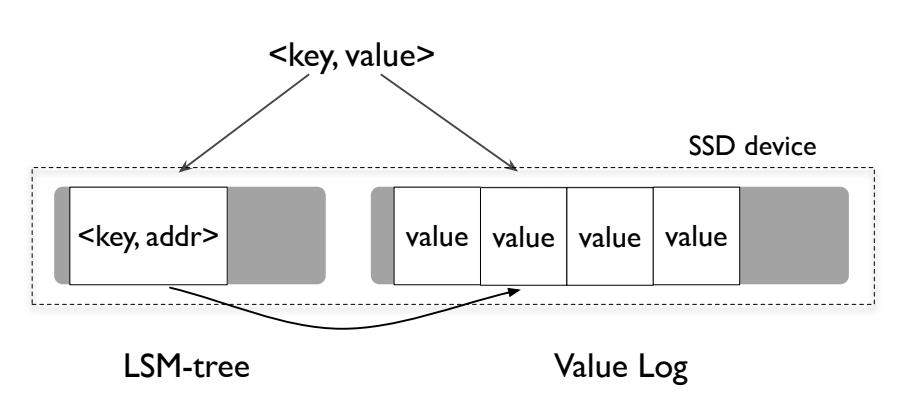

WiscKey的架构如图4所示。密钥存储在LSM树中, 而值存储在单独的值日志文件vLog中。与密钥一起存储在LSM树中的人工值是vLog中实际值的地址。

当用户在WiscKey中插入一个键-值对时, 值首先被附加到vLog, 然后键连同值的地址一起被插入到LSM树中( ``< vLog-offset, value-size>`` )。删除一个键只是从LSM树中删除它, 而不涉及vLog。vLog中的所有有效值在LSM树中都有相应的关键字；vLog中的其他值是无效的, 稍后将被垃圾收集(3.3.2)。

当用户查询一个键时, 首先在LSM树中搜索该键, 如果找到, 则检索相应值的地址。然后, WiscKey从vLog中读取值。注意, 这个过程适用于点查询和范围查询。

尽管键-值分离背后的思想很简单, 但它会带来许多挑战和优化机会, 这将在下面的小节中描述。

## 3.3 挑战

键和值的分离使得范围查询需要随机I/O。此外, 这种分离使得垃圾收集和崩溃一致性都具有挑战性。我们现在解释如何解决这些挑战。

### 3.3.1 水平范围查询

范围查询是现代键值存储的一个重要特性, 允许用户扫描一系列键值对。关系数据库[26]、本地文件系统[30、46、50]甚至分布式文件系统[37]都使用键值存储作为存储引擎, 范围查询是这些环境中需要的核心API。

对于范围查询, LevelDB为用户提供了一个基于迭代器的接口, 具有Seek(key)、Next()、Prev()、key()和Value()操作。要扫描一系列键-值对, 用户可以首先查找()起始键, 然后调用Next()或Prev()逐个搜索键。为了检索当前迭代器位置的键或值, 用户分别调用key()或value()。

在LevelDB中, 由于键和值存储在一起并进行排序, 因此范围查询可以从表文件中顺序读取键值对。但是, 由于键和值是分开存储在WiscKey中的, 范围查询需要随机读取, 因此效率不高。正如我们在图3中看到的, SSD上单个线程的随机读取性能无法与顺序读取性能相匹配。但是, 具有相当大请求大小的并行随机读取可以充分利用设备的内部并行性, 获得类似于顺序读取的性能。

为了有效地进行范围查询, WiscKey利用SSD设备的并行I/O特性, 在范围查询期间从vLog预取值。基本思想是, 对于固态硬盘, 只有密钥需要特别注意才能有效检索。只要有效地检索到键, 范围查询就可以使用并行随机读取来有效地检索值。

预取框架可以很容易地适应当前范围查询接口。在当前界面中, 如果用户请求一个范围查询, 一个迭代器将返回给用户。对于迭代器上请求的每个Next()或Prev(), WiscKey跟踪范围查询的访问模式。一旦请求了一个连续的键-值对序列, WiscKey就开始从LSM树中顺序地读取一些后续的键。从LSM树中检索的相应值地址被插入到队列中；多个线程将在后台同时从vLog获取这些地址。

### 3.3.2 垃圾收集

当键值对被删除或覆盖时, 基于标准LSM树的键值存储不会立即回收可用空间。相反, 在压缩过程中, 如果发现与被删除或被覆盖的键-值对相关的数据, 则丢弃该数据并回收空间。在WiscKey中, LSM树压缩只回收无效的键。因为WiscKey不压缩值, 所以它需要一个特殊的垃圾收集器来回收vLog中的空闲空间。

由于我们只将值存储在vLog文件(3.2)中, 从vLog中回收空闲空间的一个简单方法是首先扫描LSM树, 以获得所有有效值地址；
然后, vLog中没有来自LSM树的任何有效引用的所有值可以被视为无效并被回收。但是, 这种方法太笨重, 只能用于文件垃圾收集。

> 图5:垃圾收集的WiscKey新数据布局。此图显示了WiscKey支持高效垃圾收集的新数据布局。头指针和尾指针被维护在存储器中, 并且被持久地存储在LSM树中。只有垃圾收集线程会更改尾部, 而对vLog的所有写入都会附加到头部。

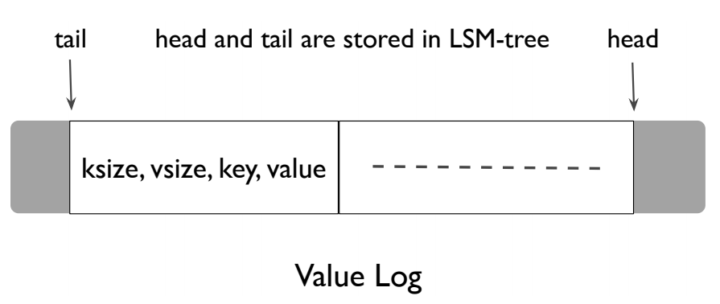

WiscKey的目标是一个轻量级的在线垃圾收集器。为了实现这一点, 我们对WiscKey的基本数据布局做了一个小小的修改:在vLog中存储值的同时, 我们还将相应的键与值一起存储。新的数据布局如图5所示:元组(键大小、值大小、键、值)存储在vLog中。

WiscKey的垃圾收集旨在将有效值(不对应于删除的键)保持在vLog的连续范围内, 如图5所示。这个范围的一端, 即头部, 总是对应于vLog的末尾, 在那里将追加新的值。这个范围的另一端称为尾部, 是垃圾收集被触发时开始释放空间的地方。只有vLog的头部和尾部之间的部分包含有效值, 并且将在查找期间被搜索。

在垃圾收集期间, WiscKey首先从vLog的尾部读取一大块键值对(例如, 几个MB ),然后通过查询LSM树找到这些值中哪些是有效的(尚未被覆盖或删除)。WiscKey然后将有效值附加回vLog的头部。最后, 它释放块先前占用的空间, 并相应地更新尾部。

如果在垃圾收集期间发生崩溃, 为了避免丢失任何数据, WiscKey必须确保在实际释放空间之前, 新追加的有效值和新尾在设备上是持久的。WiscKey通过以下步骤实现了这一点。在将有效值附加到vLog之后, 垃圾收集在vLog上调用fsync()。然后, 它以同步方式将这些新值的地址和当前尾部添加到LSM树中；尾部作为 ``<"tail", tail-vLog-offset>`` 存储在LSM树中。最后, vLog中的空闲空间被回收。

WiscKey可以配置为定期启动并继续垃圾收集, 或者直到达到特定阈值。垃圾收集也可以在脱机模式下运行以进行维护。对于删除次数很少的工作负载以及存储空间过度调配的环境, 很少会触发垃圾数据收集。

### 3.3.3 崩溃一致性

在系统崩溃时, LSM树实现通常保证插入的键值对的原子性和插入对的有序恢复。由于WiscKey的体系结构将值与LSM树分开存储, 因此获得相同的崩溃保证可能会显得复杂。然而, WiscKey通过使用现代文件系统(如ext4、btrfs和xfs)的有趣属性提供了相同的崩溃保证。考虑一个包含字节序列b1 b2 b3的文件...bn, 用户追加序列bn+1bn+2bn+3...bn+m到它。如果发生崩溃, 在现代文件系统中的文件系统恢复之后, 将观察到文件包含字节b1 b2 b3的序列...bn bn+1bn+2bn+3...bn+x ∃ x < m, 即在文件系统恢复期间, 只有一些附加字节的前缀会添加到文件的末尾[45]。不可能将随机字节或附加字节的非前缀子集添加到文件中。由于在WiscKey中, 值被顺序附加到vLog文件的末尾, 因此上述属性可以方便地转换如下:如果vLog中的值X在崩溃中丢失, 则所有未来的值(插入在X之后)也将丢失。

当用户查询一个键-值对时, 如果WiscKey在LSM树中找不到该键, 因为该键在系统崩溃期间丢失了, WiscKey的行为就像传统的LSM树一样:即使该值在崩溃之前已经写入vLog, 它也会在以后被垃圾收集。但是, 如果可以在LSM树中找到密钥, 则需要一个额外的步骤来保持一致性。在这种情况下, WiscKey首先验证从LSM树中检索到的值地址是否在vLog的当前有效范围内, 然后验证找到的值是否对应于查询的密钥。如果验证失败, WiscKey会假设该值在系统崩溃期间丢失, 从LSM树中删除该密钥, 并通知用户未找到该密钥。

由于添加到vLog中的每个值都有一个包含相应密钥的报头, 因此验证密钥和值是否匹配是简单明了的；如果需要, 可以很容易地将幻数或校验和添加到报头中。

如果用户特别请求同步插入, LSM树实现还保证了键值对在系统崩溃后的用户持久性。WiscKey通过在向其LSM树执行同步插入之前填充vLog来实现同步插入。

## 3.4 优化

在WiscKey中将键和值分开提供了一个重新思考值日志如何更新以及LSM树日志的必要性的机会。我们现在描述这些机会如何能够提高性能。

### 3.4.1 值日志写缓冲区

> 图6:写单元大小的影响。此图显示了将10GB文件写入SSD设备上的ext4文件系统的总时间, 最后是fsync()。我们改变每个write()系统调用的大小。

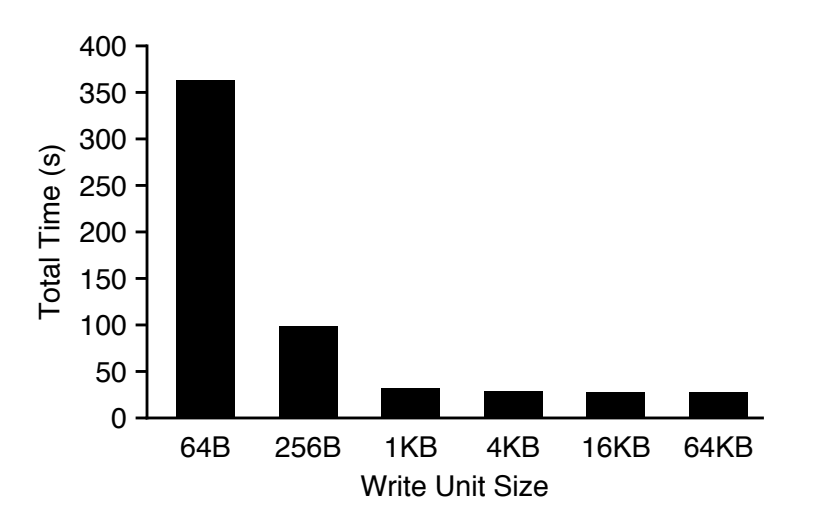

对于每个Put(), WiscKey需要通过使用write()系统调用将值追加到vLog中。然而, 对于插入密集型工作负载, 向文件系统发出大量小写操作会带来显著的开销, 尤其是在快速存储设备上[15, 44]。图6显示了在ext4 (Linux 3.14)中顺序写入一个10GB文件的总时间。对于小型写入, 每个系统调用的开销会显著增加, 导致运行时间很长。对于大型写入(大于4 KB), 设备吞吐量得到充分利用。

为了减少开销, WiscKey在用户空间缓冲区中缓冲值, 并且仅当缓冲区大小超过阈值或者用户请求同步插入时才清空缓冲区。因此, WiscKey只发出大的写操作, 并减少write()系统调用的次数。对于查找, WiscKey首先搜索vLog缓冲区, 如果没有找到, 则实际从vLog中读取。显然, 这种机制可能导致一些数据(被缓冲的)在崩溃期间丢失；获得的崩溃一致性保证类似于LevelDB。

### 3.4.2 优化LSM树日志

如图1所示, 日志文件通常用于LSM采油树。LSM树跟踪日志文件中插入的键值对, 因此, 如果用户请求同步插入并且出现崩溃, 可以在重新启动后扫描日志, 并恢复插入的键值对。

在WiscKey中, LSM树仅用于键和值地址。此外, vLog还记录插入的键以支持垃圾收集, 如前一节所述。因此, 可以避免写入LSM树日志文件, 而不会影响正确性。

如果在密钥在LSM树中持久化之前发生崩溃, 则可以通过扫描vLog来恢复它们。然而, 一个简单的算法需要扫描整个vLog进行恢复。为了只需要扫描vLog的一小部分, WiscKey在LSM树中周期性地记录vLog的头部, 作为键值对“head”, head-vLog-offset。当数据库打开时, WiscKey从存储在LSM树中的最近的磁头位置开始vLog扫描, 并继续扫描直到vLog结束。由于头部存储在LSM树中, 并且LSM树固有地保证插入到LSM树中的关键字将以插入顺序被恢复, 所以这种优化是崩溃一致的。因此, 删除WiscKey的LSM树日志是一个安全的优化, 并且可以提高性能, 尤其是在有许多小插入的情况下。

## 3.5 实现

WiscKey基于LevelDB 1.18。WiscKey在创建新数据库时创建一个vLog, 并管理LSM树中的键和值地址。vLog由具有不同访问模式的多个组件在内部访问。例如, 通过随机读取vLog来进行查找, 而垃圾收集器则从vLog文件的尾部开始顺序读取, 并附加到其头部。我们使用posix fadvise()来预先声明不同情况下vLog的访问模式。
对于范围查询, WiscKey维护一个有32个线程的后台线程池。这些线程在线程安全队列中休眠, 等待新值地址的到来。当预取被触发时, WiscKey将固定数量的值地址插入工作队列, 然后唤醒所有睡眠线程。这些线程将开始并行读取值, 并自动将它们缓存在缓冲区缓存中。

为了有效地对vLog的空闲空间进行垃圾收集, 我们使用了现代文件系统的打孔功能(fallocate())。在文件中打孔可以释放分配的物理空间, 并允许WiscKey灵活地使用存储空间。现代文件系统的最大文件大小足以让WiscKey运行很长时间, 而不会回到文件的开头；例如, ext4上的最大文件大小是64 TB, xfs上是8 EB, btrfs上是16 EB。如果需要, vLog可以很容易地改编成循环日志。

# 4. 评估

在本节中, 我们将展示评估结果, 展示WiscKey设计选择的优势。

所有实验都是在一台测试机上运行的, 该测试机配有两个英特尔至强CPU E5-2667 v2 @ 3.30GHz处理器和64GB内存。操作系统是64位Linux 3.14, 使用的文件系统是ext4。使用的存储设备是500 MB的三星840 EVO SSD, 具有500 MB/s顺序读取和400 MB/s顺序写入的最高性能。该器件的随机读取性能如图3所示。

## 4.1 微基准测试

我们使用db bench(LevelDB中默认的微基准)来评估level db和WiscKey。我们总是使用16 B的密钥大小, 但是对不同的值大小进行实验。为了更容易理解和分析性能, 我们禁用了数据压缩。

### 4.1.1 负载性能

我们现在描述顺序加载和随机加载微基准的结果。前一个基准通过按顺序插入键来构建一个100 GB的数据库, 而后一个基准以均匀分布的随机顺序插入键。请注意, 顺序加载基准测试不会导致LevelDB或WiscKey中的压缩, 而随机加载会。

> 图7:顺序加载性能。此图显示了100 GB数据集不同值大小时LevelDB和WiscKey的顺序加载吞吐量。密钥大小为16 B。

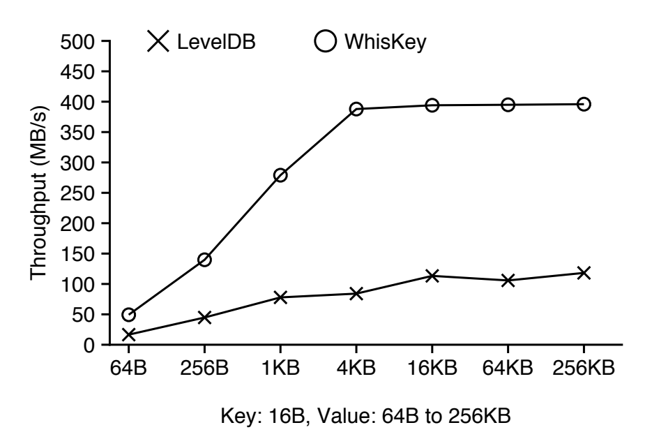

图7显示了LevelDB和WiscKey在各种值大小时的顺序装载吞吐量:这两个存储的吞吐量随着值的大小而增加。但是, 即使对于所考虑的最大值大小(256 KB), LevelDB的吞吐量也远远达不到设备带宽。为了进一步分析这一点, 图8显示了LevelDB每次运行基准测试期间不同组件所花费的时间分布；时间主要花在三个部分:写入日志文件、插入memtable, 以及等待memtable写入器件。对于小键值对, 写入日志文件占总时间的最大百分比, 原因如图6所示。

> 图8: LevelDB的顺序加载时间分解。此图显示了在LevelDB中顺序加载期间不同组件所占的时间百分比。

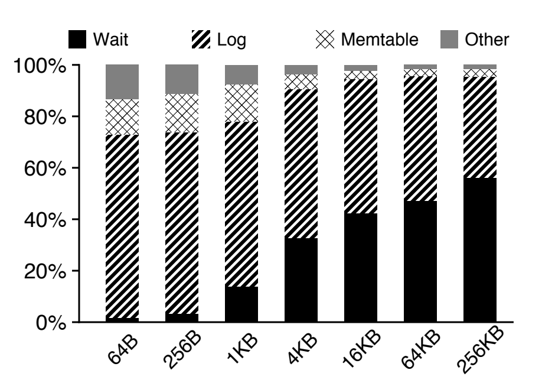

对于较大的对, 日志写入和内存表排序更有效, 而内存表刷新是瓶颈。与LevelDB不同, WiscKey对于大于4 KB的值达到了设备的最大带宽。因为它不写入LSM树日志, 缓冲区附加到vLog, 所以即使对于小值, 它也快3倍。

图9显示了不同值大小时LevelDB和WiscKey的随机负载吞吐量。

> 图9: 随机负载性能。此图显示了100 GB数据集不同值大小时LevelDB和WiscKey的随机负载吞吐量。密钥大小为16 B。

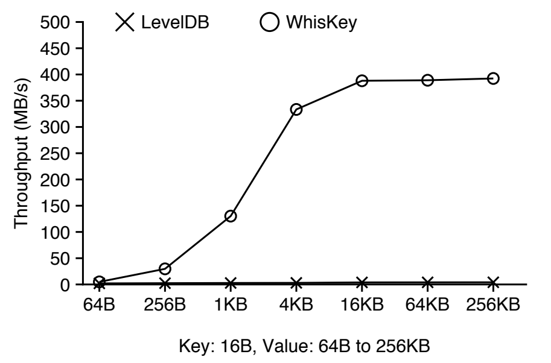

LevelDB的吞吐量范围从仅2 MB/s (64B值大小)到4.1 MB/s(256 KB值大小), 而WiscKey的吞吐量随着值大小的增加而增加, 在值大小大于4 KB后达到峰值设备写入吞吐量。对于1kb和4kb的值大小, WiscKey的吞吐量分别是LevelDB的46倍和111倍。LevelDB的吞吐量较低, 因为压缩不仅会消耗很大一部分设备带宽, 还会降低前台写入的速度(以避免LSM树的L0过载, 如2.2节所述)。在WiscKey中, 压缩只会带来很小的开销, 导致整个设备带宽得到有效利用。为了进一步分析这一点, 图10显示了LevelDB和WiscKey的写放大倍数, LevelDB的写放大倍数总是大于12, 而WiscKey的写放大倍数在值大小达到1 KB时迅速下降到接近1, 因为wis ckey的LSM树明显更小。

> 图10: 随机负载的写放大。此图显示了随机加载100 GB数据库时LevelDB和WiscKey的写放大。

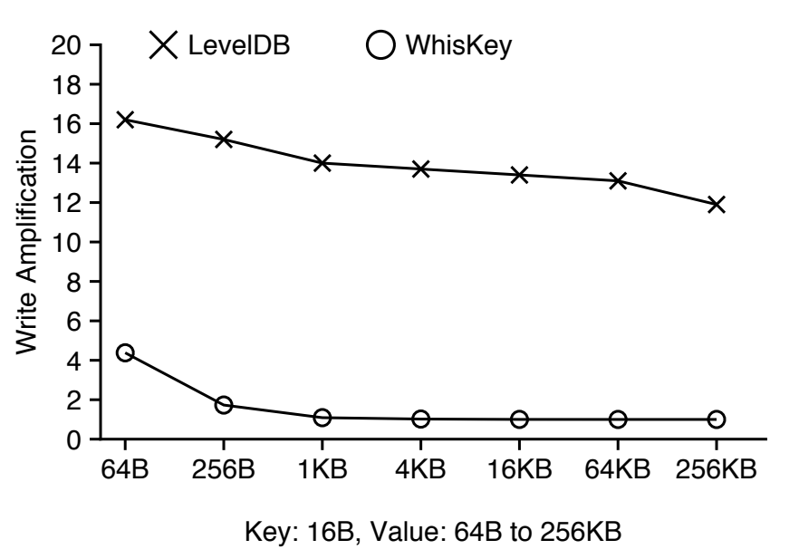

### 4.1.2 查询性能

> 图11: 随机查找性能。此图显示了随机加载的100 GB数据库上100, 000次操作的随机查找性能。

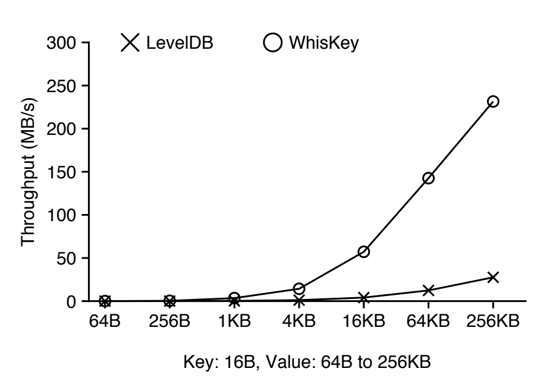

我们现在比较LevelDB和WiscKey的随机查找(点查询)和范围查询性能。图11展示了在100 GB随机加载的数据库上100000次操作的随机查找结果。即使WiscKey中的随机查找需要检查LSM树和vLog, WiscKey的吞吐量仍然比LevelDB好得多:对于1kb的值大小, WiscKey的吞吐量是LevelDB的12倍。对于较大的值, WiscKey的吞吐量仅受器件随机读取吞吐量的限制, 如图3所示。由于第2.3节中提到的高读取放大, LevelDB的吞吐量较低。WiscKey的表现明显更好, 因为较小的LSM树导致读取放大更低。WiscKey性能更好的另一个原因是WiscKey中的压缩过程不太激烈, 因此避免了许多后台读写。

图12显示了LevelDB和WiscKey的范围查询(扫描)性能。对于随机加载的数据库, LevelDB从不同级别读取多个文件, 而WiscKey需要随机访问vLog(但WiscKey利用并行随机读取)。从图12中可以看出, LevelDB的吞吐量最初随着两个数据库的值大小而增加。

> 图12: 范围查询性能。该图显示了范围查询性能。从随机(Rand)和顺序(Seq)加载的100 GB数据库中查询4 GB数据。

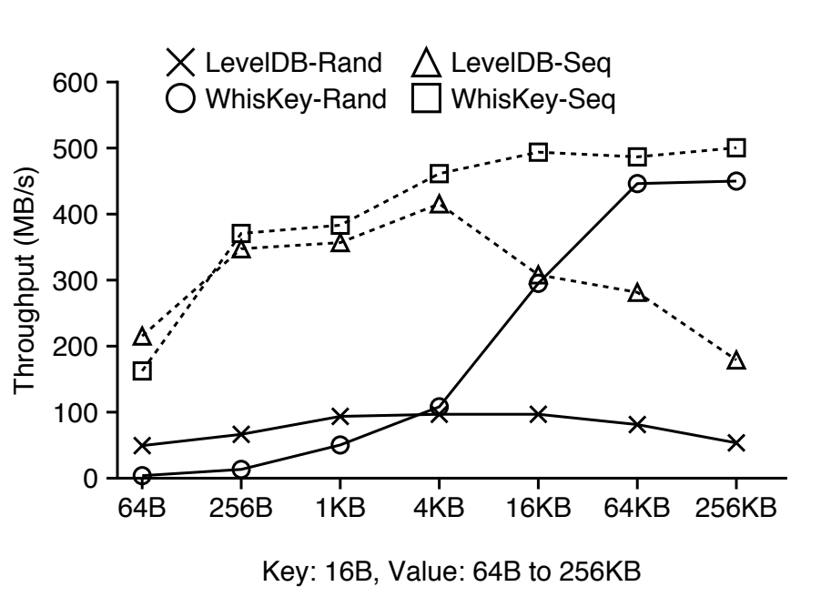

然而, 超过4 KB的值大小时, 由于一个稳定文件只能存储少量的键值对, 因此打开许多稳定文件并读取每个文件中的索引块和bloom filter是主要开销。对于更大的键值对, WiscKey可以提供设备的顺序带宽, 最高可达LevelDB的8.4倍。然而, 对于64-B键-值对, WiscKey的性能比LevelDB差12倍, 这是因为该设备对于小请求大小的并行随机读取吞吐量有限；WiscKey在具有更高并行随机读取吞吐量的高端固态硬盘上的相对性能更好[3]。此外, 这种工作负载代表了数据库被随机填充且数据在vLog中未排序的最坏情况。

图12还显示了数据排序时范围查询的性能, 这对应于顺序加载的数据库；在这种情况下, LevelDB和WiscKey都可以顺序扫描数据。顺序加载数据库的性能与随机加载数据库的趋势相同；对于64-B对, WiscKey要慢25%,因为WiscKey从vLog中读取键和值(因此浪费了带宽),但是对于大的键-值对, WiscKey要快2.8倍。因此, 对于小的键-值对, 随机加载的数据库的日志重组(排序)可以使WiscKey的范围查询性能与LevelDB的性能相当。

### 4.1.3 垃圾收集

我们现在研究垃圾收集在后台执行时WiscKey的性能。根据垃圾收集期间找到的可用空间百分比, 性能可能会有所不同, 因为这会影响写入的数据量和垃圾收集线程释放的空间量。

我们使用随机负载(受垃圾收集影响最大的工作负载)作为前台工作负载, 并研究它在不同的空闲空间百分比下的性能。我们的实验具体涉及三个步骤:首先, 我们使用随机加载创建一个数据库, 然后删除所需百分比的键值对, 最后, 我们运行随机加载工作负载并测量其吞吐量, 同时在后台进行垃圾收集。我们使用4 KB的键值大小, 并在25%到100%之间改变空闲空间的百分比。

> 图13: 垃圾收集。此图显示了在不同的可用空间比率下, WiscKey在垃圾收集下的性能。

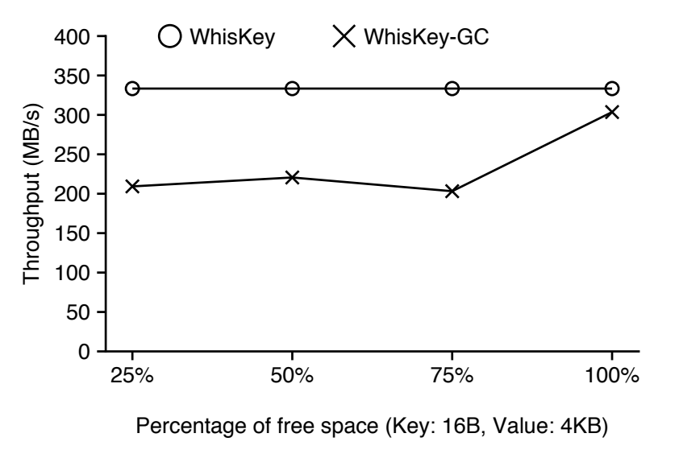

图13显示了结果:如果垃圾收集器读取的数据100%都是无效的, 那么吞吐量只降低了10%。吞吐量只是略微降低, 因为垃圾收集从vLog的尾部读取, 并且只将有效的键值对写入头部；如果读取的数据完全无效, 则不需要写入任何键值对。对于其他可用空间百分比, 由于垃圾收集线程执行额外的写入, 吞吐量下降了大约35%。请注意, 在所有情况下, 虽然
垃圾收集正在进行, WiscKey比LevelDB至少快70倍。

### 4.1.4 崩溃一致性

将键和值分开需要额外的机制来保持崩溃一致性。我们使用ALICE工具[45]验证了WiscKey的崩溃一致性机制；该工具选择并模拟一组全面的系统崩溃, 这些系统崩溃很有可能暴露不一致性。我们使用一个调用一些异步和同步Put()调用的测试用例。当配置为运行ext4、xfs和btrfs测试时, ALICE检查了3000多个选择性选择的系统崩溃, 并且没有报告任何由WiscKey引入的一致性漏洞。

新的一致性机制也会影响WiscKey在崩溃后的恢复时间, 我们设计了一个实验来测量WiscKey和LevelDB在最坏情况下的恢复时间。崩溃后, LevelDB的恢复时间与其日志文件的大小成正比；

就在memtable被写入磁盘之前, 日志文件以最大大小存在。在恢复过程中, WiscKey首先从LSM树中检索头指针, 然后从头指针开始扫描vLog文件, 直到文件结束。由于在写入memtable时, 更新后的head指针保存在磁盘上, 因此WiscKey的最坏情况恢复时间也对应于在此之前发生的崩溃。我们测量了到目前为止所描述的情况导致的最坏情况下的恢复时间；
对于1kb的值, LevelDB在崩溃后需要0.7秒来恢复数据库, 而WiscKey需要2.6秒。请注意, 如果需要, 可以配置WiscKey以更频繁地保存磁头指针。

### 4.1.5 扩大空间

在评估键值存储时, 大多数以前的工作只关注读写放大。然而, 空间放大对于闪存设备非常重要, 因为与硬盘相比, 闪存设备的每GB价格非常昂贵。空间放大是数据库在磁盘上的实际大小与数据库逻辑大小的比率[5]。例如, 如果一个1kb的键值对占用了4 KB的磁盘空间, 则空间放大倍数为4。压缩会降低空间放大, 而额外数据(垃圾、碎片或元数据)会提高空间放大。为了使讨论简单, 压缩被禁用。

对于顺序加载工作负载, 如果LSM树中的额外元数据最少, 空间放大可能接近1。对于随机加载或覆盖工作负载, 当无效对的垃圾收集速度不够快时, 空间放大通常大于1。

> 图14: 空间放大。此图显示了100 GB数据集的随机负载工作负载的实际数据库大小LevelDB和WiscKey。User-Data表示逻辑数据库大小。

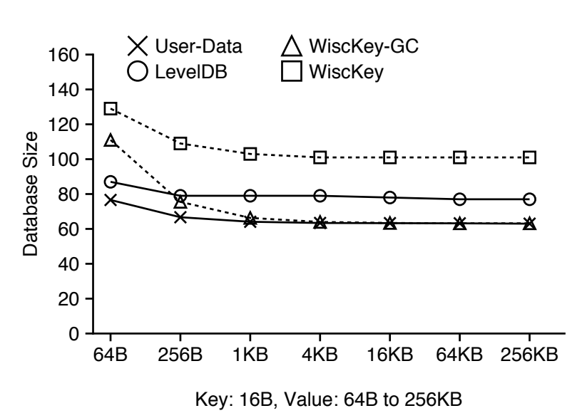

图14显示了随机加载一个100 GB的数据集(与图9相同的工作负载)后LevelDB和WiscKey的数据库大小。LevelDB的空间开销是由无效的键值对引起的, 这些键值对在工作负载完成时不会被垃圾收集。WiscKey的空间开销包括无效的键值对和额外的元数据(LSM树中的指针和vLog中的元组, 如图5所示)。在垃圾收集之后, 当额外的元数据与值的大小相比很小时, WiscKey的数据库大小接近逻辑数据库大小。

没有键值存储可以同时最小化读取放大、写入放大和空间放大。在不同的系统中, 这三个因素之间的权衡是不同的。在LevelDB中, 排序和垃圾收集是耦合在一起的。LevelDB用更高的写入放大来换取更低的空间放大；但是, 工作负载性能可能会受到显著影响。工作负载运行时, WiscKey会消耗更多空间来最小化I/O放大；因为在WiscKey中, 排序和垃圾收集是分离的, 所以垃圾收集可以在以后进行, 从而将它对前台性能的影响降到最低。

### 4.1.6 CPU使用情况

现在, 我们研究LevelDB和WiscKey对于前面几节中显示的各种工作负载的CPU使用情况。此处显示的CPU使用率包括应用程序和操作系统的使用率。

如表1所示, 对于顺序负载工作负载, LevelDB具有更高的CPU使用率。正如我们在图8中所解释的, LevelDB花费大量时间将键值对写入日志文件。写入日志文件需要对每个键值对进行编码, 这需要很高的CPU成本。由于WiscKey在优化时删除了日志文件, 因此WiscKey的CPU使用率低于LevelDB。对于范围查询工作负载, WiscKey使用32个后台线程来执行预取；所以WiscKey的CPU使用率远高于LevelDB。

我们发现, 在我们的设置中, CPU并不是LevelDB和WiscKey的瓶颈。LevelDB的架构是基于单写者协议的。后台压缩也只使用一个线程。RocksDB [25]探讨了更好的多核并发设计。

> 表1: LevelDB和WiscKey的CPU使用情况。下表比较了LevelDB和WiscKey上四个工作负载的CPU使用情况。密钥大小为16 B, 值大小为1 KB。SeqLoad和Rand-Load分别顺序和随机加载100GB的数据库。给定一个100 GB随机填充的数据库, Rand-Lookup发出100 K次随机查找, 而Range-Query顺序扫描4GB数据。

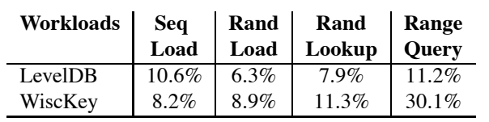

## 4.2 YCSB 基准测试

YCSB基准[21]为评估键值存储的性能提供了一个框架和一组标准的六个工作负载。我们使用YCSB在100 GB的数据库上比较LevelDB、RocksDB [25]和WiscKey。除了测量WiscKey的正常情况下的性能之外, 我们还在垃圾收集总是在后台发生的情况下运行WiscKey, 以便测量其最坏情况下的性能。RocksDB [25]是LevelDB的SSD优化版本, 有许多优化, 包括多个内存表和用于压缩的后台线程。我们使用带有默认配置参数的RocksDB。我们用1 KB和16 KB(禁用数据压缩)两种不同的值大小评估了键值存储。

> 图15: YCSB宏基准性能。该图显示了针对各种YCSB工作负载的LevelDB、RocksDB和WiscKey的性能。X轴对应于不同的工作负载, Y轴显示了标准化为LevelDB性能的性能。每个条形顶部的数字显示了实现的实际吞吐量(K ops/s)。(a)显示1kb值下的性能,( b)显示16kb值下的性能。负载工作负载相当于构建一个100 GB的数据库, 类似于随机负载微基准测试。工作负载-A有50%读取和50%更新, 工作负载-B有95%读取和5%更新, 工作负载-C有100%读取；密钥是从一个Zipf中选择的, 更新在已经存在的密钥上操作。工作负载D包括95%的读取和5%的插入新键(时间加权分布)。Workload-E涉及95%的范围查询和5%的插入新键(Zipf), 而Workload-F有50%的读取和50%的读取-修改-写入(Zipf)。

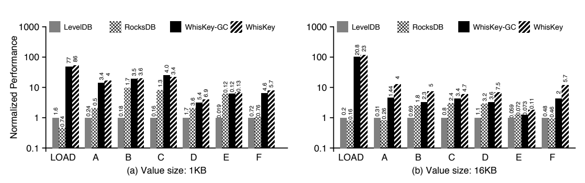

WiscKey的性能明显优于LevelDB和RocksDB, 如图15所示。例如, 在加载期间, 对于1kb的值, WiscKey在通常情况下比其他数据库至少快50倍, 在最坏情况下至少快45倍(使用垃圾收集)；即使在最差的情况下, WiscKey的性能也比16kb高104倍。
对于读取, 大多数工作负载中使用的Zipf分布允许缓存和检索流行的项目, 而不会导致磁盘访问, 因此降低了WiscKey相对于LevelDB和RocksDB的优势。因此, WiscKey的相对性能(与LevelDB和RocksDB相比)在Workload-A (50%读取)中要优于Workload-B (95%读取)和Workload-C (100%读取)。然而, RocksDB和LevelDB在这些工作负载中的任何一个方面的性能仍然无法与WiscKey相媲美。

WiscKey的最坏情况性能(垃圾收集始终打开, 即使对于只读工作负载也是如此)优于LevelDB和RocksDB。但是, 对于1kb和16kb的值, 垃圾收集对性能的影响是明显不同的。垃圾收集重复选择和清理vLog的4mb块；对于小值, 块将包括许多键值对, 因此垃圾收集花费更多时间访问LSM树来验证每一对的有效性。对于较大的值, 垃圾收集在验证上花费的时间较少, 因此会主动写出已清理的区块, 对前台吞吐量的影响更大。请注意, 如果有必要, 可以限制垃圾收集以减少其对前台的影响。

与之前考虑的微基准不同, Workload-E有多个小范围查询, 每个查询检索1到100个键值对。由于工作负载涉及多个范围查询, 访问每个范围中的第一个键会导致随机查找, 这种情况对WiscKey有利。因此, 即使对于1kb的值, WiscKey的性能也优于RocksDB和LevelDB。

# 5. 相关的工作

已经为SSD设备提出了各种基于散列表的键值存储。FAWN [8]将键值对保存在SSD上的仅附加日志中, 并使用内存中的哈希表索引进行快速查找。Flash-Store [22]和SkimpyStash [23]遵循相同的设计, 但是优化了内存中的哈希表；FlashStore使用cuckoo哈希和紧凑密钥签名, 而SkimpyStash使用线性链接将表的一部分移动到SSD。BufferHash [7]使用多个内存哈希表, 布隆过滤器选择使用哪个哈希表进行查找。淤泥[35]是高度优化的内存, 并使用日志结构, 哈希表和排序表布局的组合。WiscKey与这些键值存储共享日志结构数据布局。然而, 这些存储使用哈希表进行索引, 因此不支持构建在LSM树存储之上的现代功能, 如范围查询或快照。相反, WiscKey的目标是一个功能丰富的键值存储, 可以在各种情况下使用。

很多工作都是为了优化最初的LSM树键值存储[43]。bLSM [49]提出了一种新的合并调度器来限制写入延迟, 从而保持稳定的写入吞吐量, 并使用布隆过滤器来提高性能。VT-tree [50]通过使用间接层, 避免了在压缩期间对任何先前排序的键值对进行排序。相反, WiscKey直接将值与键分开, 无论工作负载中的键分布如何, 都显著降低了写入放大。LOCS [53]将内部闪存通道暴露给LSM树键值存储, 这可以利用丰富的并行性来实现更高效的压缩。Atlas [32]是基于ARM处理器和擦除编码的分布式键值存储, 将键和值存储在不同的硬盘上。WiscKey是一个独立的键值存储, 其中键和值之间的分离针对SSD设备进行了高度优化, 以实现显著的性能提升。LSM-特里[54]使用特里结构来组织关键字, 并提出了基于特里的更有效的压缩；然而, 这种设计牺牲了LSM树特性, 例如对范围查询的有效支持。由于RocksDB的设计与LevelDB基本相似, 因此之前描述的rocks db仍然表现出较高的写入放大。RocksDB的优化与WiscKey的设计是正交的。

Walnut [18]是一种混合对象存储, 它将小对象存储在LSM树中, 并将大对象直接写入文件系统。IndexFS [47]使用列样式的模式将其元数据存储在LSM树中, 以加快插入的吞吐量。Purity [19]还通过仅排序索引和存储来将其索引从数据元组中分离出来
按时间顺序排列的元组。这三个系统都使用了与WiscKey相似的技术。然而, 我们以一种更通用、更完整的方式解决了这个问题, 并针对各种工作负载优化了SSD设备的加载和查找性能。

还提出了基于其他数据结构的键值存储。TokuDB [13, 14]基于分形树索引, 它在内部节点缓冲更新；键是不排序的, 为了获得好的性能, 必须在内存中维护一个大的索引。ForestDB [6]使用HB+-trie来有效地索引长键, 从而提高性能并减少内部节点的空间开销。NVMKV [39]是一个FTL感知的键值存储, 它使用本地FTL功能, 如稀疏寻址和事务支持。将多个请求组合成一个操作的向量接口也被提议用于键值存储[52]。因为这些键值存储基于不同的数据结构, 所以它们在性能方面有不同的权衡；相反, 威斯基建议改进广泛使用的LSM树结构。

许多提议的技术试图克服内存中键值存储的可伸缩性瓶颈, 例如Mastree [38]、MemC3 [27]、Memcache [41]、MICA [36]和cLSM [28]。这些技术可以适用于WiscKey, 以进一步提高其性能。

# 6. 结论

键值存储已经成为数据密集型应用程序中的基本构件。在本文中, 我们提出了WiscKey, 这是一种基于LSM树的新型键值存储, 它将键和值分开, 以最小化读写放大。WiscKey的数据布局和I/O模式针对SSD设备进行了高度优化。我们的结果表明, WiscKey可以显著提高大多数工作负载的性能。我们希望WiscKey中的键值分离和各种优化技术能够启发下一代高性能键值存储。

# 致谢

我们感谢匿名评论者和Ethan Miller(我们的牧羊人)的反馈。我们感谢ADSL研究组成员、RocksDB团队(FaceBook)、Yinan Li(微软研究院)和Bin Fan(Tachyon Nexus)在不同阶段对这项工作提出的建议和意见。

本材料得到了美国国家科学基金会CNS-1419199、CNS-1421033、CNS-1319405和CNS-1218405的资助, 以及EMC、脸书、谷歌、华为、微软、NetApp、希捷、三星、维尔软件和VMware的慷慨捐赠。本材料中表达的任何观点、发现、结论或建议都是作者的, 可能不反映NSF或其他机构的观点。
