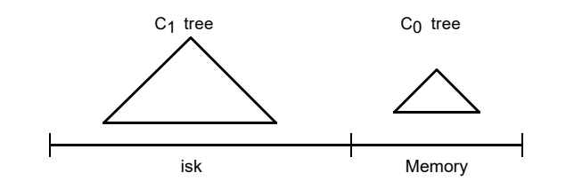
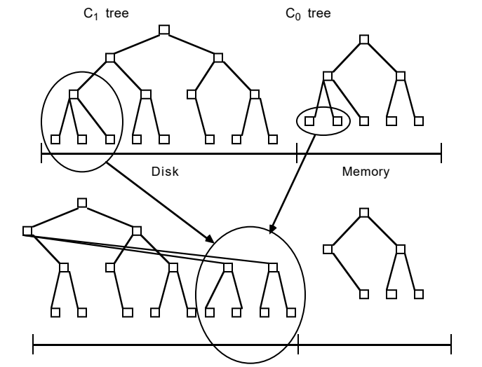
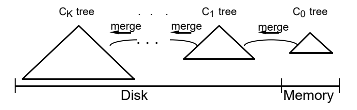
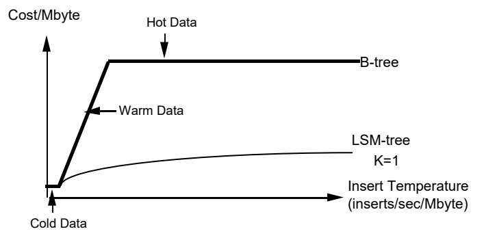

# LSM树

著作信息：

- Patrick O'Neil
- Edward Cheng
- Dieter Gawlick
- Elizabeth O'Neil
- To be published: Acta Informatica

# 摘要

高性能事务系统应用程序通常在历史表中插入行，以提供活动跟踪；同时，交易系统生成日志记录，用于系统恢复。这两种类型的生成信息都可以受益于有效的索引。一个众所周知的例子是TPC-A基准应用程序，它被修改以支持对特定账户的账户活动历史的有效查询。

这需要在快速增长的历史表上按account-id建立索引。不幸的是， **标准的基于磁盘的索引结构(如B树)将有效地加倍事务的I/O成本** ，以实时维护这样的索引，从而将总系统成本增加高达50%。显然， **需要一种以低成本维护实时索引的方法** 。日志结构的合并树(LSM树)是一种基于磁盘的数据结构，旨在为长期经历高速记录插入(和删除)的文件提供低成本索引。LSM树使用一种算法来延迟和批处理索引更改，以类似于合并排序的高效方式将基于内存的分量的更改级联到一个或多个磁盘分量。在此过程中，通过内存分量或某个磁盘分量，可以 **连续访问所有索引值以进行检索**(除了非常短的锁定期)。与传统访问方法(如B树)相比，该算法大大减少了磁盘臂的移动，并将在使用传统访问方法插入的磁盘臂成本超过存储介质成本的领域中提高性价比。LSM树方法也适用于除插入和删除之外的操作。然而，在某些情况下，需要立即响应的索引查找会损失I/O效率，因此 **LSM树在索引插入比检索条目的查找更常见的应用中最有用** 。例如，这似乎是 **历史表和日志文件** 的常见属性。第6节的结论将LSM树访问方法中内存和磁盘分量的混合使用与通常理解的在内存中缓冲磁盘页面的混合方法的优势进行了比较。

# 1. 介绍

随着活动流管理系统中的长寿命事务变得商业化([10]、[11]、[12]、[20]、[24]、[27])，提供对事务日志记录的索引访问的需求将会增加。传统上，事务日志记录侧重于中止和恢复，并要求系统在偶尔事务回滚的正常处理中参考相对短期的历史，而恢复是使用批处理顺序读取来执行的。但是，随着系统承担起更复杂活动的责任，组成单个长期活动的事件的持续时间和数量将会增加，有时需要实时回顾过去的事务步骤，以提醒用户已经完成了什么。与此同时，系统已知的活动事件的总数将增加到这样的程度，即现在用于跟踪活动日志的驻留在存储器中的数据结构不再可行，尽管预期存储器成本会继续降低。回答关于大量过去活动日志的查询的需要意味着索引日志访问将变得越来越重要。

即使对于当前的事务系统，提供索引以支持对具有高插入量的历史表的查询也有明显的价值。网络、电子邮件和其他接近事务的系统会产生大量的日志，这通常会对它们的主机系统造成损害。从一个具体的众所周知的例子开始，我们在下面的例子1.1和1.2中探索一个改进的TPC-A基准。请注意，为了便于演示，本文中的示例处理特定的参数值，推广这些结果很简单。还要注意，尽管历史表和日志都涉及时间序列数据，但LSM树的索引条目并不假定具有相同的时态关键字顺序。与检索率相比，提高效率的唯一假设是高更新率。

## 五分钟规则

下面两个例子都依赖于五分钟规则。这个基本结果表明，当页面引用频率超过大约每60秒一次时，我们可以通过构建内存缓冲区空间来将页面保存在内存中，从而避免磁盘I/O，从而降低系统成本。60秒的时间段是近似的，是每秒提供一个I/O的磁盘臂的分摊成本与缓冲4k字节的磁盘页的内存成本之间的比率，分摊在一秒内。按照第3节的符号，该比率是COSTP/COSTm除以以兆字节为单位的页面大小。这里，我们只是简单地用磁盘访问来交换内存缓冲区，而这种交换带来了经济收益。请注意，随着内存价格比磁盘价格下降得更快，60秒的时间周期预计会逐年增长。1995年的5分钟比1987年定义的5分钟要小，部分原因是技术上的(不同的缓冲假设)，部分原因是中间引入了极其便宜的大规模生产的磁盘。

## 示例1.1

考虑TPC-A基准[26]设想的每秒运行1000个事务的多用户应用程序(这个速率可以调整，但是我们在下面将只考虑1000 TPS)。每笔交易更新一个列值，从Balance列中提取一个数量Delta，在三个表的每一个中随机选择包含100个字节的行:有1000行的分行表、有10，000行的出纳员表和有100000000行的帐户表；然后，事务在提交之前将一个50字节的行写入历史表，该行包含以下列: ``Account-ID`` 、``Branch-ID`` 、``Teller-ID`` 、``Delta`` 和 ``Timestamp`` 。

预测磁盘和内存成本的公认计算表明，账户表页面在未来若干年内不会驻留在内存中(参见参考文献[6])，而分行和柜员表现在应该完全驻留在内存中。在给定的假设下，对账户表的同一磁盘页面的重复引用将相隔大约2500秒，远低于根据五分钟规则证明缓冲驻留合理所需的频率。现在，每个事务需要大约两个磁盘I/o，一个用于读取所需的帐户记录(我们将被访问的页面已经在缓冲区中的罕见情况视为无关紧要)，另一个用于写出之前的脏帐户页面，以便在缓冲区中为读取腾出空间(这是稳态行为所必需的)。因此，1000 TPS相当于每秒2000次I/o。这需要80个磁盘臂(致动器)，额定速率为每磁盘臂秒25个I/o，如[13]中所假设的。在此后的8年中(1987年至1995年)，该速度每年攀升不到10%，因此名义速度现在约为每秒40个I/o，即每秒2000个I/o需要50个磁盘臂。根据计算，TPC应用程序的磁盘成本大约是[6]中系统总成本的一半，尽管在IBM大型机系统上这个成本要低一些。然而，支持I/O的成本显然是总系统成本中不断增长的部分，因为内存和CPU的成本下降得比磁盘快。

## 示例1.2

现在我们考虑高插入量历史表上的一个索引，并证明这样一个索引实质上使TPC应用程序的磁盘成本加倍。历史表的“与时间戳连接的帐户ID”(帐户ID | |时间戳)索引对于支持高效查询最近的帐户活动至关重要，例如:

```sql
SELECT * FROM History WHERE History.Acct-ID = %custacctid AND History.Timestamp > %custdatetime;
```

如果 ``Acct-ID||Timestamp`` 索引不存在，这样的查询需要直接搜索历史表的所有行，因此变得不切实际。Acct-ID上的索引提供了大部分好处，但是如果不考虑时间戳，随之而来的成本考虑不会改变，所以我们在这里假设更有用的连接索引。实时维护这样一个二级B树索引需要哪些资源?我们看到B树中的条目每秒生成1000个，假设20天的累积期，每天8小时，16字节的索引条目，这意味着在9.2的磁盘上有576，000，000个条目，或者在索引叶级别上需要大约230万页，即使没有浪费空间。因为事务性 ``Acct-ID`` 值是随机选择的，所以每个事务至少需要从该索引中读取一页，并且在稳定状态下还需要写入一页。根据五分钟规则，这些索引页不会驻留在缓冲区中(磁盘页的读取间隔大约为2300秒)，因此所有的I/o都是针对磁盘的。在更新帐户表已经需要的2000个I/o的基础上，再增加每秒2000个I/o，需要额外购买50个磁盘臂，使我们的磁盘需求增加一倍。该图乐观地假设将日志文件索引保持20天长度所需的删除可以在空闲使用时间作为批处理作业执行。

对于历史文件上的 ``Acct-ID||Timestamp`` 索引，我们考虑使用B树，因为这是商业系统中最常用的基于磁盘的访问方法，事实上，没有哪种传统的磁盘索引结构能够始终提供卓越的I/O成本/性能。我们将在第5节讨论导致我们得出这一结论的考虑因素。

本文中介绍的LSM树访问方法使我们能够使用更少的磁盘臂对 ``Account-ID||Timestamp`` 索引执行频繁的索引插入，因此成本降低了一个数量级。LSM树使用一种算法来延迟和批处理索引更改，以一种特别有效的方式将更改迁移到磁盘上，这让人想起了合并排序。正如我们将在第5节中看到的，将索引条目放置推迟到最终磁盘位置的功能是非常重要的，并且在一般的LSM树情况下，有一系列级联的这种推迟放置。LSM树结构还支持索引的其他操作，例如删除、更新，甚至具有相同延迟效率的长等待时间查找操作。仅发现要求立即响应仍然相对昂贵。有效使用LSM树的一个主要领域是在像例1.2这样的应用程序中，检索比插入要少得多(大多数人不像写支票或存款那样频繁地询问最近的账户活动)。在这种情况下，降低索引插入的成本至关重要；同时，查询访问非常频繁，必须维护某种索引，因为不可能对所有记录进行顺序搜索。

这是论文的计划。在第二节，我们介绍了两个组成部分的LSM树算法。在第三节中，我们分析了LSM树的性能，并激励了多组分LSM树。在第4节中，我们概述了LSM树的并发性和恢复的概念。在第5节中，我们考虑竞争访问方法及其在感兴趣的应用中的性能。第6节包含结论，我们评估了LSM树的一些含义，并提供了一些扩展建议。

# 2. 双分量LSM树算法

LSM树由两个或多个树状分量数据结构组成。在本节中，我们处理简单的两个分量的情况，并假设在下文中LSM树在历史表中索引行，如示例1.2所示。请参见下图2.1。

两个分量的LSM树具有完全驻留在存储器中的较小分量，称为C0树(或C0分量)，以及驻留在磁盘上的较大分量，称为C1树(或C1分量)。尽管C1分量驻留在磁盘上，但C1中频繁引用的页面节点将照常保留在内存缓冲区中(缓冲区未示出)，因此C1流行的高级目录节点可以被视为驻留在内存中。

> 图2.1 双分量的LSM树示意图



当生成每个新的历史记录行时，恢复该插入的日志记录首先以通常的方式写入顺序日志文件。然后将历史行的索引条目插入到内存驻留的C0树中，之后它将及时迁移到磁盘上的C1树中；任何对索引条目的搜索将首先在C0进行，然后在C1进行。在C0树中的条目迁移到驻留在磁盘上的C1树之前，有一定量的等待时间(延迟),这意味着需要恢复在崩溃之前没有到达磁盘的索引条目。恢复将在第4节中讨论，但现在我们只需注意，允许我们恢复历史行的新插入的日志记录可以被视为逻辑日志；在恢复过程中，我们可以重建已插入的历史行，同时重新创建任何需要的条目来索引这些行，以重新捕获C0丢失的内容。

将索引条目插入内存驻留C0树的操作没有I/O开销。然而，与磁盘相比，容纳C0分量的内存容量成本较高，这就限制了它的大小。我们需要一种有效的方法来将条目迁移到驻留在低成本磁盘介质上的C1树中。为了实现这一点，每当作为插入结果的C0树达到接近分配的最大值的阈值大小时，正在进行的滚动合并过程用于从C0树中删除一些连续的条目段，并将其合并到磁盘上的C1树中。图2.2描述了滚动合并过程的概念。

C1树具有与B树类似的目录结构，但是针对顺序磁盘访问进行了优化，节点100%满，并且根下每一层上的单页节点序列一起打包在连续的多页磁盘块中，以便有效地使用arm这种优化也用于SB树[21]。多页块I/O用于滚动合并和长范围检索，而单页节点用于匹配索引查找以最小化缓冲需求。设想256千字节的多页块大小包含根下的节点；根据定义，根节点总是单个页面。

滚动合并在一系列合并步骤中起作用。对包含C1树的叶节点的多页块的读取使得一系列条目驻留在C1缓冲区中。然后，每个合并步骤读取缓冲在该块中的C1树的磁盘页面大小的叶节点，将来自叶节点的条目与取自C0树的叶层的条目合并，从而减小C0的大小，并创建C1树的新合并的叶节点。

包含合并前的旧C1树节点的缓冲的多页块被称为清空块，新的叶节点被写入不同的缓冲的多页块，被称为填充块。当这个填充块已经被新合并的C1叶节点填满时，该块被写入磁盘上新的空闲区域。包含合并结果的新的多页块如图2.2所示，位于先前节点的右侧。随后的合并步骤将C0和C1分量的递增索引值段集合在一起，直到达到最大值，并且滚动合并从最小值再次开始。

> 图2.2 滚动合并步骤的概念图，结果写回磁盘。



新合并的数据块被写入新的磁盘位置，因此旧的数据块不会被覆盖，并且在崩溃时可用于恢复。C1中的父目录节点也缓冲在存储器中，被更新以反映这种新的叶结构，但是通常在缓冲中保持更长的时间以最小化I/O；在合并步骤完成后，来自C1分量的旧叶节点被无效，然后从C1目录中删除。一般来说，在每个合并步骤之后，对于合并的C1分量将有剩余的叶级条目，因为合并步骤不太可能在旧叶节点清空时产生新节点。同样的考虑适用于多页块，因为一般来说，当填充块已经填充了新合并的节点时，将会有许多节点包含仍在收缩块中的条目。这些剩余条目以及更新的目录节点信息会在块内存缓冲区中保留一段时间，而不会写入磁盘。第4节详细介绍了在合并步骤中提供并发性以及在崩溃期间从丢失的内存中恢复的技术。为了减少恢复过程中的重建时间，会定期执行合并过程的检查点，将所有缓冲信息强制写入磁盘。

## 2.1 双分量LSM树算法是如何增长的

为了追溯LSM树从其生长开始的变化，让我们从内存中C0树分量的第一次插入开始。与C1树不同，C0树不会有B型树的结构。首先，节点可以是任何大小:没有必要坚持磁盘页面大小的节点，因为C0树从不位于磁盘上，所以我们不需要牺牲CPU效率来最小化深度。因此,( 2-3)树或AVL树(如例如在[1]中所解释的)是C0树的可能替代结构。当增长的C0树第一次达到其阈值大小时，从C0树中删除最左边的条目序列(这应该以有效的批处理方式而不是一次一个条目来完成),并重新组织成100%填满的C1树叶节点。连续的叶节点从左到右放置在缓冲区驻留的多页块的初始页中，直到该块被填满；然后，该块被写出到磁盘，成为C1树磁盘驻留叶层的第一部分。随着连续叶节点的增加，在存储器缓冲区中创建C1树的目录节点结构，下面将详细解释。

以不断增加的键序列顺序将C1树叶层的连续多页块写出到磁盘，以防止C0树阈值大小超过其阈值。较高级别的C1树目录节点被保存在单独的多页块缓冲区中，或者保存在单页缓冲区中，从总存储器和磁盘臂成本的观点来看，哪一个更有意义；这些目录节点中的条目包含分隔符，分隔符引导对下面单个页面节点的访问，就像在B树中一样。目的是沿着单页索引节点的路径向下到叶级提供高效的精确匹配访问，在这种情况下避免多页块读取，以最小化内存缓冲区需求。因此，我们为滚动合并或长范围检索读写多页块，为索引查找(精确匹配)访问读写单页节点。[21]中提出了一个支持这种二分法的稍微不同的架构。当一系列叶节点块被写出时，C1目录节点的部分满的多页块通常被允许保留在缓冲区中。在以下情况下，C1目录节点会被强制移动到磁盘上的新位置:

- 包含目录节点的多页块缓冲区变满。
- 根节点分裂，增加了C1树的深度(深度大于2)。
- 执行检查点。

在第一种情况下，已填充的单个多页块被写出到磁盘。在后两种情况下，所有多页块缓冲区和目录节点缓冲区都被刷新到磁盘。

在第一次将C0树的最右边的叶条目写出到C1树之后，该过程在两个树的左端重新开始，除了现在和随后的传递，C1树的多页叶级块必须被读入缓冲区并与C0树中的条目合并，从而创建要写入磁盘的C1的新的多页叶块。

一旦合并开始，情况就更复杂了。我们将两个分量的LSM树中的滚动合并过程描绘成具有概念光标，该光标在量化步骤中缓慢地循环通过C0树和C1树分量的相等键值，将索引数据从磁盘上的C0树绘制到C1树。滚动合并光标在C1树的叶级以及每个更高的目录级中都有一个位置。在每一级，所有当前合并的C1树的多页块通常将被分成两个块:“清空”块，其条目已经被耗尽，但是保留了合并光标尚未到达的信息，以及“填充”块，其反映了到目前为止的合并结果。将有一个类似的“填充节点”和“清空节点”来定义光标，该光标肯定将驻留在缓冲区中。出于并发访问的目的，每一级上的清空块和填充块都包含整数个C1树的页面大小的节点，这些节点恰好是缓冲区驻留的。(在重组单个节点的合并步骤中，对这些节点上的条目的其他类型的并发访问被阻塞。)每当需要将所有缓冲节点完全刷新到磁盘时，必须将每一级的所有缓冲信息写入磁盘上的新位置(位置反映在上级目录信息中，以及用于恢复目的的顺序日志条目)。稍后，当C1树的某一级上的缓冲器中的填充块被填充并且必须被再次刷新时，它转到新的位置。恢复期间可能仍然需要的旧信息永远不会被覆盖
在磁盘上，只有当新的写入成功且包含更多最新信息时才会失效。第4节对滚动合并过程进行了更详细的解释，其中考虑了并发性和恢复设计。

LSM树的一个重要的效率考虑是，当C1树的特定级别上的滚动合并过程以相对高的速率通过节点时，所有的读取和写入都在多页块中。通过消除寻道时间和旋转延迟，我们希望获得比普通B树条目插入中涉及的随机页面I/O更大的优势。(这一优势将在3.2节中进行分析。)总是将多页块写入新位置的想法受到Rosenblum和outer hout[23]设计的日志结构文件系统的启发，日志结构合并树由此得名。请注意，连续使用新磁盘空间进行新的多页块写入意味着正在写入的磁盘区域将会换行，并且必须重用旧的已丢弃的块。这种簿记可以在内存表中完成；旧的多页数据块失效并作为单个单元重新使用，恢复由检查点保证。在日志结构的文件系统中，旧块的重用涉及大量的I/O，因为块通常只被部分释放，所以重用需要块读取和块写入。在LSM树中，数据块在滚动合并的后沿被完全释放，因此不涉及额外的I/O。

## 2.2 在LSM树中查找

当通过LSM树索引执行需要立即响应的精确匹配查找或范围查找时，首先在C0树中搜索，然后在C1树中搜索所需的一个或多个值。与B树的情况相比，这可能意味着一点点CPU开销，因为可能需要搜索两个目录。在具有两个以上分量的LSM树中，也可能存在I/O开销。为了更好地理解第三章，我们定义了一个多分量LSM树，它有C0，C1，C2，...，CK-1和CK等分量，递增大小的索引树结构，其中C0驻留在内存中，所有其他分量驻留在磁盘中。在所有分量对(Ci-1，Ci)之间有一系列异步滚动合并过程，每当较小的分量Ci-1超过其阈值大小时，这些过程将条目从小分量移出到较大的分量。通常，为了保证已经检查了LSM树中的所有条目，精确匹配查找或范围查找有必要通过其索引结构来访问每个分量Ci。然而，有许多可能的优化，其中这种搜索可以被限制到分量的初始子集。

首先，在唯一索引值由生成逻辑保证的情况下，当时间戳被保证是不同的时，如果匹配的索引查找在早期Ci分量中定位了所需的值，则它是完整的。作为另一个例子，当查找标准使用最近的时间戳值时，我们可以限制我们的搜索，以便所查找的条目还没有迁移到最大的分量。当合并光标在(Ci，Ci+1)对中循环时，我们通常会有理由保留Ci中最近(在最后τi秒内)插入的条目，只允许较旧的条目进入Ci+1。在最频繁的查找引用是最近插入的值的情况下，许多查找可以在C0树中完成，因此C0树实现了有价值的存储器缓冲功能。[23]中也提到了这一点，这是一个重要的效率考虑因素。例如，在中止事件中访问的短期事务撤消日志的索引在创建后的相对较短的时间内将有很大比例的访问，并且我们可以预期这些索引中的大多数将保持内存驻留。例如，通过跟踪每个事务的开始时间，我们可以保证在最后τ0秒开始的事务的所有日志将在分量C0中找到，而不求助于磁盘分量。

## 2.3 LSM树中的删除、更新和长延迟查找

我们注意到删除可以和插入共享延迟和批处理的有价值的特性。当索引行被删除时，如果在C0树中的适当位置没有找到键值条目，则删除节点条目可以被放置在该位置，也由键值索引，但是注明要删除的条目行ID (RID)。当遇到实际的索引条目时，实际的删除可以在滚动合并过程中的稍后时间完成:我们说删除节点条目在合并期间迁移到更大的分量，并在遇到相关条目时消灭它。同时，必须通过删除节点条目过滤查找请求，以避免返回对已删除记录的引用。这种过滤在搜索相关键值的过程中很容易执行，因为删除节点条目将位于比条目本身更早的分量的适当键值位置，并且在许多情况下，这种过滤将减少确定条目被删除的开销。导致索引值改变的记录更新在任何类型的应用程序中都是不常见的，但是如果我们将更新看作是插入之后的删除，那么这种更新可以由LSM树以延迟的方式来处理。

我们描述了另一种有效的索引修改操作。称为谓词删除的过程提供了一种通过简单地断言谓词来执行批量删除的方法，例如断言时间戳超过20天的所有索引值都将被删除。当最旧(最大)分量中受影响的条目在滚动合并的正常过程中成为常驻条目时，该断言会导致它们在合并过程中被简单地丢弃。另一种类型的操作，即长等待时间的查找，提供了响应查询的有效方法，其中结果可以等待最慢游标的循环周期。在分量C0中插入了一个查找注释条目，当它迁移到后面的分量时，查找实际上会执行很长一段时间。一旦查找注释条目已经分发到LSM树的最大相关部分的适当区域，长等待时间查找的rid的累积列表就完成了。

## 3. 性价比和多分量LSM树

在本节中，我们分析LSM树的性价比，从两个分量的LSM树开始。我们通过类比提供相同索引功能的B树来分析LSM树，比较大量新插入所使用的I/O资源。正如我们将在第5节中讨论的，其他基于磁盘的访问方法在插入新索引条目的I/O成本方面与B树相当。我们在这里对LSM树和B树进行比较的最重要的原因是，这两种结构很容易比较，两者都包含一个条目，用于在叶级别上按排序序列索引的每一行，以及更高级别的目录信息，这些信息沿着页面大小的节点的路径引导访问。通过类比B树的效率较低但很好理解的行为，有效地说明了对LSM树的新条目插入的I/O优势的分析。

在下面的第3.2节中，我们比较了I/O插入成本，并证明了两个分量的LSM树的成本与B树的成本之比较小，这是两个因素的结果。第一个因素COSTπ/COSTP对应于在LSM树中获得的优势，即在多页块中执行所有I/O，从而通过节省大量寻道和旋转延迟时间来更高效地利用磁盘臂。COSTπ项表示作为多页块的一部分在磁盘上读取或写入一页的磁盘臂成本，COSTP表示随机读取或写入一页的成本。确定LSMtree和B树之间的I/O成本比率的第二个因素被给定为1/M，表示在合并步骤期间获得的批处理效率。m是从C0合并到C1的页面大小的叶节点中的条目的平均数。每个叶插入多个条目比(大的)B树有优势，在B树中，插入的每个条目通常需要两个I/o来读写它所在的叶节点。由于五分钟规则，在示例1.2中，从B树中读入的叶页面在其保留在缓冲区中的短时间内不太可能被再次引用以进行第二次插入。因此，在B树索引中没有批处理效应:读入每个叶节点，执行新条目的插入，然后再次写出。然而，在LSM树中，只要C0分量与C1分量相比足够大，就会有重要的分批效应。例如，对于16字节的索引条目，我们可以预期在完全压缩的4k字节节点中有250个条目。如果C0分量的大小是C1分量的1/25，那么在一个节点I/O期间，我们将预计(大约)有10个新条目进入250个条目的每个新C1节点。很明显，由于这两个因素，LSM树比B树具有效率优势，而“滚动合并”过程是获得这一优势的基础。

与多页块的效率与单页I/O的比率相对应的因子COSTπ/COSTP是一个常数，我们无法用LSM树结构对其产生任何影响。然而，合并步骤的配料效率1/M与C0分量和C1分量之间的尺寸比成比例；与C1分量相比，C0分量越大，在合并中获得的效率越高；在某种程度上，这意味着我们可以通过使用更大的C0分量来节省额外的磁盘臂成本，但这需要更大的内存成本来包含C0分量。有一个最佳的大小组合来最大限度地降低磁盘臂和内存容量的总成本，但就大型C0的内存而言，该解决方案可能非常昂贵。正是这种考虑激发了对多部件LSM树的需求，这将在第3.3节进行研究。三个分量的LSM树具有内存驻留分量C0和磁盘驻留分量C1和C2，其中分量的大小随着下标的增加而增加。C0和C1之间有一个滚动合并过程，C1和C2之间有一个单独的滚动合并过程，每次较小部分超过其阈值大小时，将条目从小部分移出到较大部分。三种成分的LSM树的优点是，通过选择C1优化C0和C1以及C1和C2之间的组合尺寸比，配料效率可以几何级数地提高。结果，C0存储器分量的大小可以与总索引成比例地做得更小，从而显著地降低了成本。

第3.4节推导了一个数学程序，用于得出多分量LSM树的不同分量的最佳相对大小，以最小化内存和磁盘的总成本。

## 3.1 磁盘模型

LSM树相对于B树的优势主要在于降低I/O成本方面(尽管100%满的磁盘分量也比其他已知的软盘结构具有容量成本优势)。LSM树的I/O成本优势的一部分在于，页面I/O可以与多页面块的许多其他页面一起分摊。

**定义3.1.1 I/O成本与数据温度** 当我们在磁盘、表中的行或索引中的条目上存储特定类型的数据时，我们发现随着存储数据量的增加，在给定的应用程序环境中正常使用时，磁盘臂的利用率会越来越高。当我们购买磁盘时，我们要为两件事买单:第一，磁盘容量，第二，磁盘I/O速率。通常这两者中的一个在任何使用中都是一个限制因素。如果容量是限制因素，我们将填满磁盘，发现提供I/o的磁盘臂只被应用程序利用了一小部分；另一方面，我们可能会发现，当我们添加数据时，磁盘臂会在磁盘只有一点点满的情况下达到其完全利用率，这意味着I/O速率是限制因素。

高峰使用期间的随机页面I/O有一个成本COSTP，它基于磁盘臂的合理租金，而作为大型多页面块I/O一部分的磁盘页面I/O的成本将表示为COSTπ，这个数量要小得多，因为它将寻道时间和旋转延迟分摊到多个页面上。我们采用以下存储成本术语:

```
COSTd = 1MB磁盘存储的成本
COSTm = 1MB存储成本
COSTP = 为随机页面提供1页/秒I/O速率的磁盘臂成本
COSTπ = 作为多页块I/O的一部分，提供1页/秒I/O速率的磁盘臂成本
```

给定一个引用大量数据的应用程序，存储容量为S MB，I/O传输速率为每秒H个随机页面(我们假设没有数据被缓冲)，磁盘臂的成本由 ``H * COSTP`` 给出，磁盘介质的成本由 ``S * COSTd`` 给出。取决于哪种成本是限制因素，另一种成本是免费的，因此访问该磁盘驻留数据的计算成本COST-D由下式给出:

```
COST-D = max(S * COSTd, H * COSTP)
```

COST-D也将是支持该应用程序的数据访问的总成本，COST-TOT，假设没有磁盘页面在内存中进行缓冲。在这种情况下，即使总存储需求S保持不变，总成本也会随着随机I/O速率H线性增加。现在，内存缓冲的要点是在将I/O速率增加到相同总存储量的某个点上，用内存缓冲区替换磁盘I/O。如果我们在这些情况下假设可以预先填充内存缓冲区以支持随机I/O请求，则磁盘的成本会下降到仅磁盘介质的成本，因此访问此缓冲区驻留数据的计算成本COST-B就是内存成本加上磁盘介质的成本:

```
COST-B = S * COSTm + S * COSTd
```

现在，支持该应用程序数据访问的总成本是这两个计算成本中的最小值:

```
COST-TOT = min(max(S * COSTd, H * COSTP), S * COSTm + S * COSTd)
```

对于给定的数据量S，随着页面访问速率H的增加，COST-TOT图中有三种成本机制。参见图3.1，其中我们绘制了COST-TOT/MByte与H/S(即每秒每兆字节的访问次数)的关系图。如果S很小，则COST-TOT受磁盘介质成本 ``S * COSTd`` (固定S的常数)的限制，随着H/S的增加，成本开始受磁盘臂使用 ``H * COSTP`` 的支配，并与固定S的H/S的增加成比例，最后，在五分钟规则规定内存驻留的点上，主导因素变成 ``S * COSTm + S * COSTd`` ，它由当前价格的内存项 ``COSTm >> COSTd`` 支配。根据Copeland等人[6]，我们将数据体的温度定义为H/S，并将这三种成本状态命名为冷、暖、热。热数据具有足够高的访问速率H，因此温度H/S足以证明内存缓冲驻留的合理性(见[6])。在另一个极端，冷数据受到磁盘容量的限制:它必须占用的磁盘卷带有足够的磁盘臂来满足I/O速率。中间是热数据，必须通过限制每个磁盘臂下使用的数据容量来满足其访问要求，因此磁盘臂是使用的极限。这些范围划分如下:

```
Tf = COSTd/COSTP = 冷热数据之间的温度分界点("冻结")
Tb = COSTm/COSTP = 热和热数据之间的温度分界点("沸腾")
```

对于使用COSTπ的多页块访问情况，存在类似定义的范围。暖区和热区的划分是五分钟规则的概括[13]。

> 图3.1 每兆字节访问成本与温度的关系图。


正如[6]中所强调的，当数据库表被统一访问时，计算它的温度是很简单的。但是，这个温度的相关性取决于访问方法:相关的温度涉及实际的磁盘访问速率，而不是逻辑插入速率(包括批量缓冲插入)。表达LSM树的一种方式是说它减少了实际的磁盘访问，从而降低了索引数据的有效温度。这个想法在第6节的结论中再次讨论。

**多页块I/O优势**

通过多页块I/O获得的优势是几种早期访问方法的核心，如有界无序文件[16]、SB树[21]和日志结构化文件[23]。一份1989年的IBM出版物分析了IBM 3380磁盘上的DB2实用程序性能[29]给出了以下分析...完成[单页读取]的时间估计约为20毫秒(假设10ms寻道，8.3毫秒旋转延迟，1.7毫秒读取)...执行顺序预取读取[64个连续页]的时间估计约为125毫秒(假设10毫秒寻道，8.3毫秒旋转延迟，106.9毫秒读取64个记录[页])，或每页约2毫秒。”因此，多页块I/O的每页2毫秒与随机I/O的20毫秒之比意味着磁盘臂的租赁成本比率COSTπ/COSTP约等于1/10。对最近一次读取4kb页面的SCSI-2磁盘的分析显示，寻道时间为9毫秒，旋转延迟时间为5.5毫秒，读取时间为1.2毫秒，总共16毫秒。读取64个连续的4kb页面需要9毫秒寻道时间，旋转延迟时间为5.5毫秒，读取64个页面需要80毫秒，总共95毫秒，大约1.5毫秒/页。COSTπ/COSTP再次等于1/10。

我们分析了一个带有SCSI-2磁盘的工作站服务器系统，容量为1GB，成本约为1000美元，峰值速率约为每秒60-70次I/O。为避免I/O队列过长，标称可用I/O速率较低，约为每秒40个I/O。多块I/O优势非常显著。

**典型工作站成本，1995年** :

```
COSTm = $100 / MByte
COSTd = $1 / MByte
COSTP = $25 / (IOs/sec)
COSTπ = $2.5 / (IOs/sec)
Tf = COSTd / COSTP = .04 IOs / (sec * MByte) ("冰点") 
Tb = COSTm / COSTP = 4 IOs / (sec * MByte) ("沸点")
```

我们使用Tb值来推导五分钟规则的参考间隔τ，该规则断言，维持每秒一页的I/O速率的数据所产生的成本与保存该数据所需的内存成本相同。这个共同的成本是:

```
(1/τ) * COSTP = pagesize * COSTm
```

求解τ，我们看到τ=(1/pagesize)*(COSTP/COSTm)= 1/(pagesize * Tb)，对于上面给出的值，对于. 004 MBytes的页面，我们得到τ = 1/(.004 * 4) 62.5秒/IO。

**示例3.1** 为了在示例1.1的TPC-A应用中实现1000 TPS的速率，账户表将有每秒H = 2000个I/O，账户表本身由100000000行100字节组成，总共S = 10GB。这里的磁盘存储成本是 ``S * COSTd= $10000``，而磁盘I/O成本是h。``COSTP = $50000``。温度 ``T = H/S = 2000/10000 = 0.2`` ，远高于冰点(5倍)，但也远低于沸点。这些热数据仅使用1/5的磁盘容量来存储数据。我们购买的是磁盘臂，而不是容量。当我们考虑示例1.2的历史表的20天 ``Acct-ID||Timestamp`` ，情况类似。如我们在示例1.2中计算的那样，这样的B树索引需要大约9.2 GB的叶级条目。假设一个正在生长的树只有大约70%的空间，那么整个树将需要13.8，但是它与Account表具有相同的I/O速率(仅针对插入)，这意味着一个可比较的温度。


## 3.2 LSM树和B树I/O成本的比较

我们将考虑索引操作的I/O成本，我们称之为可合并的: 插入、删除、更新和长等待时间的查找。下面的讨论给出了对LSM树和B树进行比较的分析。

**B树插入成本公式**

考虑执行B树插入的磁盘臂租赁成本。我们必须首先访问树中应该放置条目的位置，这需要向下搜索树的节点。我们假设对树的连续插入是在叶级的随机位置，因此由于过去的插入，访问路径中的节点页面不会一直驻留在缓冲区中。不断增加的键值的连续插入，即在右边插入的情况，是不遵守这种假设的相对常见的情况。我们注意到，B树数据结构已经可以非常有效地处理这种在右边插入的情况，因为B树一直向右增长，所以I/O很少；事实上，这是B树加载发生的基本情况。有许多其他建议的结构来处理通过不断增加的值来索引日志记录[8]。

在[21]中，B树的有效深度(用De表示)被定义为在B树的目录层中进行随机键值搜索期间在缓冲区中未找到的平均页数。对于示例1.2中用于索引 ``Account-ID||Timestamp`` 的大小的B树，De的值通常约为2。为了执行对B树的插入，我们对叶级页面(De I/O)执行键值搜索，更新它，并(在稳定状态下)写出相应的脏叶页面(1 I/O)。我们可以证明相对不频繁的节点分裂对我们的分析没有什么影响，因此可以忽略它们。在此过程中读写的页面都是随机访问的，成本为COSTP，因此B树插入的总I/O成本COSTB-ins由下式给出:

```
(3.1) COSTB-ins = COSTP * (De + 1)
```

**LSM树插入成本公式**

为了评估插入LSM树的成本，我们需要考虑多次插入的摊销，因为对内存分量C0的单次插入只是偶尔会有I/O影响。正如我们在本节开始时所解释的，LSMtree相对于B树的性能优势是基于两种不同的批处理效果。首先是已经提到的降低页面I/O成本，COSTπ。第二种基于将新插入的条目合并到C1树中的延迟通常允许大量条目在C0中积累的时间的想法；因此，在从磁盘到内存再返回的过程中，几个条目将被合并到每个C1树叶页中。相比之下，我们一直假设B树叶页面在内存中被引用的频率太低，以至于不会发生不止一次条目插入。

定义3.2.1批量合并参数M

为了量化这种多条目页叶分批效应，将给定LSM树的参数M定义为在滚动合并期间插入到C1树的每个单页叶节点中的C0树中条目的平均数。我们断言参数M是表征LSM树的相对稳定的值。事实上，M的值是由索引条目大小以及C1树和C0树的叶级之间的大小比率来确定的。我们定义了以下新的尺寸参数:

```
Se = Entry(Index Entry)大小，以字节为单位
Sp = 以字节为单位的页面大小
S0 = 分量叶级的大小，以兆字节为单位
S1 = C1分量叶级的大小，以兆字节为单位
```

那么一个页面的条目的数量大约为Sp/Se，并且位于分量C0中的LSM树的条目的分数为S0/(S0 + S1)，因此参数M由下式给出:

```
(3.2) M = (Sp/Se) * (S0 / (S0 + S1))
```

请注意，与C1相比，分量C0越大，参数M也就越大。典型的实现可能具有 ``S1 = 40 * S0`` 以及每个磁盘页面的条目数 ``Sp / Se`` 为200，因此 ``M = 5`` 。给定参数M，我们现在可以给出插入到LSM树中的条目的成本的粗略公式。我们简单地分摊将C1树叶节点放入内存并再次写出的每页成本，``2 * COSTπ`` ，在这段时间内合并到C1树叶节点的M个插入上。

```
(3.3) COSTLSM-ins = 2 * COSTπ/M
```

请注意，在LSM树和B树的情况下，我们忽略了与索引更新的I/O相关的相对较小的成本。

**LSM树和B树插入成本的比较**

如果我们比较两个数据结构的插入成本公式(3.1)和(3.3)，我们会看到比率:

```
(3.4) COSTLSM-ins/COSTB-ins = K1 * (COSTπ/COSTP) * (1/M)
```

其中K1是一个(近似)常数，``2/(De + 1)`` ，对于我们一直在考虑的索引大小，其值约为0.67。该公式表明，插入LSM树与插入B树的成本比与我们讨论过的两种批处理效应成正比: ``COSTπ/COSTP`` ，对应于多页块中页I/O与随机页I/O的成本比的一个小分数，以及1/M，其中M是滚动合并期间每页批处理的条目数。通常，两个比率的乘积将使成本比率提高近两个数量级。自然，这种改进只有在索引具有相对较高的温度的情况下才有可能，因为B树索引，所以当转移到LSM树索引时，可以大大减少磁盘的数量。

例3.2。如果我们假设示例1.2中的这种索引占用1gb的磁盘空间，但需要占用10gb才能达到必要的磁盘臂访问速率，那么在节省磁盘臂成本方面肯定还有改进的空间。如果等式(3.4)中给出的插入成本比率是 ``0.02 = 1/50``，那么我们可以缩减索引和磁盘成本:LSM树将只需要在磁盘上占用0.7千兆字节，因为紧密打包的条目和减少的磁盘臂利用率。但是，我们看到，更高效的LSM树只能将成本降低到磁盘容量所需的水平。如果我们从一个1GB的B树开始，它被限制在35gb上以接收所需的磁盘臂服务，1/50的成本改进率就可以完全实现。

## 3.3 多分量LSM树

给定LSM树的参数M被定义为在滚动合并期间插入C1树的每个单页叶节点的C0树中条目的平均数。我们一直认为数量M大于1，因为在新条目被合并到C1树的节点之前，在C0树中会有一段延迟时间。然而，从等式(3.2)可以清楚地看出，如果C1树与C0树相比非常大，或者条目非常大并且一页只能容纳很小的数量，则数量M可能小于1。M的这种值意味着，对于从C0树合并进来的每个条目，平均来说，必须将多于一个的C1树页面带入和带出存储器。在根据公式(3.4)M极小的情况下，特别是当M < K1时。COSTπ/COSTP，这甚至可以消除多页磁盘读取的批处理效应，因此我们最好使用普通的B树来代替LSM树进行插入。

为了避免M值过小，使用两分量LSM树的唯一途径是相对于C1增加C0分量的大小。考虑给定总叶条目大小S ``(S = S0 + S1，一个近似稳定的值)`` 的两分量LSM树，并且假设我们具有以字节每秒为单位的向C0插入新条目的恒定速率R。为简单起见，我们假设插入C0的条目在到达分量C1之前不会被删除，因此条目必须以插入C0的速率通过滚动合并迁移到分量C1，以保持C0的大小接近其阈值大小。(假定总大小S大致稳定，这也意味着到C0的插入率必须由来自C1的恒定删除率来平衡，可能使用一系列谓词删除。)当我们改变C0的大小时，我们影响了合并光标的循环速度。以每秒字节为单位的向C1的恒定迁移速率要求滚动合并光标以每秒字节为单位的恒定速率移动通过C0的条目，因此随着C0的大小减小，C0中从最小到最大索引值的循环速率将增加；因此，C1中用于执行滚动合并的多页块的I/O速率也必须增加。如果单个条目的C0大小是可能的，在这个概念的极限点，我们将需要为每个新插入的条目循环通过C1的所有多页块，这是对I/O的巨大需求。合并C0和C1的方法，而不是像B树那样为每个新插入的条目访问C1的相关节点，将成为我们脖子上的沉重负担。相比之下，较大的C0分量会降低合并游标的循环速度，并减少插入的I/O开销。然而，这将增加内存驻留分量C0的成本。

现在，C0有了一个规范的大小，它由LSMtree的总成本(C0的内存成本加上C1分量的介质/磁盘臂成本)最小化的点决定。为了达到这种平衡，我们从一个大的C0分量开始，将C1分量紧密地封装在磁盘介质上。如果C0分量足够大，我们到C1的I/O速率将非常小。我们现在可以减小C0的大小，用昂贵的内存换取便宜的磁盘空间，直到服务C1的I/O速率增加到C1分量介质上的磁盘臂全速运行的程度。在这一点上，进一步节省C0的内存成本将导致介质成本增加，因为我们需要将C1分量分布在部分满的磁盘上，以减少磁盘臂负载，并且在某一点上，随着我们继续缩减C0，我们将达到最低成本点。现在，在两个分量的LSM树中，我们为C0确定的标准大小在内存使用方面仍然是相当昂贵的。另一种方法是考虑采用三个或更多分量的LSM树。从概念上讲，如果C0分量的大小非常大，以至于内存成本是一个重要因素，那么我们考虑在这两个极端之间创建另一个中等大小的基于磁盘的分量。这将允许我们限制磁盘臂的成本，同时减小C0分量的尺寸。

> 图3.1 K+1个分量的LSM树



通常，K+1个分量的LSM树具有分量C0,C1,C2,...,CK-1和CK，它们是尺寸递增的索引树结构；C0分量树是内存驻留的，而所有其他分量是磁盘驻留的(但是与任何磁盘驻留访问树一样，流行页面缓冲在内存中)。在来自插入的压力下，在所有分量对(Ci-1，Ci)之间存在异步滚动合并过程，每当较小的分量Ci-1超过其阈值大小时，该过程将条目从较小的分量移出到较大的分量。在插入到LSM树中的长期条目的生命周期中，它从C0树开始，通过一系列K个异步滚动合并步骤，最终迁移到CK。

这里的焦点是插入流量下的性能，因为我们假设LSM树存在于以插入为主的环境中。LSM树发现三个或更多分量的性能会有所下降，通常每个磁盘分量会多一个页面I/O。

## 3.4 LSM树: 分量大小

在本节中，我们推导了一个公式，用于计算插入到由几个分量组成的LSM树中的I/O成本，并从数学上演示了如何为各个分量选择最佳的阈值大小。扩展示例3.3说明了B树的系统成本，两个分量的LSM树的改进系统成本，以及三个分量的LSM树的更大节约。我们将LSM树分量的大小S(Ci)定义为它在叶级包含的条目的字节数；分量Ci的大小由Si表示， =S_i) ，S是所有分量中所有叶级条目的总大小， 。我们假设对LSM树的分量C0有某个相对稳定的插入速率R(以字节每秒为单位),并且为了简单起见，所有新插入的条目都通过一系列滚动合并步骤循环到分量CK。我们还假设每个分量，C0,C1,...,CK-1的大小接近由当前分析确定的最大阈值大小。假设分量CK具有相对稳定的大小，因为在某个标准时间段内删除平衡插入。从分量CK的删除可以被认为是在不增加分量C0的插入速率R的情况下发生的。给定具有固定总大小S和存储器分量大小S0的K个分量的LSM树，该树完全由变量ri,i = 1,...,K，表示相邻分量对之间的大小比，ri = Si/Si-1，如下所述，在分量对(Ci-1,Ci)之间执行所有正在进行的合并操作的总页面I/O速率可以表示为R、插入C0的速率和比率ri的函数。我们假设不同分量的块以混合方式跨不同的磁盘臂分条，以实现利用率的平衡，因此最小化H与最小化总磁盘臂成本相同(至少在磁盘臂而不是介质容量构成门控成本的任何范围内)。这是一个标准的微积分最小化问题，即找到使给定r的总I/O速率H最小化的ri值。结果表明，假设总大小S是固定的会导致一个相当困难的问题，ri值之间的递归关系有些复杂。然而，如果我们作出可比较的假设，即最大分量大小SK是固定的(连同存储器大小S0)，如我们将在定理3.1中所示，当所有值ri等于单个常数值r时，这个最小化问题被解决。我们在定理3.2中示出了与ri值有关的稍微更精确的解决方案，其中总大小S保持恒定，并且认为ri的常数值r在所有真正感兴趣的领域中给出相似的结果。假设所有ri因子的r值都是恒定的，则Si = ri.S0。因此，总尺寸S由各个分量尺寸之和给出， ``S = S0 + r * S0 + r2 * S0 +...+ rK`` 。我们可以用S和S0来求解r。

因此，在定理3.1中，我们表明，在SK、S0和插入率R固定的情况下，为了最小化多分量LSMtree的总I/O率H，我们以最小和最大之间的几何级数来确定中间分量的大小。我们将看到，在两分量LSM树的情况下，如果我们允许S0变化，而R和SK保持不变，并将H表示为S0的函数，则H随着S0的减小而增加。我们现在可以通过改变S0的大小来最小化LSM树的总成本，即内存加磁盘臂成本。对于给定数量的分量，达到最佳总成本的适当过程如下例3.3所示。总成本中唯一剩下的自由变量是分量的数量，K+1。我们将在当前部分的最后讨论该值的权衡。

定理3.1。给定K+1个分量的LSM树，具有固定的最大分量大小SK、插入速率R和存储器分量大小S0，当比率 ``ri = Si/Si-1`` 都等于公共值R时，执行所有合并的总页面I/O速率H被最小化。因此，总大小S由各个分量大小的总和给出：

```
(3.5) S = S0 + r.S0 + r2.S0 +...+ rK * S0,
```

我们可以用S和S0来求解r。类似地，总页面I/O速率H由下式给出：

```
(3.6) H = (2R/Sp) * (K * (1 + r) - 1/2),
```

其中Sp是每页的字节数。

证明。因为我们已经假设条目在到达分量CK之前不会被删除，所以很明显，在稳定状态下，对C0的插入的速率R(以字节/秒为单位)与条目通过从分量Ci-1向分量Ci滚动合并而迁移的速率相同，对于所有I，``0 < i ≤ K`` 。考虑分量Ci-1驻留在磁盘上的情况。那么从``Ci-1`` 到Ci的合并需要以每秒 ``R/Sp`` 页的速率从分量 ``Ci-1`` 进行多页块读取，其中Sp是每页的字节数(我们从条目从 ``Ci-1`` 移出的每秒字节数的速率R中导出，假设遇到的所有条目100%从Ci-1中删除；在一般情况下，其他假设也是可能的)。合并还需要以速率ri从Ci进行多页读取。每秒R/Sp页(这是因为滚动合并游标经过的属于Ci的页数是经过 ``Ci-1`` 的页数的 ``ri = Si/Si-1)`` 倍。最后，合并需要以每秒 ``(ri+1) R/Sp`` 页的速率进行多页磁盘写入，以写出属于Ci的新合并的数据。请注意，这里我们考虑了合并导致的Ci分量的扩大。对所有磁盘驻留分量Ci求和，我们得到多页I/o的总速率H，单位为每秒页数，由下式给出：

```
(3.7) H = (R/Sp) ((2 * r1+2) + (2 * r2+2) +...+ (2 * rK - 1 + 2) + (2 * rK +1)),
```

其中 ``( 2 * ri + k)`` 形式的每一项表示分量 ``Ci: ri * R/Sp``上的所有I/O，以便为从 ``Ci-1`` 到Ci的合并读入Ci中的页面，为同一合并写出Ci中的页面，以及为从Ci到 ``Ci+1`` 的合并读入Ci中的页面。很明显，没有C0这个词，CK这个词也没有最后一个词。等式(3.7)可以改写为:

(\sum_{1}^{K}r_i&space;&plus;&space;K&space;-&space;\frac{1}{2}))

我们希望在以下条件下最小化该函数值：  &space;=&space;C)，一个常数。 为了解决这个问题，我们尽量减小: ，将  替换为 。对每个自由变量，，并使它们等于零，我们得到一组形式为: ，当所有的  (包括  )都等于  或者 。

定理3.2。我们改变定理3.1的假设，以固定总尺寸S，而不是最大分量的尺寸SK。这个最小化问题要困难得多，但可以使用拉格朗日乘数来完成。结果是根据较高指数ri的每个ri的一系列公式:

```
rK-1 = rK + 1
rK-2 = rK-1 + 1/rK-1
rK-3 = rK-2 + 1/(rK-1 * rK-2 )
```

我们省略了证明。

正如我们将看到的，ri的有用值相当大，比如20或更大，因此最大分量SK的大小决定了总大小s。因此，请注意，在定理3.2中，每个ri通常只与它的较高邻居ri+1有一小部分不同。在下文中，我们以定理3.1的近似为基础举例。

**最小化总成本**

从定理3.1可以看出，如果我们允许S0变化，而R和SK保持不变，并且将总I/O速率H表示为S0的函数，那么由于通过等式(3.5)，R随着S0的减小而增加，并且通过等式(3.6)，H与R成比例，显然H随着S0的减小而增加。现在，我们可以像在两个分量的情况下一样，通过用廉价的磁盘替换昂贵的内存来最小化LSM树的总成本。如果我们计算存储LSM树所需的磁盘介质以及保持这些磁盘臂充分利用的总I/O速率H，这将成为我们计算的起点，以确定S0的大小，从而使成本最小化。从这一点来看，随着我们进一步减小C0的大小，磁盘介质的成本会成反比上升，因为我们已经进入了磁盘臂成本是限制因素的领域。下面的例子3.3是一个两个和三个分量的LSM树的这个过程的数字图解。在这个例子之前，我们提供了两组分情况的分析推导。

总成本是内存成本的总和。S0和磁盘成本，其本身是磁盘存储和I/O成本的最大值，此处基于以每秒页数表示的多页块访问速率H:


考虑两个分量的情况，因此在等式(3.6)中， 。令 /(COST_d&space;\times&space;S_1)) = 相对于S1数据存储成本的内存成本, /S_1)&space;\times&space;(COST_\pi&space;/COST_d)(COST_M/COST_d)) , ) = 相对于S1数据存储成本的总成本。那么，代入方程(3.6)并简化，假设S0/S1很小，我们得到一个接近的近似值：

)

相对成本C是两个变量t和s的函数；变量t是一种标准化温度，用于测量应用程序所需的基本多页块I/O速率。变量s代表我们决定使用多少内存来实现LSM树。要决定S0的大小，最简单的规则是遵循线 ``s = t`` ，其中 ``C = s + 1`` ，磁盘存储和I/O容量得到充分利用。这个规则对于 ``t <= 1`` 是代价最小的，但是对于 ``t > 1`` ，极小C的轨迹遵循曲线  ，其中  。将结果放回我们获得的量纲形式，对于 ``t >= 1`` :

&space;COST_min&space;=&space;2[(COST_m&space;\times&space;S_1)(2&space;\times&space;COST_\pi&space;\times&space;R/S_p)]^{1/2})

因此，LSM树的总成本(对于t ≥ 1)被认为是以最便宜的方式保存LSM树中所有数据的足够存储器的(非常高的)成本和支持将其插入写到磁盘所需的多页块I/O的(极低的)磁盘成本的几何平均值的两倍。总成本的一半用于S0的内存，另一半用于对S1的I/O访问的磁盘。磁盘存储的成本不会显示出来，因为t >= 1可确保数据足够热，以使磁盘I/O在最小点上优先于磁盘存储。注意，对于B树，渐近地，与R相比，成本为  ，为  。

在t <= 1的情况下，即较冷的情况下，最小成本沿着s = t出现，其中 ``C = t + 1 < 2`` 。这意味着在这种情况下，总成本总是小于在磁盘上存储S1的基本成本的两倍。在这种情况下，我们根据磁盘的存储需求来确定其大小，然后使用其所有I/O容量来最大限度地减少内存使用。

例3.3。我们考虑例3.1中详述的 ``Account-ID||Timestamp`` 。下面的分析只计算插入的成本，对索引的插入速率R为每秒16000字节(1000个16字节的索引条目，不计算开销)，结果是20天的数据有5.76亿个条目，即9.2的数据。

使用B树支持索引，磁盘I/O将成为限制因素，正如我们在示例3.1中看到的那样—叶级数据是热的。我们需要使用足够的磁盘空间来提供H = 2，000次每秒的随机I/o，以便在叶级更新随机页面(假设所有目录节点都驻留在内存中)。使用第3.1节表格中的典型值  ，我们发现I/O的成本为H。  。我们计算在内存中缓冲上层节点的开销如下。假设叶节点70%满，``0.7 * (4K/16)`` = 每个叶子节点180个条目，因此叶子之上的层包含大约5.76亿/180 = 320万个指向从属叶子的条目。如果我们允许进行一些前缀压缩，以便在这一级的一个节点上可以容纳200个条目，这意味着大约16000个页面，每个页面4k字节，即64MB，内存成本COSTm为每m字节100美元，即6400美元。我们忽略了高于这个水平的节点缓冲的相对无关紧要的成本，假设B树的总成本是磁盘50000美元加上内存6400美元，即总成本56400美元。

对于由C0和C1两部分组成的LSM树，我们需要9.2的S1磁盘来存储条目，成本为  。我们将这些数据紧密地打包在磁盘上，并使用多页块I/O计算磁盘臂中同等成本支持的总I/O速率H，即H = 9200/COSTπ = 3700页/秒。现在，在等式(3.6)中，在如上设置总I/O速率H之后，我们求解R，将速率R设置为16000B/S，将Sp设置为4K。从得到的比率r = S1/S0 = 460和S1 = 9.2GB这一事实，我们为C0计算出20兆字节的内存，成本为2000美元。这是简单的s = t解决方案，总成本为11，200美元，充分利用了磁盘容量和I/O能力。因为t = .22小于1，所以这是最优解。我们为包含合并块的2mb内存增加了200美元，得出总成本为11，400美元。这是对B树成本的重大改进。下面是解决方案的完整解释。R= 16000B/S的插入速率变成了需要从C0合并到C1的4页/秒。由于C1比C0大460倍，来自C0的新条目平均合并到C1相距460个条目的位置上。因此，合并一页C0文件需要读写460页C1文件，即每秒3680页。但这正是9.2磁盘在多块I/O容量方面提供的，每个磁盘提供400页/秒，是40页/秒的标称随机I/O速率的10倍。

由于此示例显示了两个组件对磁盘资源的充分利用，因此我们没有理由在此探究三个组件的LSM树。更完整的分析将考虑如何在索引中执行偶然发现，并考虑使用更多的磁盘臂。以下示例显示了一个案例，其中三个组件为纯插入工作负载提供了改进的成本。

例3.4。考虑例子3.3，其中R增加了10倍。请注意，B树解决方案现在需要500，000美元的500磁盘来支持每秒20，000次I/O的I/O速率；其中491未被利用。但是B树的大小是一样的，我们仍然要支付6400美元来缓冲内存中的目录，总成本为506400美元。在LSM树分析中，R增加10倍意味着t增加同样的倍数，达到2.2倍。由于t大于1，最佳的双组件解决方案不会利用所有磁盘容量。我们使用等式(3.8)来计算两个组件的LSM树的最小成本27，000美元，其中一半用于13.5的磁盘，另一半用于135的内存。这里有4.3千兆字节的磁盘未被利用。用2mb内存做缓冲，总成本是27200美元。

下面是双分量的完整解释。插入速率R = 160000字节/秒变成了需要从C0合并到C1的40页/秒。由于C1比C0大68倍，合并C0的一页需要对C1进行68次页面读取和68次写入，总共每秒5450页。但这正是13.5磁盘在多块I/O容量方面所提供的。

对于R = 160，000字节/秒情况的三个组件的LSM树，最大磁盘组件的成本和成本平衡的I/O速率被计算为两个组件。对于i = 1，2，利用Si/Si-1 = r，通过定理3.1，对于完全占用的磁盘臂，我们计算出r = 23，S0 = 17兆字节(对于1700美元的存储成本)。较小的磁盘组件成本仅为较大磁盘组件的1/23。现在，从这一点来看，增加内存大小并没有很好的成本效果，而减少内存大小将导致磁盘成本的相应增加。由于目前磁盘的成本远远高于内存的成本，我们并没有通过减少内存大小来提高成本效益。因此，在三组分情况下，我们有一个类似的s = t解。对于两个滚动合并操作，允许额外的4兆字节的存储器用于缓冲，成本为400美元，因此3分量LSM树的总成本是磁盘的9200美元加上存储器的2100美元，或者总成本为11300美元，比2分量LSM树的成本有了进一步的显著改进。下面是对三组分解决方案的完整解释。内存组件C0有17兆字节，较小的磁盘组件C1有23倍大，为400兆字节，C2有23倍大，为9.2千兆字节。必须从C0合并到C1的每秒40页的数据中的每一页需要23页的读取和23页的写入，即每秒1840页。同样，40页/秒的速度从C1合并到C2，每一页都需要23页的C2读写。两个I/O速率的总和是3680，正好是9.2 G磁盘的多块I/O容量。

两个或三个组件的LSM树比简单的B树需要更多的I/O来进行查找操作。在这两种情况下，最大的组件看起来非常像相应的简单B树，但是在LSM树的情况下，我们没有为缓冲索引中叶子级别以上的节点支付6400美元的内存。树中更高的节点相对较少，以至于可以忽略，我们可以假设它们被缓冲。显然，如果查找条目的查询足够频繁，我们愿意支付缓冲所有目录节点的费用。在三组分的情况下，我们还需要考虑C1组分。因为它比最大的组件小23倍，所以我们可以轻松地缓冲它的所有非叶节点，并且应该在分析中添加这个成本。在寻找C2中的条目的情况下，C1中的无缓冲叶访问需要另一次额外的查找读取，并且要决定是否缓冲C2的目录。因此，对于三个组件的情况，在简单B树中查找所需的两个I/O上可能有一些额外的页面读取(对叶节点的页面写入计算一个I/O)。对于双组分情况，可能有一个额外的读数。如果我们确实购买了用于缓冲LSM树组件的叶层之上的节点的存储器，我们可以在两个组件的情况下满足B树的速度，并且在三个组件的情况下，在某些情况下只需支付一个额外的只读存储器。在三个组件的情况下，添加缓冲的总成本是17，700美元，仍然远远低于B树。但是将这笔钱用在其他方面可能会更好:完整的分析应该将工作负载的总成本最小化，包括更新和检索。

根据定理3.1的结果，我们通过改变大小比ri，最小化了给定S0的合并操作所需的总I/O，然后通过选择S0来最小化总成本，以实现最佳磁盘臂和介质成本。LSM树中唯一剩下的可能变化是所提供的组件总数K+1。结果是，随着组件数量的增加，S0的大小继续减小，直到组件大小之间的比率r达到值e = 2.71...，或者直到我们达到冷数据状态。

然而，从例3.4中我们可以看出，随着分量数量的增加，S0分量越来越小，对总成本的影响越来越小；在三个分量的LSM树中，存储器大小S0已经减少到17兆字节。此外，还有与增加组件数量相关的成本:执行额外的滚动合并的CPU成本和缓冲这些合并的节点的内存成本(这实际上将淹没通用成本体系中C0的内存成本)。此外，需要立即响应的索引发现有时必须从所有组件树中执行检索。这些考虑对组件的适当数量有很大的限制，在实践中可能最多会看到三个组件。

# 4. LSM树中的并发和恢复

在当前部分，我们将研究用于为LSM树提供并发性和恢复的方法。为了实现这一点，我们需要为滚动合并过程设计一个更详细的草图。我们将并发性和恢复算法正确性的正式证明留到后面的工作中，这里只是尝试激发所提出的设计。

## 4.1 LSM树中的并发

一般来说，我们有一棵由K+1个分量组成的LSM树，C0,C1,C2,...,CK-1和CK，其中C0组件树驻留在内存中，所有其他组件驻留在磁盘中。在所有组件对(Ci-1，Ci)之间有一系列异步滚动合并过程，每当较小的组件Ci-1超过其阈值大小时，这些过程将条目从小组件移出到较大的组件。每个磁盘驻留组件都是由B树类型结构中的页面大小的节点构成的，除了在根之下的所有级别上按键序列顺序的多个节点位于多页面块上。树的较高层中的目录信息通过单页节点向下访问，并且还指示哪个节点序列位于多页块上，从而可以一次执行对这种块的读取或写入。在大多数情况下，每个多页块都被单页节点填满，但是正如我们将看到的，在一些情况下，这样的块中存在较少数量的节点。在这种情况下，LSM树的活动节点将落在多页块的一组连续页上，尽管不一定是块的初始页。除了这样的连续页面不一定是多页面块上的初始页面的事实之外，LSM树组件的结构与[21]中呈现的SB树的结构相同，读者可以参考该文献以获得支持细节。

当执行相等的匹配查找时，基于盘的组件Ci的节点可以单独驻留在单页存储器缓冲区中，或者它可以是驻留在其包含的多页块内的存储器。一个多页块将作为一个长范围查找的结果在内存中被缓冲，否则，因为滚动合并光标正以一个很高的速率通过正在讨论的块。在任何情况下，Ci组件的所有非锁定节点在任何时候都可以进行目录查找，并且磁盘访问将执行后备以定位内存中的任何节点，即使它是作为参与滚动合并的多页块的一部分而驻留的。考虑到这些因素，LSM树的并发方法必须调解三种不同类型的物理冲突。

1. 在执行滚动合并的不同进程修改节点内容的同时，查找操作不应访问基于磁盘的组件的节点。
2. 对C0组件的查找或插入不应该访问树的同一部分，不同的进程正在同时改变该部分以执行到C1的滚动合并。
3. 用于从Ci-1向外到Ci的滚动合并的光标有时需要移动经过用于从Ci向外到Ci+1的滚动合并的光标，因为从组件Ci-1向外迁移的速率总是至少与从Ci向外迁移的速率一样大，并且这意味着附在较小组件Ci-1上的光标的循环速率更快。无论采用哪种并发方法，都必须允许这一过程发生，而不会在交叉点(从Ci迁移出)一个流程(迁移到Ci)被另一个流程阻塞。

节点是LSM树中使用的锁定单元，以避免在并发访问基于磁盘的组件时发生物理冲突。由于滚动合并而被更新的节点被锁定在写模式，而在查找期间被读取的节点被锁定在读模式；避免死锁的目录锁定方法是众所周知的(例如，参见[3])。C0采用的锁定方法取决于所使用的数据结构。例如，在(2-3)-树的情况下，我们可以写锁定在单个(2-3)-目录节点下的子树，该节点包含在合并到C1的节点期间受影响的范围内的所有条目；同时，查找操作会以读取模式锁定其访问路径上的所有(2-3)节点，以便一种类型的访问会排除另一种类型的访问。请注意，我们只考虑多级锁定的最低物理级别的并发性，即[28]。我们把更抽象的锁的问题留给其他人，比如保持事务隔离的键范围锁，并暂时避免幻影更新的问题；参见[4]、[14]中的讨论。因此，一旦在叶级被寻找的条目已经被扫描，读锁就被释放。在从较大组件合并的每个节点之后，释放光标下的(所有)节点的写锁定。这为长距离寻找或较快的光标通过相对较慢的光标位置提供了机会，从而解决了上述第(3)点。

现在假设我们在两个基于磁盘的组件之间执行滚动合并，将条目从Ci-1(我们称之为滚动合并的内部组件)迁移到Ci(我们称之为外部组件)。游标在Ci-1的叶级节点内总是具有明确定义的内部组件位置，指向它将要向外迁移到Ci的下一个条目，并且同时在Ci-1的每个较高目录级中沿着到叶级节点位置的访问路径具有一个位置。游标在Ci中还有一个外部组件位置，它位于叶级和沿访问路径的上层，对应于它在合并过程中要考虑的条目。当合并光标前进通过内部和外部组件的连续条目时，由合并创建的Ci的新叶节点被立即以从左到右的顺序放置在新的缓冲区驻留多页块中。因此，当前光标位置周围的Ci组件的节点通常将被分成存储器中的两个部分满的多页块缓冲区:“清空”块，其条目已被耗尽，但保留了合并光标尚未到达的信息，以及“填充”块，其反映了到此时为止的合并结果，但尚未满到足以写入磁盘。出于并发访问的目的，清空块和填充块都包含整数个C1树的页面大小的节点，这些节点恰好驻留在缓冲区中。在重组单个节点的合并步骤操作期间，所涉及的节点被锁定在写入模式，阻止对条目的其他类型的并发访问。

在最通用的滚动合并方法中，我们可能希望保留组件Ci-1中的某些条目，而不是在光标经过它们时将所有条目迁移到Ci中。在这种情况下，合并光标周围的Ci-1组件中的节点也将被分成两个驻留在缓冲区中的多页块,"清空"块包含合并光标尚未到达的Ci-1的节点，而“填充”块具有从左到右放置的节点，包含合并光标最近经过并保留在组件Ci-1中的条目。在这种最一般的情况下，合并光标的位置在任何一个时间影响四个不同的节点:在将要发生合并的清空块中的内部和外部组件节点，以及在光标前进时正在写入新信息的填充块中的内部和外部组件节点。显然，这四个节点在任何时候都可能不完全满，包含的块也是如此。在合并实际修改节点结构期间，我们对所有四个节点进行写锁定，并在量化的时刻释放这些锁定，以允许更快的光标通过；每当外部组件中的清空块中的一个节点被完全耗尽时，我们选择释放锁，但是其他三个节点通常在那时不会满。这没问题，因为我们可以对节点不完全满的树以及节点不完全满的块执行所有访问操作。一个游标经过另一个游标的情况需要特别仔细地考虑，因为通常被绕过的滚动合并的游标位置在其内部组件上将是无效的，并且必须做好准备来重定向游标。请注意，上述所有考虑事项也适用于两个组件的不同目录级别，因为移动光标会导致目录发生变化。然而，高级目录节点通常不会是驻留在多页块缓冲区中的存储器，因此必须使用稍微不同的算法，但是在每个时刻仍然会有“填充”节点和“清空”节点。在LSM树的实现提供了额外的经验之后，我们将这种复杂的考虑留给以后的工作。

到目前为止，我们还没有特别考虑过这种情况，即所考虑的滚动合并是从内C0分量指向外C1分量的。事实上，与基于磁盘的内部组件相比，这是一种相对简单的情况。与所有这样的合并步骤一样，一个CPU应该完全专用于此任务，以便在尽可能短的时间内通过写锁排除其他访问。应该预先计算要合并的C0条目的范围，并且通过已经解释过的方法预先对该条目范围进行写锁定。接下来，通过以批处理方式从C0组件中删除条目来节省CPU时间，而无需在删除每个条目后尝试重新平衡；合并步骤完成后，C0树可以完全重新平衡。

## 4.2 LSM树种的恢复

随着新条目被插入到LSM树的C0组件中，并且滚动合并过程将条目信息迁移到连续更大的组件，这项工作在内存缓冲的多页块中进行。与任何此类内存缓冲的更改一样，该工作在写入磁盘之前无法抵御系统故障。我们面临着一个经典的恢复问题:在崩溃发生和记忆丢失后，重建发生在记忆中的工作。正如我们在第2章开始时提到的，我们不需要创建特殊的日志来恢复新创建的记录上的索引条目:这些新记录的事务性插入日志在正常事件过程中被写出到一个顺序日志文件中，并且将这些插入日志(通常包含所有字段值以及插入记录所在的RID)作为重建索引条目的逻辑基础是一件简单的事情。这种恢复索引的新方法必须内置到系统恢复算法中，并且可能会延长此类事务性历史插入日志的存储回收发生之前的时间，但这是一个次要考虑事项。

为了演示LSM树索引的恢复，我们必须仔细定义检查点的形式，并演示我们知道在顺序日志文件中从哪里开始，以及如何应用连续的日志，以便确定性地将更新复制到需要恢复的索引。我们使用的方案如下。当在时间T0请求检查点时，我们完成操作中的所有合并步骤，使得节点锁被释放，然后推迟对LSM树的所有新条目插入，直到检查点完成；此时，我们通过以下操作创建一个LSMtree检查点。

- 我们将组件C0的内容写入一个已知的磁盘位置；在此之后，对C0的条目插入可以再次开始，但是合并步骤继续被推迟。
- 我们将基于磁盘的组件的所有脏内存缓冲节点刷新到磁盘
- 我们使用以下信息创建一个特殊的检查点日志:
  - 时间T0时最后插入的索引行的日志序列号LSN0
  - 所有组件的根目录的磁盘地址
  - 各种组件中所有合并游标的位置
  - 新多页块动态分配的当前信息

一旦这个检查点信息被放在磁盘上，我们就可以恢复LSM树的常规操作。在崩溃和随后重启的情况下，可以定位该检查点，并将保存的组件C0与继续滚动合并所需的其他组件的缓冲块一起加载回内存。然后，从LSN0之后的第一个LSN开始的日志被读入内存，并将它们相关的索引条目输入到LSM树中。从检查点开始，包含所有索引信息的所有基于磁盘的组件的位置都记录在从根目录开始的组件目录中，其位置可从检查点日志中得知。这些信息都没有被多页磁盘块的后续写入所擦除，因为这些写入总是针对磁盘上的新位置，直到后续的检查点使得过时的多页块变得不必要。当我们恢复索引行的插入日志时，我们将新条目放入C0组件；现在，滚动合并再次开始，覆盖自检查点以来写入的任何多页块，但恢复所有新的索引条目，直到最近插入的行已被索引并且恢复完成。这种恢复方法显然是可行的，它唯一的缺点是，在检查点过程中，当各种磁盘写入发生时，可能会有很长时间的暂停。然而，这个暂停并不太重要，因为我们可以在短时间内将C0组件写入磁盘，然后在其余的磁盘写入完成时继续插入C0组件；这只会导致比通常情况下更长的等待时间，在此期间，新插入到C0的索引条目不会被合并到更大的基于磁盘的组件中。一旦检查点完成，滚动合并进程就可以补上它错过的工作。请注意，上面检查点日志列表中提到的最后一条信息是新多页块动态分配的当前信息。在崩溃的情况下，我们将需要在恢复中找出在我们的动态磁盘存储分配算法中哪些多页块是可用的。这显然不是一个难题；事实上，在这种块中垃圾收集碎片信息的更困难的问题必须在[23]中解决。

恢复的另一个细节与目录信息有关。请注意，随着滚动合并的进行，每次从要清空的磁盘引入多页块或更高级别的目录节点时，必须立即为其分配新的磁盘位置，以防在清空完成之前出现检查点，并且必须将剩余的缓冲信息强制输出到磁盘。这意味着指向清空节点的目录条目必须立即更正，以指向新的节点位置。同样，我们必须立即为新创建的节点分配一个磁盘位置，以便树中的目录条目能够立即指向磁盘上的适当位置。在每一点上，我们都需要注意包含指向滚动合并所缓冲的较低级节点的指针的目录节点也被缓冲；只有这样，我们才能快速做出所有必要的修改，这样，检查点就不会因为等待I/o纠正目录而被阻塞。此外，在检查点发生并且多页块被读回到存储器缓冲区以继续滚动合并之后，所有涉及的块必须被分配到新的磁盘位置，并且因此指向辅助节点的所有目录指针必须被纠正。如果这听起来像是大量的工作，那么读者应该记得不需要额外的I/O，并且对于每个缓冲的块，涉及的指针数量可能只有大约64个。此外，这些更改应该分摊到大量合并的节点上，假设检查点的使用频率足以防止恢复时间增长超过几分钟；这意味着检查点之间有几分钟的I/O时间。

# 5. 与其他访问方法的性价比比较

在我们的介绍性示例1.2中，我们考虑了历史文件上 ``Acct-ID||Timestamp`` 的B树，因为它是商业系统中最常用的基于磁盘的访问方法。我们现在想要展示的是，没有任何其他磁盘索引结构能够始终如一地提供卓越的I/O性能。为了推动这一声明，我们论证如下。

假设我们正在处理一个任意的索引结构。回想一下，我们计算Acct-ID||Timestamp索引中的条目数时，假设它们在20天的积累期内每秒生成1000个条目，每天8小时。给定长度为16字节的索引条目(4字节用于Acct-ID，8字节用于时间戳，4字节用于历史行RID ),这意味着9.2的条目或大约230万4kb的索引页，即使没有浪费空间。这些结论都不会因为指数方法的具体选择而改变。B树将具有带有一定量的浪费空间的叶层以及上层目录节点，而可扩展散列表将具有稍微不同的浪费空间量并且没有目录节点，但是两种结构都必须包含9.2千兆字节的条目，如上所述。现在，要在索引结构中插入一个新的索引条目，我们需要计算要插入条目的页面，并确保该页面驻留在内存中。问题很自然地出现了:新插入的条目通常放在已经存在的所有9.2索引条目中的任意位置吗？对于大多数经典的acccess方法结构来说，答案是肯定的。

**定义5.1**  我们说基于盘的访问方法的索引结构具有连续体结构的属性，如果索引方案基于键值以其最终的校对顺序提供了新插入的索引条目的立即放置，并且所有其他条目已经存在。回想一下，TPC基准应用程序中的连续事务具有从一亿个可能值中随机生成的Acct-ID值。根据定义1.1， ``Acct-ID||Timestamp`` 索引的每个新的条目插入将被放置在已经存在的230万页条目中的一个非常随机的位置上。例如，在B树中，5.76亿个累积条目将平均包含每个Acct-ID的5.76个条目；假设具有相同Acct-ID的每个条目都有不同的时间戳。因此，每个新条目插入将被放置在具有相同Acct-ID的所有条目的右侧。但是这仍然留下了一亿个随机选择的插入点，这当然意味着每个新的插入点将出现在230万页现有条目中的随机一页上。相比之下，在可扩展散列方案[9]中，新条目具有根据 ``Acct-ID||Timestamp`` key-value的散列值计算的整理顺序，并且显然新条目与所有已经存在的条目按顺序的任何放置都是同样可能的。

现在，230万页是连续体结构的9.2千兆字节的条目所能容纳的最小数目，并且给定每秒1000次插入，这种结构的每一页大约每2300秒被访问一次用于新的插入；根据五分钟规则，缓存所有这些页面是不经济的。如果我们考虑像在有界无序文件[16]中那样用更大的节点来保存条目，这没有任何好处，因为尽管引用的频率更高，但缓冲节点的内存成本也更高，并且这两种影响相互抵消。然后，一般来说，一个页面被读入内存缓冲区以插入一个条目，稍后必须从缓冲区中删除，以便为其他页面腾出空间。在从缓冲区中删除磁盘页之前就地更新磁盘页的事务性系统中，每次索引插入时，这种更新都需要第二次I/O。因此，我们可以说，不延迟更新的连续体结构对于每个索引插入至少需要两次I/o，与B树大致相同。大多数现有的基于磁盘的访问方法是连续体结构，包括B树[5]及其大量变体，如SB树[21]，有界无序文件[16]，各种类型的哈希方案，如可扩展哈希[9]，以及无数其他方案。但是，有一些访问方法可以将其条目从一个段迁移到另一个段:Kolovson和Stonebraker的MD/OD RTrees([15])以及Lomet和Salzberg的时间分割B树([17]、[18])。差异文件方法[25]也收集小组件中的变化，随后执行对全尺寸结构的更新。我们将更深入地考虑这些结构。

首先，我们应该准确分析为什么LSM树在I/O性能方面胜过连续体结构，在某些情况下将磁盘臂负载降低了两个数量级。在其最一般的表述中，LSM树享有的优势来自两个因素:(1)保持组件C0内存驻留的能力，以及(2)仔细的延迟放置。至关重要的是，最初的插件是基于记忆的组件。在连续体结构中插入新条目需要两个I/o，这正是原因所在:它们必须放入的索引的大小不能经济地缓存在内存中。

如果组件C0在LSM树中的确定的存储器驻留不确定，如果这仅仅是缓冲相对小的盘驻留结构的概率性伴随，则可能存在存储器驻留属性将恶化的情况，并且这将导致LSM树性能的严重恶化，因为新条目插入的增长部分导致额外的I/o。如果保证初始插入不会导致I/O，则支持LSM树中高性能的第二个因素，在索引的更大连续体中的谨慎延迟放置，对于保证组件C0不会在昂贵的存储介质中不受控制地增长是重要的。事实上，多组分LSM树提供了一系列的延期安置，以尽量减少我们的总成本。

将会发现，对于所考虑的不是连续体结构的特殊结构，虽然提供了新插入条目在最终位置的延迟放置，但是这并没有仔细地保证新插入的初始成分保持驻留在存储器中。相反，该组件被视为驻留在定义文件中的磁盘，尽管很大一部分可能被缓冲在内存中。但是由于没有对这个因素的控制，组件可能会增长到主要驻留在磁盘上，因此I/O性能会降低到每个新插入至少需要两个I/O的程度，就像B树一样。

**时间分离的B树**

首先，我们考虑Lomet和Salzberg的时分B树或TSB树([17]，[18])。TSB树是一种二维搜索结构，通过时间戳和键值来定位记录。假设每次插入具有给定键值的记录时，旧的记录就会过时；然而，所有记录的永久历史，不管是否过时，都被编入索引。当一个新条目被插入到没有空间容纳它的TSB树的(当前)节点中时，根据情况，该节点可以通过键值或时间来分割。如果按时间t分割一个节点，所有时间戳范围小于t的条目都转到分割的历史节点，所有时间戳范围超过t的条目都转到当前节点。目标是最终将过时的记录迁移到便宜的一次写入存储器上的TSB树的历史组件中。树的所有当前记录和当前节点都位于磁盘上。

我们看到TSB树的模型与我们的有些不同。当写入具有相同Acct-ID的新历史行时，我们不认为我们的旧历史行在任何意义上都过时了。无可争议的是，TSB树的当前节点集形成了将更新推迟到更长期组件的独立组件。然而，没有尝试像LSM树的C0组件一样将当前树保存在内存中。实际上，当前树呈现为驻留在磁盘上，而历史树驻留在一次写入存储器上。没有人声称TSB树加速了插入性能；该设计的目的是为一段时间内生成的所有记录提供一个历史索引。如果没有执行新插入的有保证的内存驻留组件，我们将回到每个条目插入两个I/o的情况。

**MD/OD R树**

Kolovson和Stonebraker的MD/OD R-树[15]与TSB树相当，因为它使用二维访问方法(R-树)变体来通过时间戳范围和键值对历史记录进行聚类和索引。MD/OD R树中引入的重要R树变体是该结构旨在跨越磁盘(MD)和光盘(OD)；与TSB树一样，最终目标是最终将过时的记录迁移到存档树，该存档树具有包含在廉价的一次写入光学存储器上的叶页和适当的目录页。这种迁移是通过真空吸尘器过程发生的(VCP)。

每当磁盘上的R树索引达到阈值大小时，VCP会将最旧的叶页面的一部分移动到光盘上的归档R树。本文研究了这一过程的两种不同的变化，包括要清空的百分比以及归档和当前R树是一个结构还是两个结构(MD/OT-RT-1和MD/OT-RT-2)。与TSB树一样，当前树(MD R树)被表示为驻留在磁盘上，而归档树(OD R树)驻留在一次写入存储上，并且没有声称MD/OD R树加速了插入性能。显然，OD目标排除了滚动合并技术。如果没有执行新插入的有保证的内存驻留组件，我们将回到每个条目插入有两个I/o的情况。事实上，即使[15]中用于模拟的记录数量很少，图4显示，对于所研究的两种变体结构，每次插入读取的平均页数从未低于2。如果将MD/OD R树提升到内存层次结构的上一级以使用内存和磁盘，则LSM树和MD/OD R树之间存在粗略的对应关系，但由于三种介质的特性不同，大多数细节并不相同。

**差异文件**

差异文件方法[25]从主数据文件开始，主数据文件在很长一段时间内保持不变，而新添加的记录被放入一个特定的溢出区，称为差异文件。在未来的某个时间点(没有仔细指定),假设更改将与主数据文件合并，并且将启动一个新的差异文件。本文的大部分内容都与具有更小的动态区域的优点和避免双重访问的方法有关，通过唯一记录标识符查找操作需要首先在差异文件中查找(通过某个索引)，然后在主数据文件中查找(大概通过一个单独的索引)。布隆过滤器的概念被建议作为避免这种双重访问的主要机制。同样，与上面定义的访问方法一样，差异文件不提供保持差异文件内存驻留。在3.4节中建议，当差异文件被转储并随后被合并到主文件中时，“差异-差异”文件可以被合理地保存在存储器高速缓存中，以允许在线重组。这种方法不再进一步分析。它对应于在C1与C2合并时在内存中维护C0组件的想法，但该演示似乎假设相对较慢的插入速率，这由第3.2节中给出的10，000，000个记录文件每小时100次更改的示例所证实。不建议将差异-差异文件一直保存在内存中，也没有提到插入操作的I/O节省。

**选择性延迟文本索引更新**

Dadum、Lum、Praedel和Schlageter [7]的文本索引维护方法也是为了通过推迟实际的磁盘写入来提高索引更新的系统性能。索引更新被缓存在内存中，直到由于与查询的冲突而被迫退出，或者由后台任务慢慢退出。这是一个文本系统，在与被更新的文档相关联的关键字和与查询相关联的关键字之间会有冲突。更新后，查询运行磁盘上的索引。因此，与LSM树不同，内存缓存不是作者索引的一部分。延迟方法允许在强制和诱骗两种情况下分批更新。然而，更新的模式看起来仍然像一个连续体结构。

# 6. 结论和建议的扩展

由于B树具有缓冲在内存中的常用目录节点，因此它实际上是一种混合数据结构，将大部分数据的低成本磁盘介质存储与最常用数据的高成本内存可访问性相结合。LSM树将这种层次结构扩展到不止一个级别，并在执行多页磁盘读取时结合了合并I/O的优势。

在图6.1中，我们对图3.1进行了扩展，绘制了“每兆字节的访问成本”与“每兆字节的访问速率”，即数据温度，用于通过B树和两个组件的LSM树进行数据访问，即磁盘组件数量K = 1。从最低的访问速率开始，“冷”数据的成本与其所在的磁盘介质成比例；就典型的成本数字而言，每兆字节每秒高达0.04 I/o，即“冰点”，磁盘访问成本为每兆字节1美元。“热数据”区域始于冰点，此时磁盘臂成为访问的限制因素，介质未得到充分利用；就示例3.3而言，每秒每兆字节1页I/O的成本为每兆字节25美元。最后，当访问如此频繁以至于B树访问的数据应该保留在内存缓冲区时，我们有“热数据”；在每兆字节内存100美元的情况下，这种访问速率的成本将是每兆字节100美元，这意味着每兆字节每秒至少4次I/o的速率，即“沸点”。

> 图6.1：每兆字节访问成本与插入温度的关系图



缓冲对B树的影响是随着访问速率进入热数据区域而使图形变平，以便更频繁的访问不会导致更高的成本，从而延长热数据上升线的斜率。稍微思考一下，就可以看出LSM树的作用是降低访问成本，对于可合并操作(如插入和删除)的任何实际访问速率，大大降低了冷数据的访问成本。此外，指示B树内存驻留的访问率的许多情况，即图4.1中标记为“热数据”的情况，可以通过LSM树大部分容纳在磁盘上。在这些情况下，由于LSM树的批处理效应，数据在逻辑访问速率(插入/秒)方面是热的，但在物理磁盘访问速率方面只是热的。这对于具有大量可合并操作的应用程序来说是一个非常重要的优势。

## 6.1 LSM树应用的扩展

首先，应该清楚的是，LSM树条目本身可能包含记录，而不是指向磁盘上其他地方记录的rid。这意味着记录本身可以通过它们的键值进行聚类。这样做的代价是更大的条目和伴随而来的每秒字节数的插入速率R的加速，以及光标移动和总I/O速率h的加速。但是，正如我们在示例3.3中看到的，三个组件的LSM树应该能够以磁盘介质的代价提供必要的循环来存储记录和索引，并且在任何情况下都需要所有这些磁盘介质以非聚集方式存储行。

集群的优势可能会对性能产生非常重要的影响。例如，考虑第三方托管事务方法[20]，由于长期更新的非阻塞性质，它是支持工作流管理的一个很好的层。在托管方法中，对各种集合托管字段的许多增量改变可以由长期事务产生。使用的方法是留出请求的增量金额(托管数量)并解锁并发请求的汇总记录。我们需要保存这些托管数量的日志，我们可以为这些日志考虑两个可能的集群索引:生成事务的事务ID (TID ),以及托管数量所在字段的字段ID (FID)。我们可能会很容易地拥有二十个托管日志，并且在很长一段时间内存中只存在一个TID(足够长，以至于这些日志不再是传统日志结构中的内存驻留对象)，并且在事务执行提交或中止之前，TID的集群都很重要，这决定了这些日志的最终效果。在提交的情况下，从字段中取出的数量将是永久的，日志可以简单地被忘记，但是在中止的情况下，我们希望将数量返回到日志的FID指定的字段中。需要一定的速度。在处理中止时，应当访问中止事务的日志(通过TID进行聚类是一个重要的优点)，并且应当纠正具有相应FID的字段。但是，如果该字段不是常驻内存，而不是读入包含的记录，则日志可以通过其FID重新转化(放置在不同的LSM树中)群集。然后，当一个托管字段被读回到内存中时，我们将尝试访问由FID聚集的所有日志，这些日志可能有一些更新要执行；同样，可能会有大量的日志被访问，将这些日志聚集到LSM树中是一个重要的节省。首先通过TID使用LSM树对托管日志进行聚类，然后当相关字段不在内存中时通过FID进行聚类，这将节省大量I/o，其中长期事务对冷数据或热数据进行大量更新。这种方法是对[20]的“扩展场”概念的改进。

在第2.2节末尾提到的LSM树算法的另一个可能的变化是在组件Ci中保留最近的条目(在最后τi秒产生)的可能性，而不是让它们迁移到Ci+1。这个想法提出了许多替代方案。一种变体表明，在光标循环期间，可能会生成诸如TSB树所提供的时间键索引。滚动合并可用于为新版本插入提供很高的效率，多组件结构建议最终组件迁移到一次写入存储，并对归档时间键索引进行大量控制。这种方法显然值得进一步研究，并且已经成为一篇会议论文的主题[22]。

进一步研究的其他想法包括如下：

(1) 将定理3.1和示例3.3的成本分析方法扩展到为了I/O平衡而必须用合并来平衡部分查找操作的情况。由于磁盘上的负载增加，将不再可能将所有磁盘I/O容量分配给滚动合并操作并针对这种情况进行优化。必须为查找操作工作负载留出一定比例的磁盘容量。扩展成本分析的其他方法是在迁移到组件CK之前允许删除，并考虑在(Ci-1，Ci)合并期间在内部组件Ci-1中保留一定比例的最近条目。

(2) 很明显，我们可以卸载维护LSM树的CPU工作，这样就不必由生成日志记录的CPU来完成这项工作。我们只需要将日志传递给另一个CPU，然后再传递find请求。在有共享内存的情况下，几乎没有额外的延迟就可以完成查找。这种分布式工作的设计需要仔细考虑。

# 致谢

作者要感谢Jim Gray和Dave Lomet的帮助，他们阅读了本文的早期版本，并提出了宝贵的改进建议。此外，这篇文章的审稿人提出了许多有价值的建议。
